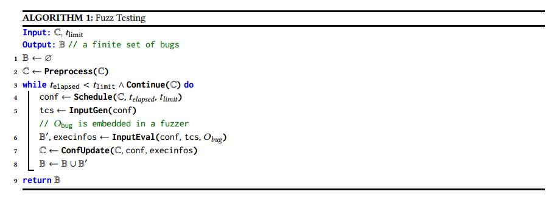
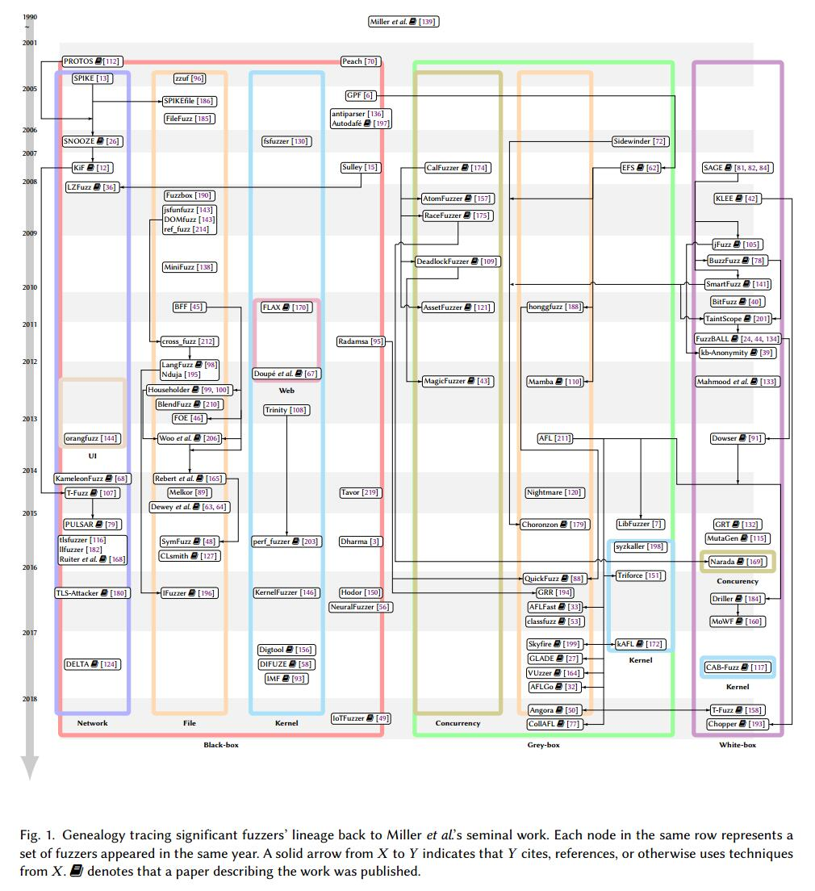

# Abstract

在当今可用的众多软件漏洞发现技术中，模糊测试由于其概念简单，部署的低屏障以及发现现实世界软件漏洞的大量经验证据而一直非常受欢迎。虽然近年来研究人员和从业人员都为改进模糊测试投入了大量不同的努力，但这项工作的激增也使得难以获得全面和一致的模糊测试观点。为了帮助保存并使大量的模糊测量文献保持连贯性，本文提出了一种统一的，通用的模糊测试模型以及当前模糊文献的分类。我们通过调查相关文献和艺术，科学和工程方面的创新，有条不紊地探索模型模糊器的每个阶段的设计决策，使现代模糊器有效。

| relevant information |                                                              |
| -------------------- | ------------------------------------------------------------ |
| *作者*               | VALENTIN J.M. MANÈS，HYUNGSEOK HAN,CHOONGWOO HAN,SANG KIL CHA∗,MANUEL EGELE,EDWARD J. SCHWARTZ,MAVERICK WOO, |
| *单位*               |                                                              |
| *出处*               | CSUR‘19                                                      |
| *原文地址*           | <https://github.com/wtwofire/database/blob/master/papers/fuzzing/Review/2019-fuzzing%EF%BC%9A%20Art%2C%20Science%2C%20and%20Engineering.pdf> |
| *源码地址*           |                                                              |
| *发表时间*           | 2019                                                         |

# 1. 简介

自从20世纪90年代初引入[139]以来，模糊测试一直是发现软件安全漏洞的最广泛部署的技术之一。在高级别，模糊测试指的是重复运行程序和构造的输入的过程，该输入可能在语法上或语义上不正确。在实践中，攻击者通常在诸如漏洞利用生成和渗透测试的场景中部署模糊测试[20,102]; 2016年DARPA网络大挑战赛（CGC）的几支队伍也在他们的网络推理系统中使用模糊测试[9,33,87,184]。在这些活动的推动下，防御者开始使用模糊测试来试图在攻击者发现漏洞之前发现漏洞。例如，Adobe [1]，Cisco [2]，Google [5,14,55]和Microsoft [8,34]等知名厂商都将模糊测试作为其安全开发实践的一部分。最近，安全审计员[217]和开源开发人员[4]也开始使用模糊测试来衡量商品软件包的安全性，并为最终用户提供一些合适的保证形式。

模糊社区非常有活力。在撰写本文时，仅GitHub就拥有了超过一千个与模糊测试相关的公共存储库[80]。正如我们将要展示的那样，文献中还包含大量的模糊器（参见第7页的图1），并且越来越多的模糊测试研究出现在主要安全会议上（例如[33,48,164,165,199,206] ]）。此外，博客圈中充满了许多模糊测试的成功故事，其中一些还包含了我们认为是[精华](https://goo.gl/37GYKN )的东西，这些精华在文献中占有一席之地。

不幸的是，研究人员和从业人员在模糊测试方面的工作激增也带来了阻碍进展的警告信号。例如，一些模糊器的描述不会超出其源代码和手册页。因此，随着时间的推移，很容易忘记这些模糊测试中的设计决策和潜在的重要调整。此外，各种模糊器使用的术语中存在可观察到的碎片。例如，虽然AFL [211]使用术语“测试用例最小化”来指代减小崩溃输入大小的技术，但同样的技术在funfuzz中也被称为“测试用例减少”[143]。虽然BFF [45]包含一种称为“崩溃最小化”的技术，听起来非常相似，但崩溃最小化的目的实际上是最小化崩溃输入和原始种子文件之间不同的位数，而不是减少崩溃输入的大小。我们认为这种分散使得难以发现和传播 fuzzing 知识，从长远来看，这可能严重阻碍 fuzzing 研究的进展。

基于我们的研究和我们在模糊测试方面的个人经验，本文作者认为现在是整合和提炼模糊测试大量进展的黄金时间，其中许多是在2007-2008 [73,187,189]年出版的三本关于该主题的贸易书籍之后发生的 。我们注意到Li等人同时进行了调查。 [125]侧重于基于覆盖的模糊测试的最新进展，但我们的目标是提供有关该领域近期发展的综合研究。为此，我们将首先使用§2来展示我们的模糊术语和统一的模糊测试模型。坚持本文的目的，选择我们的模糊术语来密切反映当前的主要用法，我们的模型模糊器（算法1，第4页）旨在适应大量的模糊测试任务，如分类在目前的模糊文献（图1，第7页）。通过这种设置，我们将在§3-§7中有条不紊地探索模型模糊器的每个阶段，并在表1中详细介绍主要模糊器（第9页）。
在每个阶段，我们将调查相关文献来解释设计选择，讨论重要的权衡，并突出许多奇妙的工程努力，帮助使现代模糊器有效地完成他们的任务。

# 2. 系统化，分类和测试程序

术语“模糊”最初由Miller等人创造。在1990年，它指的是“生成一个由目标程序消耗的随机字符流”的程序[139，p。 4]。从那时起，模糊的概念及其动作 - “fuzzing” - 出现在各种各样的语境中，包括动态符号执行[84,207]，基于语法的测试用例生成[82,98,196]，权限测试[21,74]，行为测试[114,163,205]，表示依赖性测试[113]，函数检测[208]，健壮性评估[204]，漏洞利用开发[104]，GUI测试[181]，签名生成[66]和渗透测试[75,145]。为了使大量的模糊测试文献中的知识系统化，让我们首先提出从当前使用中提取的模糊测试术语。

## 2.1 Fuzzing & Fuzzing Testing

直观地说，fuzzing是使用“模糊输入”运行被测程序（PUT）的行为。Honoring Miller等人，我们认为模糊输入是PUT可能不期望的输入，即PUT可能错误处理的输入并且触发PUT开发者无意识的行为。为了捕捉这个想法，我们将术语fuzzing定义如下。

> **定义2.1（fuzzing）**。模糊测试是使用从输入空间（“模糊输入空间”）采样的输入执行PUT，该输入空间突出了PUT的预期的输入空间。

三个评论是有序的。首先，尽管通常看到模糊输入空间包含预期的输入空间，但这不是必需的 - 前者包含d的输入不在后者中就足够了。其次，在实践中，模糊测试几乎肯定会进行多次迭代;因此，在上面写“重复执行”仍然很准确。第三，抽样过程不一定是随机的，我们将在§5中看到.

Fuzz testing是一种利用fuzzing的软件测试技术。为了区别于其他人并尊重我们认为最突出的目标，我们认为它有一个特定的目标，即找到与安全相关的错误，其中包括程序崩溃。此外，我们还定义了fuzzer和fuzz campaign，这两者都是模糊测试中的常用术语。

> **定义2.2（Fuzz Testing）**。Fuzz Testing是使用fuzzing，其目标是测试PUT违反安全策略的地方。
> **定义2.3（Fuzzer）**。Fuzzer是一种在PUT上执行fuzz testing的程序。
> **定义2.4（Fuzz Campaign）**。Fuzz Campaign是一个在有特定安全策略的PUT上的特定执行的Fuzzer。

通过fuzzing campaign运行PUT的目的是找到违反所需安全策略的错误[23]。例如，早期fuzzer使用的安全策略仅测试生成的输入 - 测试用例 - 是否使PUT崩溃。但是，fuzz testing 实际上可用于测试任何可执行的安全策略，即EMenforceable [171]。决定执行是否违反安全策略的具体机制称为**bug oracle**。

> **定义2.5（Bug Oracle）**。 bug oracle是一个程序，可能作为fuzzer的一部分，用于确定PUT的给定执行是否违反特定的安全策略。

 我们将fuzzer实现的算法简称为**“fuzz algorithm”**。几乎所有 fuzz algorithm都依赖于PUT之外的一些参数（路径）。参数的每个具体设置都是**fuzz configuration：**

> **定义2.6（Fuzz Configuration）**。fuzz algorithm的fuzz configuration包括控制fuzz algorithm的参数值。

Fuzz configuration通常被写为元组。请注意，fuzz configuration中的值类型取决于fuzz algorithm的类型。例如，将随机字节流发送到PUT [139]的fuzz algorithm具有简单的配置空间{（PUT）}。另一方面，复杂的fuzzer包含接受一组配置并随时间推移设置的算法 - 这包括添加和删除配置。例如，CERT BFF [45]在活动过程中改变了突变率和种子（在第5.2节中定义），因此其配置空间为{(PUT，s1，r1)，(PUT，s2，r2）,. … }。最后，对于每个配置，我们还允许fuzzer存储一些数据。例如，覆盖引导的模糊器可以存储每个配置的获得的覆盖范围。

## 2.2 Paper Selection Criteria

为了达到明确的范围，我们选择在2008年1月至2018年5月的4个主要安全会议和3个主要软件工程会议的最后一个议程中包括所有关于模糊测试的出版物。按字母顺序排列，前者包括（i）ACM会议计算机和通信安全（CCS），（ii）IEEE安全和隐私（S＆P）研讨会，（iii）网络和分布式系统安全研讨会（NDSS），以及（iv）USENIX安全研讨会（USEC）;后者包括（i）ACM国际软件工程基础研讨会（FSE），（ii）IEEE / ACM自动软件工程国际会议（ASE），以及（iii）国际软件工程会议（ICSE）。对于出现在其他场所或媒介中的作品，我们根据自己对其相关性的判断将它们包括在内。

正如§2.1中所提到的，fuzz testing与软件测试的区别仅在于它与安全相关。尽管瞄准安全漏洞并不意味着除了在理论上使用bug oracle之外的测试过程中存在差异，但所使用的技术在实践中通常会有所不同。在设计测试工具时，我们经常假设源代码的存在和PUT的知识。与fuzzer相比，这些假设通常会将工具的开发推向不同的形状。尽管如此，这两个领域仍然彼此纠缠不清。因此，当我们自己的判断力不足以区分它们时，我们遵循一个简单的经验法则：如果出版物中没有出现fuzz这个词，我们就不包括它。

## 2.3 Fuzz Testing Algorithm

我们提出了一种用于fuzz testing的通用算法，算法1，我们想象它已经在模型fuzzer中实现。它足以适应现有的模糊测试技术，包括§2.4中定义的黑色，灰色和白盒模糊测试。算法1将一组fuzz configurations C和一个超时 t_limit 作为输入，并输出一组发现的错误B.它由两部分组成。第一部分是预处理功能，它在fuzz campaign开始时执行。第二部分是循环内的一系列五个函数：**Schedule，InputGen，InputEval，ConfUpdate和Continue**。此循环的每次执行都称为**fuzz iteration**，并且在单个测试用例上执行InputEval称为**fuzz run**。请注意，一些模糊器不会实现所有五个功能。例如，为了模拟Radamsa [95]，我们让ConfUpdate简单地返回C，即它不会更新C.

**Preprocess（C）–>C**

>  用户为Preprocess提供一组fuzz configurations作为输入，并返回一组可能已修改的fuzz configurations。根据fuzz algorithm，Preprocess可以执行各种操作，例如将检测代码插入PUT，或测量种子文件的执行速度。见§3

**Schedule(C,telapsed,tlimit) –> conf **

> Schedule接收当前的fuzz configurations，当前时间t_elapsed和超时t_limit作为输入，并选择要用于当前模糊迭代的fuzz configuration。见§4。

**InputGen（conf）–>tcs **

> InputGen将fuzz configurations作为输入，并返回一组具体测试用例 tcs 作为输出。生成测试用例时，InputGen使用conf中的特定参数。一些模糊测试器使用conf中的种子来生成测试用例，而其他模糊器则使用模型或语法作为参数。见§5。

**InputEval (conf, tcs, Obug) –> B′, execinfos**

> InputEval采用fuzz配置conf，一组测试用例 tcs 和一个bug oracle Obug作为输入。它在tcs上执行PUT并使用bug oracle O_bug检查执行是否违反了安全策略。然后它输出发现的错误集B'和关于每个fuzz运行的信息 execinfos。我们假设O_bug嵌入在我们的模型模糊器中。见§6。

**ConfUpdate(C，conf，execinfos) –> C **

> ConfUpdate采用一组fuzz configurations C，当前配置 conf，以及每个模糊运行的信息 execinfos作为输入。它可能会更新一组fuzz configurations C.例如，许多灰盒模糊器会根据execinfos减少C中的模糊配置数量。见§7。

**Continue (C) –>  {True, False} **

> Continue将一组fuzz configurations C作为输入，并输出一个布尔值，指示是否应该进行下一个模糊迭代。此功能对于模型白盒模糊器很有用，当没有更多路径可以发现时，它可以终止。

## 2.4  Fuzzers 的分类

在本文中，我们根据模糊器在每个模糊运行中观察到的语义粒度将模糊器分为三组：黑盒，灰盒和白盒fuzzer。请注意，这与传统的软件测试不同，传统的软件测试只有两个主要类别（黑盒和白盒测试）[147]。正如我们将在§2.4.3中讨论的那样，灰盒模糊测试是白盒模糊测试的一种变体，它只能从每次模糊运行中获取一些部分信息。 

图1按时间顺序列出了现有fuzzer的分类。从Miller等人的开创性工作开始。 [139]，我们手动选择了在大型会议上出现或获得超过100个GitHub stars的流行fuzzer，并将其关系显示在图上。黑盒fuzzer位于图的左半部分，灰盒和白盒模糊器位于右半部分。

表1详细介绍了主要会议上出现的每个主要fuzzer所使用的技术。由于空间限制，我们省略了几个主要的fuzzer。每个模糊器都投影在我们上面提到的模型模糊器的五个功能上，其中一个杂项部分提供了有关fuzzer的额外细节。第一列（检测粒度）表示基于静态或动态分析从PUT获取多少信息。当fuzzer在两个阶段使用不同类型的插桩时，出现两个圆圈。例如，SymFuzz [48]运行白盒分析作为预处理，以便为随后的黑盒活动提取信息，而Driller [184]在白盒和灰盒模糊之间交替进行。

+ **第二列**显示来源是否公开。

+ **第三列**表示模糊器是否需要源代码才能运行。

+ **第四列**指出了模糊器是否支持内存模糊测试（参见§3.1.2）。

+ **第五列**是关于fuzzer是否可以推断模型（参见§5.1.2）。

+ **第六列**显示了在Preprocess中，fuzzer是执行静态分析还是动态分析。**第七列**指示fuzzers是否支持处理多个种子，并执行调度。

+ **变异列**指定fuzzers是否执行输入变异以生成测试用例。我们使用“半黑半白”来表示fuzzer根据执行反馈引导输入变异。基于模型的专栏是关于fuzzer是否基于模型生成测试用例。

+ **基于约束的列**显示fuzzers执行符号分析以生成测试用例。**污点分析列**意味着模糊测试器利用污点分析来指导其测试用例生成过程。

+ **InputEval部分**中的两列显示fuzzers是使用堆栈哈希还是使用代码覆盖率执行崩溃分类。

+ **ConfUpdate部分**的第一列指示在ConfUpdate期间模糊器是否进化种子池，例如，向池中添加有趣的种子（参见§7.1）。 ConfUpdate部分的第二列是关于fuzzers是否以在线方式学习模型。最后，ConfUpdate部分的第三列显示了从种子池中删除种子（参见§7.2）。

###  2.4.1黑盒fuzzer

术语“黑盒”通常用于软件测试[29,147]，fuzzing表示没有看到PUT内部的技术 - 这些技术只能观察PUT的输入/输出行为，将其视为一个黑盒子。在软件测试中，黑盒测试也称为IO驱动或数据驱动测试[147]。大多数传统的模糊器[6,13,45,46,96]属于这一类。一些现代模糊器，例如funfuzz [143]和Peach [70]，也考虑了有关输入的结构信息，以生成更有意义的测试用例，同时保持不检查PUT的特性。类似的直觉用于自适应随机测试[51]。

### 2.4.2白盒Fuzzer

在频谱的另一个极端，白盒模糊[84]通过分析PUT的内部和执行PUT时收集的信息来生成测试用例。因此，白盒模糊器能够系统地探索PUT的状态空间。术语白盒模糊是由Godefroid [81]在2007年引入的，它指的是动态符号执行（DSE），它是符号执行的变体[35,101,118]。在DSE中，符号和具体执行同时进行，其中具体的程序状态用于简化符号约束，例如，具体化系统调用。因此，DSE通常被称为concolic testing（具体的+符号的）[83,176]。此外，白盒模糊测试也被用于描述采用污点分析的模糊器[78]。
白盒模糊测试的开销通常远高于黑盒模糊测试的开销。这部分是因为DSE实现[22,42,84]经常采用动态插桩和SMT求解[142]。虽然DSE是一个活跃的研究领域[34,82,84,105,160]，但许多DSE不是白盒模糊器，因为它们的目的不是找到安全漏洞。因此，本文没有提供有关DSE的全面调查，我们将读者引用到最近的调查论文[16,173]以获取更多信息。

### 2.4.3灰盒Fuzzer

一些安全专家[62,72,189]提出了一种中间方法，并将其称为灰盒模糊测试。通常，灰盒模糊器可以获得PUT内部和/或其执行的一些信息。与白盒模糊器不同，灰盒模糊器不具备PUT的完整语义;相反，他们可以对PUT执行轻量级静态分析和/或收集有关其执行的动态信息，例如覆盖范围。 Greybox模糊器使用信息近似来测试更多输入。尽管安全专家之间通常存在共识，但黑盒，灰盒和白盒模糊测试之间的区别并不总是很明显。黑盒模糊器可能仍会收集一些信息，而白盒模糊器通常被迫做一些近似。本次调查中的选择，特别是表1中的选择，是有争议的，但是作者最好的判断。

灰盒模糊器的早期示例是EFS [62]，它使用从每个模糊运行中收集的代码覆盖率来使用进化算法生成测试用例。 Randoop [155]也使用了类似的方法，但它没有针对安全漏洞。现代模糊器如AFL [211]和VUzzer [164]是此类别中的示例。

# 3 预处理(PREPROCESS)

一些模糊器在第一次模糊迭代之前修改了初始的fuzz configurations。这种预处理通常用于插桩PUT，清除潜在的冗余配置（即“(seed selection)种子选择”[165]），并修剪种子

## 3.1 插桩（Instrumentation ）

与黑盒模糊器不同，灰盒和白盒模糊器可以在InputEval执行模糊运行（参见§6），或者在运行时模糊内存内容时插桩PUT以收集执行反馈。虽然还有其他方法可以获取PUT内部的信息（例如处理器跟踪或系统调用[86,188]），但插桩通常是收集最有价值信息的方法，因此几乎完全定义了颜色。模糊（从表1的第一列）。

程序插桩可以是静态的也可以是动态的 - 前者在PUT运行之前发生，而后者在PUT运行时发生。由于静态检测在运行时之前发生，因此它通常比动态检测产生更少的运行时开销。

静态插桩通常在编译时在源代码或中间代码上执行。如果PUT依赖于库，则必须单独插桩它们，通常通过使用相同的插桩重新编译它们。除了基于源代码的插桩，研究人员还开发了二进制级静态插桩（即二进制重写）工具[71,122,218]。

虽然它比静态插桩具有更高的开销，但动态插桩的优势在于它可以轻松地插桩动态链接库，因为插桩是在运行时执行的。有几种众所周知的动态插桩工具，如DynInst [161]，DynamoRIO [38]，Pin [131]，Valgrind [152]和QEMU [30]。通常，动态插桩在运行时发生，这意味着它对应于模型中的InputEval。但为了方便读者，我们在本节中总结了静态和动态插桩。

给定的模糊器可以支持多种类型的插桩。例如，AFL在源代码级别使用修改后的编译器支持静态插桩，或者在QEMU的帮助下支持二进制级别的动态插桩[30]。使用动态插桩时，AFL可以插桩（1）PUT本身的可执行代码（默认设置），或者（2）PUT中的可执行代码和任何外部库（使用AFL_INST_LIBS选项）。第二个选项 - 插桩所有遇到的代码 - 可以报告外部库中代码的覆盖信息，从而提供有关覆盖范围的更完整的图像。但是，这反过来会导致AFL模糊外部库函数中的其他路径。

### 3.1.1执行反馈（Execution Feedback. ）

灰盒模糊器通常将执行反馈作为输入来演化测试用例。 AFL及其后代通过检测PUT中的每个分支指令来计算分支覆盖。但是，它们将分支覆盖信息存储在一个byte向量中，这可能导致路径冲突。 CollAFL [77]最近通过引入一个新的路径敏感哈希函数来解决这个问题。同时，LibFuzzer [7]和Syzkaller [198]使用节点覆盖作为执行反馈。 Honggfuzz [188]允许用户选择要使用的执行反馈。

### 3.1.2 内存模糊测试（In-Memory Fuzzing ）

在测试大型程序时，有时需要仅模糊PUT的一部分而不为每个模糊迭代重新生成进程，以便最小化执行开销。例如，复杂（例如，GUI）应用程序在接受输入之前通常需要几秒钟的处理。模糊这些程序的一种方法是在初始化GUI之后拍摄PUT的快照。为了模糊新的测试用例，可以在将新测试用例直接写入内存并执行之前恢复内存快照。同样的直觉适用于涉及客户端和服务器之间的大量交互的模糊网络应用程序。这种技术称为内存模糊[97]。例如，GRR [86,194]在加载任何输入字节之前创建快照。这样，它可以跳过不必要的启动代码。 AFL还使用fork服务器来避免一些流程启动成本。尽管它与内存模糊测试具有相同的动机，但是fork服务器涉及为每个模糊迭代分离一个新进程（参见§6）。

一些模糊器[7,211]对函数执行内存模糊测试，而不会在每次迭代后恢复PUT的状态。我们称这种技术为内存API模糊测试。例如，AFL有一个名为persistent mode [213]的选项，它在循环中重复执行内存API模糊测试而不重新启动进程。在这种情况下，AFL忽略了在同一执行中被多次调用的函数的潜在副作用。

虽然有效的内存API模糊测试会受到不合理的模糊测试结果的影响：内存模糊测试中发现的错误（或崩溃）可能无法重现，因为（1）为目标函数构造有效的调用上下文并不总是可行的，并且（ 2）可能存在多个函数调用未捕获的副作用。请注意，内存中API模糊的健全性主要取决于入口点函数，找到这样的函数是一项具有挑战性的任务。

### 3.1.3线程调度（Thread Scheduling ）

竞争条件错误可能难以触发，因为它们依赖于可能不经常发生的非确定性行为。但是，通过显式控制线程的调度方式，也可以使用插桩来触发不同的非确定性程序行为[43,410,121,157,169,174,175]。现有工作表明，即使是随机调度线程也可以有效地找到竞争条件错误[174]。

## 3.2 种子选择（seed selection problem）

回忆§2，模糊器接收一组控制fuzzing algorithm行为的fuzz configurations。不幸的是，fuzz configurations的一些参数，例如基于突变的模糊器的种子，具有大的值域。例如，假设分析师模糊测试接受MP3文件作为输入的MP3播放器。有无数的有效MP3文件，这提出了一个自然的问题：我们应该使用哪些种子进行模糊测试？这个问题被称为(**seed selection problem** )种子选择问题[165]。

有几种方法和工具可以解决种子选择问题[70,165]。常见的方法是找到最大化覆盖度量的最小种子集，例如节点覆盖，并且该过程称为计算最小集。例如，假设当前配置集C由两个seeds s1和s2组成，它们覆盖PUT的以下地址：{s1→{10,20}，s2→{20,30}}。如果我们有第三个种子s3→{10,20,30}的执行速度与s1和s2一样快，那么人们可能会认为fuzz s3而不是s1和s2是有意义的，因为它直观地测试了更多程序逻辑以一半的执行时间成本。这种直觉得到了Miller的报告[140]的支持，该报告显示，代码覆盖率增加1％会使发现的错误百分比增加0.92％。如§7.2所述，此步骤也可以是ConfUpdate的一部分。

Fuzzers在实践中使用各种不同的覆盖度量。例如，AFL的minset基于分支覆盖，每个分支上都有一个对数计数器。该决定背后的基本原理是，只有当分支计数在数量级上不同时才允许它们被认为是不同的。 Honggfuzz [188]根据执行指令数，执行分支数和唯一基本块计算覆盖率。此度量标准允许模糊器向minset添加更长的执行时间，这有助于发现拒绝服务漏洞或性能问题。

## 3.3 种子修剪（Seed Trimming ）

较小的种子可能消耗较少的内存并且意味着更高的吞吐量。因此，一些模糊器试图在模糊种子之前减小种子的尺寸，这称为种子修剪。种子修剪可以在Preprocess中的主模糊循环之前或作为ConfUpdate的一部分进行。使用种子修剪的一个值得注意的模糊器是AFL [211]，只要修改后的种子达到相同的覆盖范围，它就使用其代码覆盖率插桩迭代地移除一部分种子。同时，雷伯特等人 [165]报道，他们的size minset算法，通过给予较小的种子更高优先级来选择种子，与随机种子选择相比，导致更少数量的独特错误。

## 3.4准备驱动程序

应用程序当难以直接fuzz PUT时，准备一个模糊驱动程序是有意义的。这个过程在很大程度上是手动的，尽管这只在模糊测试活动开始时才进行一次。例如，当我们的目标是库时，我们需要准备一个调用库中函数的驱动程序。类似地，内核模糊器可能会模糊用户态应用程序来测试内核[28,117,154]。 MutaGen [115]利用其他程序（驱动程序）中包含的PUT知识进行模糊测试。具体来说，它使用动态程序切片来改变驱动程序本身，以生成测试用例。 IoTFuzzer [50]通过让驱动程序成为相应的智能手机应用程序来定位物联网设备。

# 4 调度(SEHEDULING)

在模糊测试中，调度意味着为下一个模糊运行选择模糊配置。正如我们在§2.1中所解释的，每个配置的内容取决于模糊器的类型。对于简单的模糊器，调度可以很简单 - 例如，zzuf [96]在其默认模式下只允许一个配置（PUT和其他参数的默认值），因此根本没有决定。但对于更高级的模糊器，如BFF [45]和AFLFast [33]，他们成功的一个主要因素在于他们的创新调度算法。在本节中，我们将仅讨论黑盒和灰盒模糊测试的调度算法;白盒模糊测试中的调度需要符号执行器独有的复杂设置，我们将读者引用到[34]。

## 4.1  Fuzz配置调度（FCS）问题(The Fuzz Configuration Scheduling (FCS) Problem)

