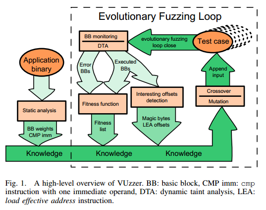
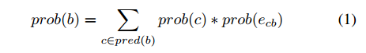
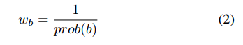
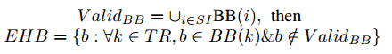
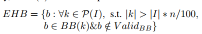
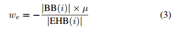
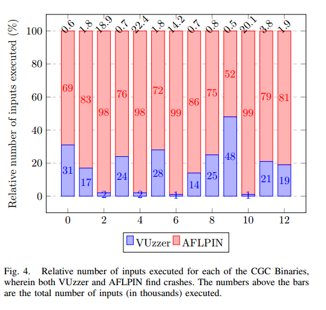
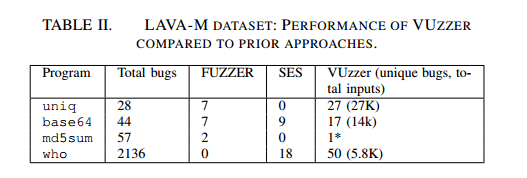
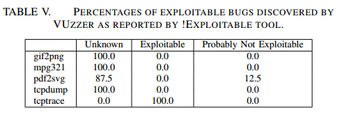

---

title: 'VUzzer: Application-aware Evolutionary Fuzzing'
date: 2019-01-29 17:49:47
tags:
- fuzzing
- pin
- 静态分析
- 动态分析
- 污点分析
- CFG
- LAVA
- NDSS'17
- 2017年
categories:
- 论文
- fuzzing
---

# Abstract

Fuzzing是一种有效的软件测试技术，用于查找错误。考虑到实际应用程序的大小和复杂性，现代模糊器往往是可扩展的，但在探索执行更深层次的错误或者能够在应用程序中深入渗透但不具有可扩展性方面无效。在本文中，我们提出了一种应用程序感知的进化模糊测试策略，它不需要任何有关应用程序或输入格式的先验知识。**为了最大化覆盖范围并探索更深入的路径，我们利用基于静态和动态分析的控制和数据流特征来推断应用程序的基本属性。**与应用程序无关的方法相比，这可以更快地生成有趣的输入。我们在VUzzer中实现我们的模糊测试策略并在三个不同的数据集上进行评估：DARPA Grand Challenge二进制文件（CGC），一组实际应用程序（二进制输入解析器）和最近发布的LAVA数据集。在所有这些数据集中，通过快速查找几个现有和新的错误，VUzzer产生的结果明显优于最先进的模糊器。

| relevant information |                                                              |
| -------------------- | ------------------------------------------------------------ |
| *作者*               | Sanjay Rawat, Vivek Jain, Ashish Kumar, Lucian Cojocar,Cristiano Giuffrida and Herbert Bos |
| *单位*               | Computer Science Institute, Vrije Universiteit Amsterdam;Amsterdam Department of Informatics  International Institute of Information Technology, Hyderabad |
| *出处*               | NDSS ’17                                                     |
| *原文地址*           | https://github.com/wtwofire/database/blob/master/papers/fuzzing/2017-VUzzer%20Application-aware%20Evolutionary%20Fuzzing.pdf |
| *源码地址*           | https://github.com/vusec/vuzzer                              |
| *发表时间*           | 2017年                                                       |

# 论文简略概括：

***其它相关源码地址：***

污点分析数据存储结构：https://github.com/lemire/EWAHBoolArray

AFLPIN: https://github.com/mothran/aflpin

AFLFAST: https://github.com/mboehme/aflfast

DECREE: https://github.com/CyberGrandChallenge/cgc-releasedocumentation/blob/master/walk-throughs/pin-for-decree.md

# 简介

在本文中，我们介绍了VUzzer，一个应用程序感知的进化模糊器，它既可扩展又可快速发现执行中的漏洞。与优化输入生成过程以最大速率生成输入的方法相比，我们的工作探索了设计领域的一个新点，我们在前端做更多的工作，产生更少但更好的输入。关键的直觉是我们可以通过基于控制和数据流应用功能的“智能”突变反馈回路来提高通用模糊器的效率，而无需采用可扩展性较低的符号执行。我们展示了我们可以通过在模糊运行期间对应用程序进行轻量级静态和动态分析来提取这些功能。我们的控制流功能允许VUzzer优先考虑深度（并因此感兴趣）路径，并在改变输入时优先考虑频繁（因此无趣）路径的优先级。我们的数据流功能允许VUzzer准确地确定改变这些输入的位置和方式。

由于其应用感知突变策略，VUzzer比现有的模糊器更有效。我们评估了VUzzer在三个不同数据集上的表现：a）DARPA CGC二进制文件[15]，这是一组人工创建的交互式程序，旨在评估错误发现技术; b）一组具有不同复杂程度的Linux程序（djpeg，mpg321，pdf2svg，gif2png，tcpdump，tcptrace）和c）最近发布的来自LAVA团队的二进制文件[17]，许多Linux实用程序都有几个注入的错误。在我们对不同数据集的实验中，我们通过生成数量级较少的输入来表现优于AFL，同时发现更多崩溃。例如，在mpg3211中，我们通过执行23K输入发现300次独特崩溃，而883K输入则通过AFL找到19次独特崩溃。

贡献：我们做出以下贡献：

1）我们表明现代模糊器可以“更智能”而不需要采用符号执行（难以扩展）。我们的应用感知突变策略将AFL等最先进的模糊器的输入生成过程提高了几个数量级。

2）我们提出了几个应用程序特征来支持有意义的输入变异。

3）我们在三个不同的数据集上评估VUzzer，一个实现我们方法的功能齐全的模糊器，并表明它非常有效。

4）为了促进该领域的进一步研究和支持开放科学，我们开放我们VUzzer原型的源代码，可在https://www.vusec.net/projects/fuzzing获得。

# 总体描述

为了解决上一节中提到的挑战，我们提出了VUzzer，一种应用程序感知的进化模糊器。图1概述了其主要组件。

由于VUzzer是一个进化模糊器，因此有一个反馈循环可以帮助从旧的输入中获得新的输入。生成新输入时，VUzzer会根据其在上一轮输入上的执行情况来考虑应用程序的特征。通过考虑这些特性，我们使反馈回路“智能”并帮助模糊器找到具有高频率的非零IG的输入。

## 1. 特征

**数据流特征**：数据流特征提供有关应用程序中输入数据和计算之间关系的信息。 VUzzer使用诸如污点分析之类的众所周知的技术来提取它们，并使用它们根据输入中某些偏移处的数据类型来推断输入的结构。例如，它通过检测x86 ISA的cmp系列的每个指令来确定分支的字节（“分支约束”），以确定它使用哪些输入字节（偏移）以及它与哪些值进行比较。通过这种方式，VUzzer可以确定哪些偏移对于变异感兴趣以及在这些偏移处使用哪些值（在第I部分中提供问题的部分答案）。 VUzzer现在能够通过更频繁地定位此类偏移并通过在这些偏移处使用预期值来满足分支约束来更明智地进行变异。这样做可以解决魔术字节的问题，而无需使用符号执行。

同样，VUzzer监视lea指令以检查索引操作数是否被污染。如果是这样，它可以确定相应偏移处的值是int类型并相应地改变输入。除了这两个简单但功能强大的特征外，还有许多其他功能。

**控制流特征**：控制流特征允许VUzzer推断某些执行路径的重要性。例如，图2显示了清单3中代码的简化CFG。执行错误块的输入通常是不感兴趣。因此，识别这样的错误处理块可以加速感兴趣输入的生成。我们将在以下部分中展示如何检测错误处理代码。目前，我们假设我们可以启发式地识别包含错误处理程序的基本块。

另一个例子涉及嵌套块的可达性。到达块F的任何输入更有可能比到达块H的输入更深入到代码中，因为后者不是嵌套的。我们使用控制流特征来对路径进行去优先级和优先级排序。由于枚举应用程序中的所有可能路径是不可行的，我们通过为各个基本块分配权重来实现此度量。具体而言，作为错误处理代码一部分的基本块获得负权重，而难以到达的代码区域中的基本块获得更高权重。

图1显示了单次模糊测试包含几个步骤。 VUzzer期望有效输入的初始池SI，称为种子输入。第一步是执行过程内静态分析以获得一些控制流和数据流特征（第III-B节），然后是主要的进化模糊循环。在本节的其余部分，我们将介绍描述整个过程的所有步骤。

## 2.  静态分析器

在模糊测试过程开始时，我们使用轻量级过程内静态分析来（i）通过扫描应用程序的二进制代码来获得cmp指令的立即值，以及（ii）计算应用程序二进制文件基本块的权重。

应用程序代码中cmp指令中存在的许多立即值通常表示应用程序期望输入在某些偏移处具有许多这些值。例如，清单3中对程序的分析产生了每个基本块的权重列表LBB和包含{0xEF，0xFD，％，@，MAZE}的字节序列的列表Limm。为了确定基本块权重，我们将每个函数的CFG建模为马尔可夫模型，并计算到达函数中每个基本块b的概率pb。然后我们计算每个基本块b的权重wb为1 / pb。因此，到达基本块的概率越低，权重越高。使用该模型，每个基本块的概率和权重显示在图2中的每个节点旁边（参见第IV-A3节）。我们观察到，例如，到达基本块G的概率小于到达基本块F的概率，而基本块F的概率低于基本块H.VUzzer在模糊循环的后续步骤中使用这些列表。

## 3.  主fuzzing循环

我们通过使用算法1中的步骤来描述主fuzzing循环。在主循环开始之前，我们用一组种子输入SI执行应用程序以推断出一组初始的控制流和数据流特征。对于SI中的所有输入，我们运行动态污点分析（DTA）以捕获有效输入的共同特征。具体来说，我们这样做是为了前面提到的魔术字节和错误处理代码检测。使用这些功能，我们生成一个初始输入总体，作为算法1中INITIALIZE步骤的一部分。请注意，我们的魔术字节检测确保这些新输入跨越第一次这样的应用程序检查。由于DTA具有很高的开销，我们在主循环开始后尽可能少地使用它。

**输入执行**：我们使用上一步中的每个输入执行应用程序，并生成相应的已执行基本块的跟踪。如果任何输入执行以前未见过的的基本块，我们会污染输入并使用DTA通过监视应用程序的数据流功能来推断其结构属性。

**适应度计算**：在算法1的EVALUATE步骤中，我们计算每个输入的适应度作为执行的基本块的频率的加权和。我们使用权重列表LBB在基本块上分配权重。属于错误处理代码的基本块会产生负权重 - 现在我们仍然假设我们可以识别这些基本块。该适应度计算背后的直觉是为执行具有较高权重的基本块的输入提供高分，从而对相应路径进行优先级排序，同时还执行具有高频率的某些基本块以捕获大循环。例如，让我们考虑两个路径p1和p2，分别由两个输入i1和i2执行，使得p1 = A-> B - > D - >E - >H - >J和p2 = A - >B - >D - >E - >F - >J.为简单起见，让我们假设错误处理基本块J得到权重-1并且每个基本块的执行频率为1.使用图2中的权重，p1和p2的频率的加权和为7 （1 + 1 + 2 + 2 + 2-1）和9（1 + 1 + 2 + 2 + 4-1）。因此，输入i2获得更高的适应度分数，并且将比i1更多地参与生成新输入。该步骤最终生成按其适应度分数降序排列的输入排序列表。

**遗传算子和新输入生成**：这是我们模糊测试策略中最后也是最重要的功能，包括算法1中的SELECT，RECOMBINE和MUTATE步骤。这些子步骤一起负责生成有趣的输入。在主循环的每次迭代中，我们通过组合和突变SI的输入，所有受污染的输入以及Lf的前n％来生成新一代输入。我们将此集称为ROOT集。

具体来说，我们通过交叉和变异生成新的输入。首先，我们从ROOT中随机选择两个输入（父项）并应用交叉来生成两个新输入（子项）。具有固定概率，这两个输入进一步经历突变。 Mutation使用多个子操作，例如删除，替换和在给定输入中的某些偏移处插入字节。变异运算符利用数据流功能生成新值。例如，在插入或替换字节时，它使用来自Limm的字符来生成不同长度的字节序列。类似地，选择来自当前输入的父项的各种偏移用于突变。因此，如果存在任何魔术字节，它们将在结果输入中的适当偏移处被替换。

这个循环的输入生成一直持续到我们满足终止条件。目前，我们在发现崩溃或VUzzer达到预先配置的代数时终止。

# 设计与实现

## 1. 实现细节

**1）动态污点分析（DTA）**：DTA是VUzzer的核心，因为它在发展新输入方面发挥着重要作用。这也是将VUzzer与现有模糊器区分开来的技术。 DTA用于监视应用程序内受污染的输入（例如，网络包，文件等）的流动。在程序执行期间，DTA可以确定哪些存储器位置和寄存器依赖于受污染的输入。根据粒度，DTA可以将受污染的值追溯到输入中的各个偏移量。 VUzzer使用DTA跟踪cmp和lea指令中使用的污染输入偏移。对于每个执行的cmp指令cmp op1，op2（op1和op2可以是寄存器，存储器或立即操作数），DTA确定op1和/或op2是否被一组偏移污染。我们的DTA实现能够在字节级别跟踪污点。对于给定的受污染操作数op，DTA为op的每个字节提供污点信息。

**2）魔术字节检测**：基于我们对具有魔术字节的文件格式的理解，我们假设魔术字节是输入字符串中固定偏移处的固定字节序列。我们已经在几种具有魔术字节的文件格式上验证了这一假设，例如jpeg，gif，pdf，elf和ppm。由于VUzzer是给定应用程序的一些有效输入的可用性，我们在模糊测试开始时在这些输入上使用DTA的结果。由于应用程序期望输入包含魔术字节，因此DTA在cmp指令上的结果将包含对魔术字节的相应检查。

例如，清单3中的代码在输入文件的开头需要一个魔术字节0xFDEF。因此，DTA将捕获两条cmp指令 - cmp reg，0xFD，reg受到偏移0的污染，cmp reg，0xEF，reg受到偏移量1的污染。如果对这个程序我们有一个有效输入的集合，我们可以在所有相应的执行中观察这两条cmp指令。相反，如果对于一组有效输入，我们在所有输入的DTA结果中得到cmpi =（oi; vi），vi是偏移oi的魔术字节的一部分。

在魔术字节检测期间，对于给定的cmpi指令，如果相应的值取决于每个字节的多个偏移，我们不认为这种偏移是魔术字节候选。例如，对于给定的cmp指令，如果DTA检测到|Tji|> 1，我们从魔术字节占位符的任何进一步考虑中排除这些偏移（ÎTji）。这种情况表明相应操作数的值可以从那些偏移ÎTji处的污染值导出。对多个字节的依赖打破了魔术字节是固定（常量）字节序列的假设。我们将所有这些偏移的集合表示为Oother。

**3）基本块权重计算**：从基于覆盖的fuzzing角度来看，每条可行路径对于遍历都很重要。一个简单的模糊测试策略是花费同等的努力为所有可行路径生成输入。但是，由于存在控制结构，某些路径的可达性可能与其他路径的可达性不同。如果我们有嵌套的控制结构，这种情况就会频繁出现[41]。因此，与其他输入相比，任何运行这种难以触及的代码的输入都应该得到更多奖励。

我们通过为嵌套控制结构中包含的基本块指定更高权重来合并此奖励。由于枚举过程间级别的所有路径都难以缩放，我们的分析在过程间级别，即，我们计算包含在函数内的每个基本块的权重。稍后，我们收集并添加由给定输入执行的路径中所有基本块的权重。通过这种策略，我们通过将几个过程内路径分数拼接在一起来模拟过程间路径的分数。

如果我们认为特定基本块的输入到下一个基本块的转换取决于某个概率，我们可以从控制流图（CFG）中导出一个称为马尔可夫过程的概率模型用于输入行为。马尔可夫过程是一个随机过程，其中给定试验的结果仅取决于过程的当前状态[30]。我们将函数的CFG建模为马尔可夫过程，其中每个基本块具有基于其与其他基本块的连接的概率。

对于给定的基本块，我们为其所有输出边分配相等的概率。因此，如果out（b）表示基本块b的所有输出边缘的集合，则∀eb * Î out（b）; prob（eb *）= 1/|out（b）|。基本块b的转移概率（似然）计算如下：

其中prod（b）是b的所有前辈的集合。我们使用定点迭代算法来计算与CFG中的每个基本块相关联的概率。 CFG的root基本块初始化概率为1。通过为每个后备项分配固定概率1来处理循环，从而忽略后备本身的影响（即，我们将循环展平以加速定点计算）。从等式1，每个基本块b的权重由下式给出：

**4）错误处理代码检测**：如前所述，在模糊测试期间，大多数突变输入将执行最终处于某种错误状态的路径。对这些执行路径进行优先级排序是提高创建有趣输入的机会的关键一步。我们的错误处理检测启发式依赖于有效输入的可用性，这是VUzzer的先决条件。由于我们的错误处理检测取决于应用程序的动态行为，因此它以增量方式检测错误处理基本块。

***初始分析***：对于每个有效输入iÎSI，我们收集由i执行的基本块的集合BB（i）。设ValidBB表示所有有效输入的所有这些已执行基本块的并集。然后我们创建一组完全随机的输入，表示为TR。对于此集合中的每个输入，我们根据基本块收集其执行跟踪。如果在来自TR的输入的每次执行中存在并且它不存在于ValidBB中，则假定来自这样的一组执行的基本块是错误处理基本块（即，属于错误处理代码）。直觉是因为SI是一组有效输入，所以不会触发错误处理代码。因此，ValidBB将仅包含与有效路径对应的基本块。由于TR是一组完全随机的输入，它们很可能在执行期间被错误处理代码捕获。

我们是一种非常保守的错误处理基本块检测策略，因为如果某些输入被不同的错误处理代码捕获，我们可能会错过几个基本块。尽管如此，请注意，我们永远不会将与有效路径对应的基本块分类为错误处理基本块。更正式的表示如下

EHB就是错误处理基本块集合。

***增量分析***：我们观察到，由于我们的错误处理检测策略基于应用程序的动态行为，因此在初始分析期间不会触发所有错误处理代码。随着输入的发展，它们会探索更多路径，从而遇到新的错误处理代码。出于这个原因，我们在后来的模糊测试迭代期间启动增量分析。在我们的实验设置中，我们观察到，随着我们进行更多的模糊测试迭代，新的错误处理代码实例的数量减少了。这反映了软件具有有限数量的错误处理代码实例的直觉，这些代码实例在应用程序的不同部分中重用。因此，当我们执行更多迭代时，我们减少运行增量分析的频率。

我们的增量分析背后的直觉是观察到，随着模糊测试的进行，大多数新生成的输入最终会触发一些错误处理代码。在给定的迭代中，让I成为迭代中生成的输入集。让大多数量由|I|的n％量化。我们的（离线）实验表明，n = 90是一个合理的选择。设BB（I）是由I中的输入执行的所有基本块的集合。如果它与来自I的输入少与n％的相关联，且它不在V alidBB集中，则将来自BB（I）的基本块b分类为错误处理基本块。更正式地说，让P（I）表示I的幂集。然后

***错误处理基本块的权重计算***：在检测到错误处理基本块（EHB）之后，我们希望对包含此类块的路径进行优先级排序。我们通过惩罚相应的输入来实现这一点，以便这些输入参与下一代的机会较少。为此，每个EHB都给出负权重，这会影响相应输入的适合度（见第IV-A5节）。然而，这种策略本身并不充分，因为与输入执行的基本区块总数相比，EHB只是少数，因此这么小的数量将产生微不足道的影响。我们通过定义影响系数μ（可调参数）来解决这个问题，影响系数μ决定单个错误处理基本块可以使多少（非错误处理）基本块无效。直观地，该参数确定，一旦输入进入错误处理代码，任何相应基本块在计算适合度分数时的贡献必须减少因子μ。对于给定的输入i，我们使用以下公式进行重量计算。

其中|BB（i）|是由输入i执行的所有基本块的编号，|EHB（i）|是由i执行的所有错误处理基本块的编号，并且0.1≤μ≤1.0。

**5）适应度计算**：适应度计算是进化算法最重要的组成部分之一。这对于实现反馈回路至关重要，这为下一步的输入生成提供了动力。一旦产生新的输入，其参与产生新输入的机会取决于其适合度。

VUzzer以两种方式评估输入的适应性。如果输入的执行导致发现新的非EHB基本块，则输入有资格参与下一代。这类似于AFL（额外使用EHB组）。然而，如前所述，这种适应度测量认为所有新发现的路径相等，这是有问题的。输入的重要性（以及因此适应性）取决于其执行的路径的兴趣度，而该路径又取决于相应基本块的权重。因此，我们将输入i的适应度fi定义为捕获所有相应基本块权重的效果的函数。

其中BB（i）是由输入i执行的基本块的集合，Freq（b）是当由i执行时基本块b的执行频率，Wb是基本块b的权重（通过使用等式2），li是输入i的长度，LMAX是输入长度的预配置限制。 LMAX用于解决输入膨胀现象。在遗传算法的说法中，两个适应度标准（即发现新基本块的能力和更高的fi）都对应于探索和开发的概念 - 发现新的基本块表示新的方向（即探索）和较高的fi表示基本块的较高执行频率（以及其他因素）（即，在相同方向上的利用）。

**6）输入生成**：VUzzer的输入生成由交叉和变异两部分组成，它们不是互斥的，即交叉以固定的概率跟随在变异之后。

交叉：交叉是一种简单的操作，其中从前一代中选择两个父输入，并生成两个新的子输入。

变异：变异是一种更复杂的操作，它涉及若干子操作以将给定的父输入改变为相应的子输入。该过程在以下步骤中详述：

- 步骤1：从集合Oother中随机选择受污染的偏移量并在这些偏移量处插入字符串。字符串由从集合Limm获得的字节组成。

- 步骤2：从集合Llea中随机选择偏移量并通过用有趣的整数值（例如0，MAX UINT，负数）替换它们来改变来自步骤1的字符串中的这种偏移量。

- 步骤3：对于父输入的所有受污染的cmp指令，如果op1 ≠ op2的值，则将步骤2中字符串中受污染偏移的值替换为op2的值，否则将以固定概率替换受污染的值字节由随机字节序列组成。

- 步骤4：将魔术字节放置在由我们的魔术字节检测器确定的相应偏移处。

## 2. 实现细节

VUzzer的核心功能是在***Python 2.7***中实现的。一些实现的分析，例如错误处理基本块检测的增量分析，是内存密集型的，因此我们还利用了更新版本（如***BitVector3***）提供的高效数据结构。 VUzzer内部由两个主要组件组成，包括静态和动态分析，如下面进一步详述。

**静态分析**：VUzzer在IDA [27]中实现了两种静态分析（常量字符串提取和基本块权重计算）。分析是使用IDAPython [18]用Python编写的。

**动态分析**：VUzzer在Pin动态分析框架的顶部实现了动态分析（基本块跟踪和DTA）[31]。对于基本块跟踪，我们实现了一个pintool来记录执行期间遇到的每个基本块及其频率。我们的pintool可以根据需要有选择地跟踪某些库执行的基本块。选择性库监控允许我们减少执行跟踪开销并专注于预期的应用程序代码。

我们的DTA实现基于Stamatogiannakis等[46]提出的***DataTracker***，后者又基于LibDFT [29]。由于LibDFT只能处理32位应用程序，因此当前的VUzzer原型只能用于模糊32位应用程序（也用于我们的评估）。请注意，这不是一个基本限制，事实上，我们正在VUzzer中实现64位支持。任何更新版本将在https://www.vusec.net/projects/fuzzing上提供。

为了使其适合我们的目的，我们还对DataTracker进行了一些更改：

- 在DataTracker中，与每个内存位置关联的污点标记被建模为元组：<ufd，file_offeset>，即唯一文件描述符和与该描述符关联的文件的偏移量。这些元组中的每一个都是64位长（ufd为32位，file_offset为32位）。每个内存位置都有一组与之关联的元组，以确定偏移量和内存位置受污染的文件。我们将其更改为**EWAHBoolArray type**，它是一种压缩的bitset数据类型。由于我们只需要来自一个（输入）文件的数据流信息，因此我们修改了DataTracker以仅通过该文件传播污点。因此，在我们的修改版本中，与每个存储器位置相关联的污点标签被建模为仅包含偏移的EWAHBoolArray。因此，我们的实现速度至少快2倍，并且使用的内存比DataTracker少几倍。

- 我们为cmp系列指令添加了插桩回调，如CMP，CMPSW，CMPSB，CMPSL和lea指令，以捕获计算中涉及的操作数的字节级污点信息。

- 我们为每个实现的系统调用重写了钩子，并为一些额外的系统调用添加了钩子，例如pread64，dup2，dup3，mmap2等。为了评估我们在DARPA数据集[15]上的性能，我们还实现了基于DECREE的钩子系统调用，与普通的Linux系统调用不同。

**crash分类**：一旦模糊测试开始产生崩溃，它可能会继续产生更多的崩溃，并且应该有一些机制来区分由于不同的错误（或相同的错误但不同的实例）导致的崩溃。为了确定崩溃的唯一性，**VUzzer使用由Molnar等人提出的堆栈散列的变体[37]**。在我们的pintool中，我们实现了一个环形缓冲区，用于跟踪最后5个函数调用以及在崩溃之前执行的最后10个基本块。我们计算此缓冲区的哈希值，每次遇到新的崩溃时，我们将新生成的哈希值与旧的哈希值进行比较，以确定报告的崩溃是否是新的唯一崩溃。

# 评估

为了测量我们提出的模糊测量技术的有效性，本节介绍了对VUzzer的评估。为了将VUzzer显示给各种应用程序，我们选择在三个不同的数据集上测试VUzzer A. DARPA CGC二进制文件[15]，B. [43]中使用的二进制格式的杂项应用程序，C.最近的一组错误二进制文件由LAVA [17]生成。

我们在配备32位2核Intel CPU和4 GB RAM的Ubuntu 14.04 LTS系统上进行了实验。对于DARPA CGC数据集，（提供的）环境是具有称为DECREE的自定义OS的VM。我们要强调的是，我们的主要评估目标是展示VUzzer在识别错误（可能深埋在执行中）的效率，其输入比AFL等最先进的模糊器少得多。我们当前的VUzzer原型并不像AFL那样针对快速输入执行进行优化，因此我们不寻求这方面的比较。

## A.  DARPA CGC数据集

作为Cyber Grand Challenge的一部分，DARPA发布了一组二进制文件，这些二进制文件在一个名为DECREE的自定义操作系统中运行。共有131个二进制文件，其中注入了各种类型的错误。但是，由于以下原因，我们无法在所有这些上运行VUzzer：

- 通过接受来自STDIN的输入，所有二进制文件本质上都是交互式的。一旦启动，其中许多人会提供一个菜单来选择一个动作，包括退出选项。此外，在许多情况下，有多个菜单（在程序的不同状态下）具有不同的退出选项。由于VUzzer需要生成完全随机输入的步骤（错误处理代码检测，第IV-A4节），执行此类输入会使应用程序循环，查找有效选项，包括退出选项。这会导致应用程序永远运行。这是一个接口问题，而不是我们的模糊测试方法的基本限制。

- 其中一些二进制文件是使用浮点指令编译的，这些指令LibDFT不能处理，因此VUzzer无法获得正确的数据流信息。

- 由于VUzzer基于Pin [32]，我们按照给定的程序在DECREE5中运行pintools。但是，我们无法使用Pin运行一些二进制文件。

- 某些二进制文件涉及与其他二进制文件的交互，而VUzzer无法处理这些二进制文件。 

在考虑了上面提到的障碍之后，我们总共留下了63个二进制文件。为了与AFL进行比较，我们还运行了AFLPIN，一种基于pintool的AFL实现。 AFLPIN具有与AFL相同的模糊引擎，但是获取执行跟踪的机制不同。我们选择使用AFLPIN代替AFL是为了与SUT具有相同的接口机制，即通过文件描述符0（STDIN）将输入传递给pintool。

VUzzer在29个CGC二进制文件中发现了崩溃，而AFLPIN只发现了23个崩溃。由于每个CGC也附带修补版本，我们通过运行修补程序版本的二进制文件来验证VUzzer发现的每个错误，以避免进一步崩溃。最重要的结果是这两个模糊器中每次崩溃的执行输入数量。我们运行两个模糊器最多6个小时。图4描绘了两个模糊器发现崩溃（总共13个）的情况的执行次数，证明VUzzer与AFL相比可以显着修剪搜索空间。

在对特定二进制NRFIN_00015进行模糊测试时，我们观察到以离散方式计算适应度分数fi的重要性。此二进制文件中的漏洞是循环中缓冲区溢出的典型情况。我们观察到在第18次迭代之后，没有发现新的BB，但是fi保持增加，表明典型的循环执行行为。在第63次迭代（总执行次数13K），我们到达缓冲区的边界。 AFLPIN无法检测到这次崩溃。

我们注意到，我们目前对该数据集的结果是适度的，特别是在Driller [47]报告的结果中。我们进一步调查了结果，发现了一些可能会影响我们当前VUzzer原型在CGC上的性能的特性。

- 在多个二进制文件中，只有通过执行给定菜单中的一组非常特定的操作才能达到错误状态。例如，在CROMU_00001应用程序中，必须执行以下操作：登录A - >向用户B发送许多消息 - >登录B - >检查消息。目前，VUzzer无法重复序列。

- 有效输入的概念很模糊。回想一下，我们使用每个CGC二进制文件以XML文件形式提供的整个会话作为一个输入。因此，基本上没有无效输入的概念。因此，我们无法充分利用VUzzer的全部功能。

- 与上述相关的是有趣的抵消问题。由于CGC二进制文件是交互式的，因此输入本质上是一个探索应用程序状态的序列，它可能因输入而异。例如，其中一个二进制文件允许用户加载文件。处理文件时会触发该错误。相应的文件加载菜单可以出现在输入中的任何位置，因此文件中的偏移量与输入中加载的位置相关，因此很难自动推理偏移量。

鉴于上述问题，我们认为VUzzer不适合交互式程序，主要是因为它与这些程序的接口机制不佳。

## B.  LAVA数据集

在最近的一篇论文中，Dolan-Gavitt等人。开发了一种注入难以触及的故障的技术，并创建了一些Linux实用程序的错误版本[17]，用于测试基于模糊测试和符号执行的错误查找解决方案。我们使用LAVA-M数据集[17]来评估VUzzer。该数据集由4个Linux实用程序-base64，who，uniq和md5sum组成，每个注入多个故障（每个实用程序使用相同的二进制文件）。 LAVA论文报告了在这些有缺陷的应用程序上评估基于覆盖的模糊器（FUZZER），符号执行和基于SAT的方法（SES）的结果。

为了提高可读性，我们重申表II中原始LAVA论文的结果。表II中的最后一列显示了VUzzer产生的结果。显示的数字是VUzzer识别的唯一错误。在md5sum的情况下，我们无法运行VUzzer，因为它在第一轮输入生成时崩溃，而不允许程序解析更多任何输入。 LAVA二进制文件中的每个注入故障都有一个ID，并且在每个二进制文件由于该故障而崩溃之前，ID将打印在标准输出上。这使我们能够精确识别VUzzer触发的故障。表III报告了VUzzer为每个LAVA二进制文件触发的故障的ID。

我们的LAVA数据集结果中出现了一些有趣的点。大多数LAVA注入的断层都是基于人工注入的路径条件，如lava到达特定路径并触发bug。由于其数据流功能，VUzzer非常好地捕获了这一点。例如，在base64模糊测试期间，我们了解到前四个字节应该是'val或lav'以跟随特定路径。类似地，我们发现最后几个字节应包含以下任何值以采用不同的路径：las [，lat\x1b，Wsal等。应该注意，LAVA注入的大多数路径约束都是多字节约束。这种约束对于AFL在执行中更深入地造成了严重的问题（如[16]中所述）。另一个有趣的观点是VUzzer对who的表现。 LAVA文件中使用的模糊器甚至找不到一个bug，而VUzzer发现了几个独特的崩溃。

总体而言，在两个人工数据集中，VUzzer报告了令人鼓舞的结果，尽管正如预期的那样，它确实与DARPA CGC数据集中的交互式程序相悖。我们现在继续在实际程序中评估VUzzerz，这些程序也被其他模糊器考虑过。

## C.  各种应用程序（VA）数据集

我们使用真实世界程序的数据集（djpeg / eog，tcpdump，tcptrace，pdf2svg，mpg321，gif2png）来评估VUzzer的性能。Rebert等人还对这些程序进行了评估，以报告几个错误[43]，因此我们将这些程序纳入我们的评估中，用于比较目的。对于这些程序中的每一个，我们在Ubuntu 14.04中使用vanilla发行版。我们注意到，通过评估这些实用程序，我们还针对一些著名的库，如libpcap，libjpeg，libpoppler和libpng。每个程序最多24小时模糊。为了突出VUzzer的性能，我们还在这些应用程序上运行了AFL。表IV显示了在VA数据集上运行VUzzer和AFL的结果，VUzzer在发现的唯一崩溃次数和触发此类崩溃所需的输入数量方面明显优于AFL。

图5详细描述了24小时内崩溃的分布情况。每个图的x轴显示每2小时采样的累计崩溃总和。如图所示，对于几乎所有应用程序，VUzzer在后续的模糊测试中不断发现崩溃，而AFL在几次初始迭代后很快就耗尽了精力。这是因为在后期阶段，AFL无法找到新的（更深的）路径，而VUzzer能够在探索新路径时学习分支约束，因此能够在模糊测试的后期阶段发现崩溃。图5中另一个有趣的注意事项是，与AFL相比，VUzzer不仅能够以更少的输入找到崩溃，而且还可以在更短的时间内完成（参见图5中垂直线的位置）。我们想再次说明我们还没有优化VUzzer来实现快速输入。我们认为存在多种提高VUzzer执行速度的技术，例如，在单个模糊迭代中使用类似AFL的fork服务器，或者在多个核心或机器上分配并发模糊工作者。

## D.  Crash - Triage分析

Fuzzers倾向于产生大量崩溃。修复与崩溃相关的每个错误都是一个耗时但有利可图的过程。提供给软件开发人员的唯一信息是应用程序的版本号和崩溃本身。当然，错误修补工作投入到更多（安全性）关键的错误中。

！Exploitable [19]是CERT提出的一种工具，它建立在GDB之上，并使用启发式方法来评估由bug引起的崩溃的可利用性。启发式算法基于崩溃位置，内存操作（读取或写入）以及应用程序触发的信号。虽然这种分析不合理，但它简单，快速，并提供了崩溃严重程度的提示。我们使用！Exploitable工具对VUzzer在此数据集上发现的崩溃进行排名。表五列出了我们的结果。

如表中所示，由于！Exploitable工具的简单性，大多数情况都被标记为未知。没有一个案例被标记为可能可利用。最后，VUzzer在tcptrace中发现的每次崩溃似乎都是可利用的。我们调查了tcptrace中的一个崩溃，并且有一种看似明显的方法来利用它：漏洞是对堆缓冲区的越界写入。写入的边界和数据受到污染（即，受攻击者控制）。

了进一步分析VUzzer发现的错误的质量，我们测量了crash与所涉及的库之间的距离（如果有的话）。位于库中的错误可能会包含在使用该库的任何应用程序中，因此这些错误具有高优先级。我们还需要记住，这些是未知的错误，因此其中许多可能是0-day。当我们发现大量独特崩溃时，尽早报告最重要的崩溃是一个优先事项，因此我们依靠自动分析来估计错误的严重性。简而言之，如果库中发生崩溃，那么报告就是一个严重的错误。但是，有时在用户应用程序中会出现错误，但错误的真正原因在于应用程序使用的库。因此，当在应用程序代码中观察到崩溃时，我们还测量距上一次库调用的距离。

崩溃与库之间的距离由两个指标衡量。首先，我们计算崩溃和最后一次库调用之间执行的指令数。直觉是最终导致崩溃的计算（及其副作用）可能源于库调用。其次，我们计算崩溃和最后一次库调用之间的堆栈帧数。作为一个例子，使用驻留在主应用程序中的输出函数钩子的库（例如 tcpdump，tcptrace，mpg321）被这种启发式方法所覆盖。表VI列出了我们的分析结果。

mpg321中的所有崩溃都发生在（libid3tag）库中。发行版维护者对libid3tag库进行了大量修补（补丁级别为10）。这表明该库已知包含许多错误。 gif2png总是在应用程序内部崩溃。高数据的指标均证实了这一点。 pdf2svg大部分时间都在libpoppler中崩溃。堆栈帧距离为3，因为信号从Linux的vdso通过标准库路由。 tcpdump和tcptrace使用相同的（libpcap）库，但由于tcpdump显示网络流的内容，因此它与库的距离更远。

基于上述分析，我们认为VUzzer报告的许多崩溃事件都发现了0-day漏洞，我们目前正在向开源社区进行负责任的披露。表七提供了迄今为止我们分析和报告的一些错误的信息。

#  相关工作

在前面的部分中，我们已经强调了VUzzer和AFL之类的状态模糊器之间的一些主要区别。在本节中，我们调查了最近在模糊测试领域的其他研究工作。这使我们能够突出显示与现有工作相关的一些功能和差异。

## A.  基于搜索的进化输入生成

使用进化算法进行输入生成是软件工程中一个经过深入探索的研究领域[7]，[34]。已经尝试使用进化算法进行输入生成以发现应用程序中的漏洞[25]，[42]，[45]。不同之处在于，这些方法假定应用程序的先验知识集中在导致程序易受攻击部分的路径上。这个属性使这些方法更接近定向模糊测试，因此，我们的模糊测试策略大大偏离它们。与VUzzer不同，与AFL类似，这些方法使用的反馈循环不会尝试将应用程序行为与输入结构相关联以增强输入生成。

## B.   Whitebox模糊测试方法

Whitebox模糊测试是通过考虑应用程序的属性来提高传统随机模糊测试性能的最早尝试之一。有许多方法可以使模糊测试更有效，例如，通过应用符号执行和动态污点分析来解决分支约束[20] - [24]，[26]。虽然VUzzer在很多方面都与这些方法不同，但根本的区别仍然是符号执行的使用。与VUzzer类似，Ganesh等人提出的BuzzFuzz [20]利用动态污点分析，但用途完全不同。BuzzFuzz是一个定向模糊器，因此，它不会尝试学习每条路径的约束。它使用污点分析来检测影响代码中危险点的字节，如库调用参数，并在输入中改变这些字节以触发异常行为。大多数这些方法还需要源代码的可用性来执行分析。

## C.  Blackbox / Graybox模糊测试方法

尽管简单且完全与应用程序无关，但Blackbox模糊器，如Peach [1]，Sulley [39]和Radamsa [40]已经发现了实际应用程序中的错误。但是，在整篇论文中，我们已经讨论了这种模糊器的局限性。

最近，基于符号和模仿执行的模糊测试方法在“智能”模糊测试领域占主导地位[12]，[38]，[47]，[51]。 Mayhem [12]是CMU的一个系统，用于自动查找二进制代码中可利用的错误，它使用多种程序分析技术（包括符号执行）来推理给定输入的应用程序行为。这与VUzzer的思想相似。但是，由于VUzzer的目标与Mayhem的目标不同，VUzzer不需要重量级的程序分析技术，而是通过应用基于轻量级程序分析的启发式方法来推断输入的重要属性。同样，Driller [47]使用混合的concolic执行技术[33]通过解决分支约束来进行更深入的路径探索来辅助模糊测试。在[28]中，Kargen'等提出一种不同的方法来生成模糊输入。对于正在测试的给定应用程序，他们的方法通过注入影响输出的故障来修改另一个输入生成器应用程序。使用此策略，错误程序生成变异输入。但是，目前尚不清楚这些突变输入是否确实会影响应用程序消耗这些输入的方式。 TaintScope [49] - 校验和感知模糊器 - 使用污点分析来推断校验和处理代码，这进一步有助于模糊旁路校验和检查。在模糊测试时，VUzzer也可以从这种（补充）技术中受益。在最近的一项工作[8]（与我们的工作同时进行）中，AFLFAST的作者提出了一种基于马尔可夫模型的技术来识别低频路径，以便将模糊测试的重点放在该方向上。部分由VUzzer使用的启发式算法是对由最大输入数量执行的路径进行优先级排序。 VUzzer的错误处理基本块检测技术与此类似，虽然权重很轻。 VUzzer应用其他数据和控制流功能来加速输入生成。

还有其他一些技术来增强模糊测试[11]，[43]，[51]。 VUzzer还可以通过多种方式从这些方法中受益。例如，种子选择[43]可以帮助VUzzer从一组良好的种子输入开始。

#  结论

本文认为，模糊测试的关键优势在于实现轻量级，可扩展的错误查找技术，并且应用重量级和不可扩展的技术（如基于符号执行的方法）不是提高基于覆盖fuzzing的性能的最终解决方案。在研究了几种现有的通用（黑/灰盒）模糊器（包括最先进的AFL模糊器）后，我们注意到它们往往与应用程序无关，这使得它们在发现根深蒂固的错误方面效率较低。应用程序不可知策略的关键限制是它们无法更快地生成有趣的输入。我们通过模糊化应用程序感知测试过程来解决这个问题。

我们利用应用程序的控制和数据流特征来推断输入的几个有趣属性。控制流特征允许我们对某些路径进行优先级排序和优先级排序，从而使输入生成成为受控过程。我们通过为基本块分配权重并为输入实现权重感知适应性策略来实现这一点。

通过使用动态污点分析，我们还监控应用程序的多个数据流特征，使我们能够推断输入的结构属性。例如，这为我们提供了有关输入中的哪些偏移在几个分支条件下使用，哪些值用作分支约束等的信息。我们在反馈循环中使用这些属性来生成新输入。

我们在一个名为VUzzer的开源原型中实现了我们的模糊测试技术，并在几个应用程序上对其进行了评估。我们还将其性能与AFL的性能进行了比较，结果表明，在几乎所有测试案例中，与AFL相比，VUzzer能够在少于一个数量级的输入下发现错误。这具体表明，通过分析应用行为来推断输入属性是一种可行且可扩展的策略，可以提高模糊性能，并为该领域的未来研究提供有希望的方向。