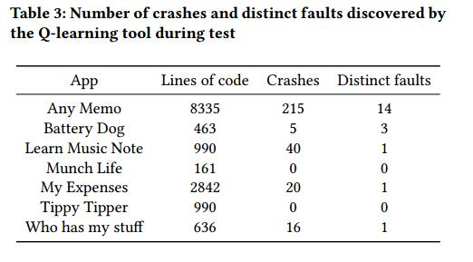

# A Reinforcement Learning Based Approach to Automated Testing of Android Applications

# Abstract

近年来，研究人员积极提出了自动化Android应用程序测试的工具。然而，他们的技术仍然遇到重大困难。首先是实现高代码覆盖率的困难，因为应用程序通常有大量的业务和转换的可能的组合，这使得在测试大型系统场景时会非常的耗时和无效。其次是实现广泛的应用功能的困难，因为某些功能只能通过特定的事件序列来实现。因此，在随机测试中，它们的测试频率较低。面对这些问题，我们应用称为Q学习的强化学习算法，以利用随机和基于模型的测试。 Q-learning代理与Android应用程序交互，逐步构建行为模型并基于模型生成测试用例。代理以最佳方式探索应用程序，尽可能多地显示应用程序的功能。与随机和基于模型的测试相比，使用Q学习的探索提高了代码覆盖率，并且能够检测被测应用程序中的故障

KEYWORDS：Android, Test Input Generation, Reinforcement Learning, Q-Learning 

| relevant information |                                                              |
| -------------------- | ------------------------------------------------------------ |
| *作者*               | Thi Anh Tuyet Vuong， Shingo Takada                      |
| *单位*               | Grad. School of Science and Technology, Keio University Yokohama, Japan Grad. School of Science and Technology, Keio University Yokohama, Japan |
| *出处*               | A-TEST ’18                                                   |
| *原文地址*           | <https://dl.acm.org/citation.cfm?id=3278191>                 |
| *源码地址*           |                                                              |
| *发表时间*           | 2018年                                                       |

# 1. 引言

近年来，全球范围内移动软件的经济增长导致了开发人员对有效测试工具的持续需求。作为对这种需求的回应，研究人员提出了一种不同的工具，可以用尽可能少的人力来自动测试移动应用程序。大多数研究人员选择Android平台来开发他们的工具，因为Android手机的市场份额很大，Android测试工具无疑是有用的，并且与许多开发人员相关。此外，Android平台的开源特性使研究人员更容易访问应用程序和底层操作系统[11]。我们针对Android平台并针对Android应用程序开发测试工具的原因相同。

Android应用程序由一个或多个``activities`组成，这些activities是负责应用程序用户界面（UI）的组件。每个activities都包含各种UI组件，如按钮，文本，复选框等。Android应用程序是基于事件的，这意味着它的行为基于对用户输入事件（UI事件）的响应，如单击，滚动，文本输入它还对来自手机操作系统的系统事件做出反应，如电话呼叫或短信信号等。由于Android应用程序基于事件的特性，相当多的研究都集中在自动生成输入事件以进行测试。无论采用何种技术，目标都是生成相关输入，以尽可能多地显示应用程序的功能。然而，这个领域的研究人员仍面临两个主要挑战：

- 移动应用程序通常包含大量组件和可执行的事件。因此，测试组件和事件的所有可能组合是耗时的，并且难以扩展到大型系统。自动测试工具应仅测试与应用程序相关的事件序列，即导致测试应用程序功能的序列。
- •应用程序的某些功能只能通过特定的事件序列（难以到达的功能）来实现，这使得自动随机测试难以显示和测试它们。

本文的主要贡献是提出强化学习的应用，特别是Q学习，以自动生成Android应用程序的测试输入。使用强化学习，我们构建了一个测试工具，以试错法的方式交互和探索应用程序的功能。在此探索过程中，该工具动态构建应用程序的行为模型，并生成遵循最有可能揭示应用程序功能的事件序列的测试用例。本文还展示了与最先进的自动化测试工具相比较的工具评估。

本文的结构如下：第2节回顾了Android测试技术的相关工作;第3节介绍Q学习，然后第4节解释了Q-Learning工具的提议方法和实现细节;第5节讨论了对拟议工具的评估，最后第6节总结了论文以及对未来工作的建议。

# 2 相关工作

在本节中，我们将研究Android应用程序的自动测试输入生成中的现有技术。

我们可以基于探索策略对测试输入生成技术进行分类[11]。第一种技术是Random Exploration，其中测试工具生成随机事件并将它们发送到应用程序。虽然这种技术快速而简单，但生成的事件通常是不充分的。这是因为应用程序只能响应每个应用程序状态下的许多不同类型的事件中的一些。此外，所产生的事件通常是多余的，并且很难揭示难以触及的功能。 Android Monkey [2]是一个使用随机测试策略的黑盒测试工具，因其简单性而在开发人员中广泛使用。它在生成事件（仅UI事件）方面特别有效，能够每秒向应用程序发送数千个事件。 Monkey通常在测试工具中获得最高的代码覆盖率。然而，从人类与应用程序交互的角度来看，它发现的崩溃很难再现和不切实际。可能更好的说法使用Monkey测试比功能测试更接近压力测试。 Dynodroid [18]也是一种使用随机探索策略的黑盒测试工具，但与Monkey相比它有一些改进。它不是选择随机事件，而是选择与应用程序当前上下文最相关的事件（BiasedRandom策略）。开发人员提供无法自动生成的输入，例如测试前对工具的身份验证信息。 Dynodroid还通过分析应用程序的侦听器来生成相关的系统事件。属于此类别的另一组工具是模糊测试器：DroidFuzzer [29]，Intent Fuzzer [25]，Null Intent Fuzzer [5]等。它们主要旨在生成无效输入，导致被测应用程序崩溃

第二种技术是基于模型的探索策略，其中测试工具静态或动态地构建测试中的应用程序的GUI模型，然后使用该模型来探索应用程序并生成事件。 A3E [10]提出了一种基于动态模型的动态深度探索，该动态模型将每个活动视为应用的状态。这种状态表示的简化导致测试不完整，因为A3E侧重于测试活动之间的转换，而不是每个活动内部的行为。 PUMA [14]是一个动态分析框架。它包含一个通用UI自动化功能（Monkey），可以公开用户可以定义处理程序的高级事件。这些处理程序指导Monkey的探索，并指定应用程序检测以收集动态状态信息或在应用程序执行期间触发环境中的更改。AndroidRipper [3]（也称为GUIRipper [8]或MobiGUITAR [7]）通过爬行构建应用程序模型。在每个活动中，它会注册当前状态下的所有可用事件。然后使用深度优先搜索策略系统地执行所有这些操作。AndroidRipper仅生成UI事件。

最后一类技术是系统探索战略，它使用符号执行和进化算法等算法来指导探索。这种技术被EvoDroid [19]和Acteve [9]等工具使用。 EvoDroid为Android应用程序的系统测试提出了一种演化方法。进化测试将每个测试用例视为个体。根据某些启发式方法演变由许多个体组成的群体，以最大化代码覆盖并减少测试数量。 EvoDroid静态分析测试中的应用程序以构建其行为模型。这个模型允许进化搜索确定如何跨越个体将遗传构成传递给后代[19]。另一方面，Acteve系统地生成基于concolic测试的测试输入。它通过在事件序列之间提出包含的概念来处理类型测试的路径爆炸问题，以避免冗余事件执行。

虽然与产生相同数量的事件的随机策略相比，基于模型的策略似乎更有效，但它仍然面临着许多挑战。基于黑盒模型的测试通常通过在测试之前静态构建应用程序模型或在测试期间动态地通过记录来自正在运行的应用程序的所有可能事件序列来进行。然后它生成测试用例以覆盖模型中的序列[21] [30]。因此，生成的测试用例的有效性很大程度上取决于记录模型的完整性以及应用程序状态的表示方式。一种广泛使用的技术是随机遍历被测应用程序的GUI以构建模型，但这种技术在处理复杂的GUI时是多余的和有限的。原因是某些状态比其他状态更容易到达，因此它们将在随机策略下更频繁地执行;而一些难以触及的国家可能根本不会被执行。停止条件也很难确定，有多少随机探索足以获得完整的模型？

面对难以触及的GUI测试问题，Mariani等人[20]提出了一种用于通用Java桌面软件的黑盒GUI测试工具，它能够向前看并执行某些操作，以便进入难以触及的GUI。他们特别使用Q-learning，一种强化学习技术来实现这一目标。他们的工具（称为AutoBlackTest）动态构建行为模型，并在与被测软件交互时逐步生成测试用例。 AutoBlackTest将被测软件的行为模型表示构建为多方向图。节点表示状态（GUI），而边表示可执行操作。连接节点对应于状态之间的转换。在Q学习算法探索应用程序并观察新状态或执行新操作的每个步骤中，它都扩展了行为模型。当该工具提供初始测试套件时，性能得到改善，该测试套件指示如何测试软件的最相关功能。

TESTAR [13]是一种测试工具，它还使用Q-learning来基于GUI信息生成测试序列，而无需访问源代码。来自TESTAR结果的统计分析指出，Q学习行动选择策略仅在适当选择参数时才有效。 TESTAR可以测试一般桌面软件和基于Web的软件。通过AutoBlackTest和TESTAR，强化学习技术已被证明在独立Java应用程序的GUI测试中非常有用。然而，由于Android平台以及Android应用程序本身的特殊性，这样的工具不能直接用于测试Android应用程序。强化学习需要适应Android环境，需要证明它在Android测试中很有用，因此本研究的目的是：在Android应用程序测试中应用强化学习。

以下部分介绍了强化学习和Q-Learning，提供了必要的背景知识，以便理解论文的其余部分。

# 3 Q-LEARNING 

Q-Learning [26]是一种着名的强化学习技术，受行为主义心理学的启发，软件代理试图以反复试验的方式与环境互动。在每次交互时，代理执行一个动作，然后根据环境的当前状态，它根据其立即奖励并最终转移到环境返回的新状态来评估该动作的后果。总体目标是让代理学习如何以最佳方式行动以最大化累积奖励，这是在执行整个动作序列时收集的奖励。
强化学习问题的数学公式是马尔可夫决策过程。它由[26]定义：

- S：可能状态的集合
- A：可能的行动的集合
- R：给予的奖励的分布（状态，行动）对
- P：转移概率，即给定的下一个状态的分布（状态，动作）对
- γ：折扣因子图1总结了强化学习机制以及环境与代理之间的相互作用。

Q学习代理在一系列离散时间步骤t = 0,1,2,3 ......中的每一个与环境交互[26]。在时间t = 0，环境从初始状态s0∈S开始。然后在从t = 0到完成的每个时间步骤：

- 代理选择在∈A（st）处的动作，其中A（st）是一组状态st中可用的动作

- 环境采样并基于奖励R（.| st，at）的分布返回数值奖励rt

- 环境采样并基于转移概率P返回下一状态st + 1（.| st，at）

- 代理接收奖励rt并在新状态st + 1中结束自身。

在每个步骤t，代理观察环境的当前状态st并基于策略π选择动作。此策略表示代理对环境的行为。因为我们希望代理以最佳方式行事以最大化累积奖励，强化学习的目标是使政策π*最大化累积折扣奖励
$$
\sum_{t>0}γ^tr_t
$$
给定规则π，在Q学习中，我们定义一个称为Qvalue函数（或Q函数）的函数，它告诉一个（状态，动作）对有多好。对于状态s和动作a的任何组合，该函数返回可以通过执行以在a状态以s开始然后遵循规则π的一系列动作可以实现的预期累积奖励。最佳Q值函数Q *是对于所有可能的规则，从给定（状态，动作）对可实现的最大预期累积奖励。
$$
Q^π (s_t , a_t ) = max_π \sum_{t >0}
(γ^tr_t |s = s_0, a = a_t,π)
$$
如果已知下一步Q* s_{t + 1}，a_{t + 1}）的最佳状态 - 动作值，则最优策略是采取最大化r +γQ*的预期回报的动作（s_{t + 1}，a_{t + 1}）其中r是当前步骤的直接奖励。 Q *满足Bellman方程：

$$
Q^∗(s_t , a_t ) = R(s_t , a_t ) + γ max_{a_t+1}
Q(s_{t+1}, a_{t+1})
$$
其中γ是介于0和1之间的折扣率参数。它平衡了即时奖励和累积奖励的相关性：γ越接近0值越立即奖励，γ越接近1值越累积奖励。因此，最优策略π*对应于采用由Q *指定的具有最高Q值的动作.Q学习算法基于等式（3）以迭代地估计Q函数的值。 Q函数使用默认值初始化。每当代理从状态st执行动作以达到状态st + 1并且接收奖励rt时，Q-function被更新为：
$$
Q(s_t , a_t ) ← Q(s_t , a_t ) + α(r_t + γ max_a
Q(s_{t+1}, a) − Q(s_t , a_t ))
$$
在该公式中，α是学习率（0≤α≤1）。 α表示新观察对Q函数估计值的影响。

如果应用于马尔可夫环境，Q学习算法保证收敛到真正的Q函数，具有有限的立即奖励和状态 - 动作对不断更新[28]。

# 4 提议的方法：在Android应用程序测试中进行Q-LEARNING

因为Q-Learning算法具有结合达到某种环境状态的最佳方式的能力，所以它可以用于指导探索到达揭示应用程序功能或难以到达状态的状态。在本文中，Q学习代理探索Android应用程序，可以将其建模为GUI状态的集合，并在每次迭代时生成诸如点击，类型，滑动，滚 动等事件。代理逐渐学习如何以揭示应用程序功能的方式遍历应用程序，然后生成涵盖尽可能多的代码的测试用例。

在本文中，Markov模型的设计目的是为Android应用程序生成测试输入，如下所示：

- S：应用程序状态集。状态由活动名称和相应屏幕上可用的UI事件集确定。通过在每次访问一个状态时添加新状态，在每个Q学习迭代处更新该组访问状态。
- A：可能的GUI事件集。事件对应于可以在GUI组件上执行的动作（例如，按钮点击）。它由元组（GUI组件类名，事件类型，GUI组件唯一资源ID，屏幕上GUI组件的位置）定义。
- R：在给定转换（状态，事件，新状态）时返回数值的奖励函数
- P：在当前状态下执行事件时，转换到新状态由被测应用程序的响应确定
- γ：折扣因子

我们的Q学习测试工具由两个主要角色组成：环境和代理。 Environment表示Android设备和正在测试的应用程序。它有三个辅助模块：Observer，Executor和Reward Function。代理了解被测应用程序的最相关行为模型，并根据此模型生成测试用例。行为模型结合了Q学习的结果。它包含状态空间S，可以在每个状态上执行的事件集以及每个（状态，事件）对的估计Q函数。

为了创建测试用例，代理执行一系列固定数量的事件，也称为episode 。在完成一集之后，代理从已经访问过的那些中选择随机状态并从那里开始新的episode 。一集的长度是影响代理的有效性的一个重要参数，因为它可以为每个测试用例确定搜索空间的大小。该参数在很大程度上取决于应用程序的设计，例如活动的复杂性以及不同活动之间的交互频率。每集的迭代过程如下：

从t = 0到episode 结束，重复：

- 步骤1：环境 - 观察者观察正在测试的应用程序并构建当前的抽象状态。
- 步骤2：代理确认当前状态，并根据策略及其当前行为模型选择要执行的下一个事件。
- 步骤3：环境 - 执行程序执行所选事件。
- 步骤4：环境 - 观察者观察应用程序的新GUI状态
- 步骤5：环境 - 奖励功能计算后续奖励。
- 步骤6：代理更新Q功能。
  

下面给出每个步骤的细节。

## 4.1观察环境（步骤1和4）

Observer是环境的一个模块，其功能是观察环境的当前状态。 Observer的任务是在每次迭代时创建当前GUI树的抽象表示，简称为状态。 GUI树是GUI组件的层次结构，我们可以在运行时使用Android UI Automator从测试中的应用程序中提取。抽象GUI状态由当前活动的名称和当前GUI树中所有UI事件的元组组成。观察者仅在抽象状态中包括属于当前被测试应用程序的GUI元素（通过检查GUI元素属于哪个包）。在本文中，只考虑事件类型的点击，长按，检查（复选框），文本输入和滚动。即使Android平台支持更多的事件类型，我们目前仅支持这5种，因为它们是最广泛使用的，并将其他部分视为未来工作的一部分。除了正在测试的应用程序的UI事件之外，观察者还将菜单按钮单击和设备的后退按钮单击作为可用的UI事件。

## 4.2选择要在当前状态下执行的事件（步骤2）

在每个时间步，代理选择要在当前状态下执行的事件。基于策略π选择该事件。选择良好政策的挑战是平衡exploration and exploitation 之间的贸易往来[26]。为了获得巨大的回报，代理必须更喜欢过去曾经尝试过的事件，并且发现它们在产生奖励方面是有效的。它应该利用它对应用程序的了解并选择具有最高Q值的事件。但是要选择此类事件，代理商还必须探索新事件，以便在将来做出更好的选择。因此，通常考虑概率方法。在这项研究中，我们使用了一种名为ε-greedy的流行政策。代理选择当前状态中可用的随机事件，具有概率ε，或根据当前行为模型选择具有最高Q值的事件，概率为1-ε。

在测试过程开始时，我们希望代理能够探索尽可能多的状态，以便构建最接近应用程序的完整模型，因此，应使用大的ε值。然而，一旦模型构建得很好，我们希望代理遵循Q值函数来快速达到应用程序的功能并测试它们，因此预期ε值较小。在本文中，我们从ε= 1开始以实现最大探索，然后我们在第一次100集期间均匀地减小其值，直到最终的最小值（在评估期间的实证研究之后为0.5）以改变代理的行为exploitation 。

## 4.3在环境中执行事件（步骤3）

Executor模块通过UI Automator [15]和Android Debug Bridge [1]在实际的Android设备或模拟器上执行事件。 Executor可以执行观察者可观察到的所有事件类型：单击，长按，检查，文本输入，滚动。对于文本输入，文本在执行期间随机生成。

## 4.4计算奖励（步骤5）

通过奖励函数R在环境中计算奖励，奖励函数R基本上告诉代理哪个事件是好的以及哪个是坏的。在确定奖励函数时，需要考虑两个方面：GUI更改和执行频率。

为了启发式地识别触发新功能的事件，奖励函数支持导致抽象GUI状态的许多变化并给予他们更高奖励的事件。这种推理类似于AutoBlackTest [20]中使用的推理。给定两个状态s1和s2，奖励函数通过比较和识别s2中但不在s1中的GUI事件的数量来计算从s1到s2的变化程度，描述为| s2 \ s1 |。然后通过比率| s2 \ s1 | / | s2 |来确定相对变化其中| s2 |是| s2 |中的GUI事件数。此公式考虑新出现在s2中的组件，但不考虑从s1中消失的组件。这样可以避免为触发应用程序活动之间跳转的事件提供过大的值。它适度地增加了Q值，因此我们可以测试每个活动中活动和功能之间的转换。

添加了另一个因素来帮助代理平衡the exploration and exploitation ：执行频率。我们计算每个事件执行的次数，并随着执行频率的增加而减少奖励。与一定次数的迭代之后的GUI改变奖励相比，该奖励值变得相对较小。但它有助于Q-agent在测试开始时更快地探索新状态，从而提高其状态空间的完整性。
总之，奖励函数的定义由以下公式给出：
$$
r_t = R(s_t ,a_t ,s_{t+1}) = \frac{|s_{t+1} \ s_t |}{|s_{t+1}|} 
+ \frac{1}{f(s_t,a_t )}
$$
其中f（st，at）是处于状态 st 直到时间 t 的事件 at 的执行频率。

## 4.5 更新Q值函数（步骤6）

代理根据当前迭代期间发生的转换构建和更新Q值函数，即行为模型。

代理在每次迭代之后使用等式（4）更新Q值函数，学习率α= 1并且折扣率γ= 0.9。学习率α接近1会对新模型的新观察产生更大的影响。我们选择值α= 1，以便代理快速了解应用程序的行为方式。折扣因子平衡了即时奖励与未来事件的相关性，值0.9最大化了整个episode 期间收集的奖励，而不是最大化直接奖励。因此，等式（4）变为
$$
Q（s_t，a_t）←r_t + 0.9 max_a Q（s_{t + 1}，a）
$$
当动作到达未被访问的状态时，公式的第二项是因为我们没有对该状态的Q值进行任何估计。在这种情况下，Q值只是即时奖励。否则，根据目标状态中的事件的奖励值和Q值来计算Q值。

特殊功能用于处理转换导致退出被测应用程序的情况。在这种情况下，测试工具随机执行最多数量的事件，这些事件不属于被测应用程序。这个最大数量是两个事件。每次执行后，我们都会检查该工具是否返回到测试中的应用程序。如果是，我们正常进行测试;如果没有，我们强制该工具返回应用程序的启动器活动。触发退出应用程序的事件被给予0奖励，因为我们避免执行它。这是必要的，因为我们无法在正常的应用程序退出和应用程序崩溃（我们认为存在故障）之间进行区分。

## 4.6实现

该工具是用Python 2.7编写的。该工具的架构和工作流程如图2所示。为了与Android设备和被测应用程序进行交互，我们使用Android UI Automator [15]的python库以及Android Debug Bridge [1]

# 5评估

## 5.1评估指标

衡量工具有效性的指标是代码覆盖率，这是评估测试工具的通用指标。具体而言，我们使用行覆盖来评估Q-Learning工具并与其他测试工具进行比较，因为它是最小的覆盖单位。

该工具的评估旨在回答以下研究问题：

- RQ1：与最先进的测试工具相比，该工具是否能提高代码覆盖率？
- RQ2：该工具是否能够检测故障？

该工具与最先进的测试工具进行了比较：Android Monkey，Dynodroid和PUMA。

## 5.2目标应用

我们在七个开源Android应用程序上评估了我们的工具：AnyMemo [22]，Battery Dog [16]，Learn Music Notes [24]，Munch Life [23]，My Expenses [27]，Tippy Tipper [12和 Who has mystuff [6]。它们具有各种大小和复杂性，具有静态和动态内容。表1提供了每种应用的简短描述。

## 5.3评估设置

每个工具都在AndroTest [11]提供的单独虚拟机上运行。 AndroTest为各种应用程序的集合评估不同的测试工具提供了一个很好的基准。所有虚拟机都运行Ubuntu 32位，带有6114 MB基本内存和2个处理器。对于每个测试会话，应用程序仅在默认设置的模拟器上安装。为了防止先前会话的寄生数据，在开始新测试之前，已删除模拟器上的所有数据并重新启动模拟器。每个测试工具在每个应用程序上运行四次，然后将平均值作为最终结果。

## 5.4获得结果

### 5.4.1代码覆盖率

代码覆盖率是使用Emma [4]获得的，这是一个帮助程序类，它在运行测试之前嵌入在被测应用程序中。自定义脚本用于从设备中提取代码覆盖率，并且每隔五分钟将其转换为人类可读的报告。该报告提供有关包，类，块和行覆盖的详细信息。 Emma返回的覆盖范围考虑了检测类的代码行。我们根据Emma的结果计算实际覆盖率（仅计算应用程序的代码行数）并在评估中使用它。

### 5.4.2应用程序故障

当应用程序意外崩溃时，在运行该工具时会发现应用程序故障。错误的堆栈跟踪由logcat记录，logcat是一个转储系统消息的命令行工具。通过Android Debug Bridge（adb）从手机或模拟器中检索错误跟踪。

## 5.5评估结果

我们的工具获得的代码覆盖率与Android Monkey，Dynodroid和Puma的结果进行了比较。我们执行每个工具一小时，然后我们停止它，即我们比较执行一小时后的结果

### 5.5.1 RQ1：与最先进的测试工具相比，该工具是否提高了代码覆盖率？

表2比较了七个目标应用程序的代码覆盖率，图3显示了Q学习工具实现的代码覆盖率的变化。

除了Battery Dog，我们的工具获得的代码覆盖率略低于Dynodroid，所提议的方法在7个应用程序中有6个优于DynoDroid和Puma。这种差异可以解释为Dynodroid可以生成系统事件和UI事件，而我们的工具只能生成UI事件。在Battery Dog的情况下，应用程序监视手机的电池电量，它响应系统事件，我们的工具无法处理。

对于大多数应用程序，Android Monkey获得了更高的代码覆盖率，因为它能够每秒有效地生成大量事件，远远超过我们的工具。

### 5.5.2 RQ2：工具是否能够检测到应用程序中的故障？

尽管代码覆盖率是测试工具有效性的良好指标，但测试的最终目标是发现应用程序中的错误。因此，我们需要根据检测到的故障来评估该工具。在每次测试期间，通过Android Debug Bridge记录设备的日志，然后进行分析以发现与应用程序相关的故障。对于每个应用程序，我们计算在测试期间由应用程序引起的错误（或崩溃）的数量以及不同故障的数量。表3总结了实验结果。我们的工具能够在大多数应用程序中触发崩溃并发现故障。在一些应用中，多次崩溃是由同一故障引起的

# 6 对有效性的威胁

有效性的两个主要威胁是内部和外部有效性。外部有效性的一个威胁是用于评估的应用程序数量。虽然我们只有七个应用程序，但我们尝试通过选择不同类别和不同大小的应用程序来最小化这种威胁。
对内部有效性的威胁是我们方法的非确定性，这可能导致每次运行获得不同的代码覆盖率。因此，我们执行了多次运行以减少此威胁。

# 7结论

本文提出了一种使用Q学习算法的Android应用程序测试强化学习方法。所提出的工具基于Q学习代理，并通过让代理以试错方式与应用程序交互来逐步构建应用程序的行为模型。 Q-learning代理以最佳方式探索应用程序，达到应用程序最相关的功能，从而生成测试用例。对该工具的评估已经证明，与现有测试工具相比，该工具在代码覆盖率方面有显着改进，并且能够发现故障。

未来改进我们的工具包括详细调查Q学习算法的奖励函数，支持更多类型的事件，如系统和上下文事件，以及处理非确定性。