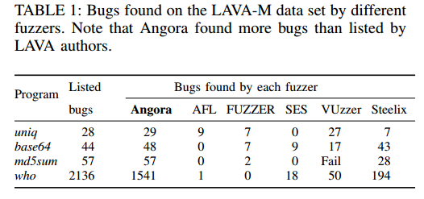

# Abstract

​	Fuzzing是一种用于查找软件错误的流行技术。然而，最先进的模糊器的性能还有很多不足之处。基于符号执行的模糊器产生高质量输入但运行缓慢，而基于随机变异的模糊器运行速度快但难以产生高质量输入。我们提出了一种新的基于突变的模糊器Angora，它的性能远远超过了最先进的模糊器。Angora的主要目标是通过解决路径约束来增加分支覆盖率而无需符号执行。**为了有效地解决路径约束，我们引入了几个关键技术：可扩展的字节级污点跟踪，上下文敏感的分支计数，基于梯度下降的搜索和输入长度探索**。在LAVA-M数据集上，Angora发现了几乎所有注入的错误，发现了比我们比较的任何其他模糊器更多的错误，并且发现错误是程序中第二好的模糊器的8倍。Angora还发现了LAVA作者注射但却无法触发的103个错误。我们还在八个流行的，成熟的开源程序上测试了Angora。Angora分别在file，jhead，nm，objdump和size中发现了6,52,29,40和48个新错误。我们测量了Angora的覆盖范围，并评估了其关键技术如何促成其令人印象深刻的性能。

| relevant information |                                                              |
| :------------------- | ------------------------------------------------------------ |
| *作者*               | Peng Chen, Hao Chen                                          |
| *单位*               | ShanghaiTech University, University of California, Davis     |
| *出处*               | IEEE S&P’18                                                  |
| *原文地址*           | https://github.com/wtwofire/database/blob/master/papers/fuzzing/2018Angora%20Efficient%20Fuzzing%20by%20Principled%20Search.pdf |
| *源码地址*           | https://github.com/AngoraFuzzer/Angora                       |
| *发表时间*           | 2018年                                                       |

# 1 简介

​	Fuzzing是一种用于查找软件错误的流行技术。基于覆盖的模糊器面临着如何创建输入以探索程序状态的关键挑战。一些模糊器使用符号执行来解决路径约束[5,8]，但符号执行很慢，无法有效地解决许多类型的约束[6]。为了避免这些问题，AFL不使用符号执行或任何重量级程序分析[1]。它对程序进行插桩，以观察哪些输入探索新的程序分支，并将这些输入作为进一步变异的种子。 AFL在程序执行时产生很低的开销，但是它创建的大多数输入都是无效的（即，它们无法探索新的程序状态），因为它盲目地改变输入而不利用程序中的数据流。几个模糊器为AFL添加了启发式算法来解决简单的判断，例如“魔术字节”[25,19]，但它们无法解决其他路径约束。

​	我们设计并实现了一个名为Angora的模糊器，它通过解决路径约束而不使用符号执行来探索程序的状态。Angora跟踪未探测的分支并尝试解决这些分支上的路径约束。我们引入了以下技术来有效地解决路径约束。

- 上下文敏感的分支覆盖。 AFL使用上下文敏感分支覆盖来近似程序状态。我们的经验表明，为分支覆盖添加上下文使Angora能够更普遍地探索程序状态（第3.2节）。

- 可扩展的字节级污点跟踪。大多数路径约束仅依赖于输入中的几个字节。通过跟踪哪些输入字节流入每个路径约束，Angora只改变这些字节而不是整个输入，因此大大减少了探索空间（第3.3节）。

- 基于梯度下降搜索。当改变输入以满足路径约束时，Angora避免了符号执行，这是昂贵的并且不能解决许多类型的约束。相反，Angora使用机器学习中流行的梯度下降算法来解决路径约束（第3.4节）。

- 类型和形状推断。输入中的许多字节共同用作程序中的单个值，例如，在程序中用作32位有符号整数的输入中的四个字节的组。为了允许梯度下降有效搜索，Angora定位上述组并推断其类型（第3.5节）。

- 输入长度探索。只有当输入的长度超过某个阈值时，程序才可以探索某些状态，但是符号执行和梯度下降都不能告诉模糊器何时增加输入的长度。 Angora检测输入长度何时可能影响路径约束，然后充分增加输入长度（第3.6节）。

​        Angora大大超过了最先进的模糊器。表1比较了Angora与其他模糊器在LAVA-M数据集上发现的漏洞[9]。Angora在数据集中的每个程序中发现了更多错误。特别是，Angora发现了1541个漏洞，是第二个最好的模糊器Steelix发现的漏洞数量的8倍。此外，Angora发现了LAVA作者注射但却无法触发的103个错误。我们还在八个流行的，成熟的开源程序上测试了Angora。Angora分别在file，jhead，nm，objdump和size中发现了6,52,29,40和48个新错误（表5）。我们测量了Angora的覆盖范围，并评估了其关键技术如何促成其令人印象深刻的性能。

#  2 背景：AFL

​	模糊测试是一种自动测试技术，用于查找错误。 American Fuzzy Lop（AFL）[1]是一种基于突变的灰盒模糊器。 AFL采用轻量级编译时插桩和遗传算法来自动发现可能触发目标程序中新内部状态的测试用例。作为基于覆盖率的模糊器，AFL生成输入以遍历程序中的不同路径来触发错误。

## 2.1 分支覆盖范围

​	AFL通过一组分支来测量路径。在每次运行期间，AFL计算每个分支执行的次数。它将分支表示为元组（lprev; lcur），其中lprev和lcur分别是条件语句之前和之后的基本块的ID。AFL通过使用轻量级检测获取分支覆盖率信息。在编译时在每个分支点注入插桩。对于每次运行，AFL分配路径跟踪表以计算每个条件语句的每个分支执行的次数。表的索引是分支的散列，h（lprev; lcur），其中h是散列函数。

​	AFL还在不同的运行中保留全局分支覆盖表。每个条目都包含一个8位向量，用于记录分支在不同运行中执行的次数。该向量b中的每个位表示一个范围：b0,……,b7分别代表范围[1]，[2]，[3]，[4; 7]，[8; 15]，[16; 31]，[32; 127]，[128; ∞）。例如，如果设置了b3，则表示存在执行此分支执行4到7次的运行，包括。

​	AFL比较路径跟踪表和分支覆盖表，以启发式方式确定新输入是否触发程序的新内部状态。如果发生以下任一情况，输入将触发新的内部状态：

- 程序执行新分支，即路径跟踪表具有此分支的条目，但分支覆盖表没有此分支的条目。

- 存在一个分支，其中当前运行中执行的此分支的次数n与先前的任何运行不同。 AFL通过检查表示n的范围的位是否被设置在分支覆盖表中的相应位向量中来近似地确定这一点。

## 2.2 变异策略

​	AFL随机应用以下变异[3]。

- 位或字节翻转。

- 尝试设置“有趣”的字节，单字或双字。

- 将小整数加到或减去字节，单字或双字。

- 完全随机的单字节集。

- 块删除，通过覆盖或插入来复制块，或块memset。

- 在随机位置拼接两个不同的输入文件。

# 3 设计

## 3.1 概述

​	AFL和其他类似的fuzzer使用分支覆盖作为度量。但是，在计算分支覆盖范围时，它们没有考虑调用上下文。我们的经验表明，没有上下文，分支覆盖将无法充分探索程序状态。因此，我们建议使用上下文敏感分支覆盖作为覆盖度量（第3.2节）。

​	算法1显示了Angora的两个阶段：插桩和fuzzing循环。在fuzzing循环的每次迭代期间，Angora选择一个未探测的分支并搜索探索该分支的输入。我们介绍了以下关键技术，以有效地找到输入。

- 对于大多数条件语句，其判断仅受输入中的几个字节的影响，因此改变整个输入将是徒劳的。因此，在探索分支时，Angora会确定哪些输入字节流入相应的判断，并专注于仅改变这些字节（第3.3节）。

- 确定要改变的输入字节后，Angora需要决定如何改变它们。使用基于随机或启发式的突变不能有效地找到令人满意的值。相反，我们将分支上的路径约束视为输入上黑盒函数的约束，并且我们调整梯度下降算法来解决约束（第3.4节）。

- 在梯度下降期间，我们在其参数上评估blackbox函数，其中一些参数由多个字节组成。例如，当输入中的四个连续字节总是作为整数流一起用于条件语句时，我们应该将这四个字节视为函数的单个参数而不是四个独立参数。为了实现这一目标，我们需要推断输入中的哪些字节统一用作单个值以及值的类型是什么（第3.5节）。

- 仅仅改变输入中的字节是不够的。只有在输入超过阈值后才会触发一些错误，但这会在决定输入长度时产生两难。如果输入太短，则可能不会触发某些错误。但如果输入太长，程序可能运行得太慢。大多数模糊器使用临时方法改变输入的长度。相比之下，Angora使用代码检测程序，该代码检测较长输入何时可以探索新分支并确定所需的最小长度（第3.6节）。

​	图1显示了fuzzing条件语句的步骤图。图2中的程序演示了这些步骤。

- 字节级污点跟踪：当使用字节级污点跟踪对第2行的条件语句进行模糊测试时，Angora确定字节1024-1031流入此表达式，因此它仅改变这些字节。

- 基于梯度下降的搜索算法：Angora需要分别找到在第2行上运行条件语句的两个分支的输入。Angora将条件语句中的表达式视为输入x上的函数f（x），并使用梯度下降来找到两个输入x和x'，使得f（x）> 0且f（x'）≤0。

- 形状和类型推断：f（x）是向量x上的函数。在梯度下降期间，Angora分别计算f的每个分量的f的偏导数，因此它必须确定每个分量及其类型。在第2行，Angora确定x由两个组件组成，每个组件由输入中的四个字节组成，并具有32位有符号整数类型。

- 输入长度探索：除非输入至少有1032个字节，否则main不会调用foo。我们不是盲目地尝试更长的输入，而是检测从输入读取的常用函数，并确定更长的输入是否会探索新的状态。例如，如果初始输入短于1024字节，则第12行上的条件语句将执行true分支。

​       由于fread的返回值与1024进行比较，因此Angora知道只有至少1024字节长的输入才能探索错误分支。类似地，第16行和第19行的检测指示Angora将输入扩展到至少1032个字节以执行函数foo。

##  3.2 上下文敏感的分支计数

​	第2节描述了AFL的分支覆盖表。它的设计有几个优点。首先，它节省空间。分支数量与程序大小呈线性关系。其次，使用范围来计算分支执行在关于不同执行计数是否指示了程序新的内部状态提供了良好启发。当执行计数很小（例如，小于4）时，计数的任何变化都是显着的。然而，当执行计数很大（例如，大于32）时，变化必须足够大以被认为是重要的。

​	但这种设计有局限性。由于AFL的分支对上下文不敏感，因此它们无法区分不同上下文中同一分支的执行，这可能会忽略程序新的内部状态。图3说明了这个问题。考虑第3行分支的覆盖范围。在第一次运行期间，程序采用输入“10”。当它在第19行调用f（）时，它在第4行执行true分支。之后，当它在第21行调用f（）时，它在第10行执行false分支。由于AFL对分支的定义是上下文不敏感的，它认为两个分支都已执行。之后，当程序采用新输入“01”时，AFL认为此输入不会触发新的内部状态，因为第4行和第10行的分支都在上一次运行中执行。但实际上这个新输入触发了一个新的内部状态，因为当输入[2] == 1时它将导致第6行崩溃。

​	我们将上下文合并到分支的定义中。我们将分支定义为元组（lprev, lcur, context），其中l prev和lcur分别是条件语句之前和之后的基本块的ID，context是h（stack）其中h是散列函数，并且stack包含调用堆栈的状态。例如，让图3中的程序首先在输入10上运行。在它从第19行进入f（）之后，它将执行分支（l3; l4; [l19]）。然后，在从第21行进入f（）之后，它将执行分支（l3; l10; [l21]）。相反，当程序在输入“01”上执行时，它将执行分支（l3; l10; [l19]），然后执行（l3; l4; [l21]）。通过将调用上下文合并到分支的定义中，Angora可以检测到第二次运行会触发新的内部状态，这将在改变输入时[2]时导致第6行产生carsh。

​	向分支添加上下文会增加独特分支的数量，这在发生深度递归时可能会很明显。我们当前的实现通过选择用于计算调用堆栈的散列的特定函数h来缓解该问题，其中h计算堆栈上所有调用位置的ID的xor。当Angora插桩程序时，它会为每个调用点分配一个随机ID。因此，当函数f递归调用自身时，无论Angora将同一调用站点的ID推送到调用堆栈多少次，h（堆栈）最多输出两个唯一值，在函数f中这最多会使独特分支的数量增加一倍。我们对现实世界程序的评估表明，在结合上下文后，独特分支的数量增加了多达7.21倍（表7），以换取改进代码覆盖的好处（图7）。

## 3.3 字节级别的污点跟踪

​	Angora的目标是创建执行未开发分支的输入。当它尝试执行未探测的分支时，它必须知道输入中的哪些字节偏移影响分支的谓词。因此，Angora需要字节级别的污点跟踪。然而，污点跟踪是昂贵的，尤其是在单独跟踪每个字节时，因此AFL避免了它。我们的主要观点是，在大多数程序运行中都不需要进行污点跟踪。一旦我们对输入运行了污点跟踪（图1中的步骤1），我们就可以记录哪些字节偏移流入每个条件语句。然后，当我们改变这些字节时，我们可以在没有污点跟踪的情况下运行程序。这通过其许多突变来分摊一个输入上的污点跟踪成本，这使得Angora具有与AFL类似的输入执行吞吐量（第5.6节）。

​	Angora将程序中的每个变量x与污点标签tx相关联，污点标签tx表示输入中可能流入x的字节偏移量。污点标签的数据结构对其内存占用量有很大影响。一个简单的实现是将每个污点标签表示为位向量，其中每个位i表示输入中的第i个字节。然而，由于该位向量的大小在输入的大小上线性增长，因此该数据结构对于大输入将是禁止的，但是在某些程序中找到错误需要大量输入。

​	为了减少污点标签的大小，我们可以将位向量存储在表中，并使用表中的索引作为污点标签。只要表中条目数的对数远小于最长位向量的长度（通常是这种情况），我们就可以大大减小污点标签的大小。

​	但是，这种数据结构带来了新的挑战。污点标签必须支持以下操作：

- INSERT（b）：插入位向量b并返回其标签。

- FIND（t）：返回污点标签t的位向量。

- UNION（tx; ty）：返回污点标签，表示污点标签tx和ty的位向量的并集。

​       FIND代价很低，但UNION很高。 UNION采取以下步骤。首先，它找到两个标签的位向量并计算它们的联合u。这一步代价很低。接下来，它搜索表以确定u是否已存在。如果没有，它会增加u。但如何高效搜索？线性搜索会很昂贵。或者，我们可以构建一个位向量的哈希集，但是如果它们中有很多并且每个位向量都很长，那么计算哈希码和存储哈希集的空间就会花费很多时间。由于UNION是我们在算术表达式中跟踪污染数据时的常见操作，因此它必须是高效的。注意，我们不能使用UNION-FIND数据结构，因为矢量不是不相交的，即两个不同的位矢量可能在同一位置具有1。

​	我们提出了一种新的数据结构，用于存储位向量,允许有效INSERT，FIND和UNION。对于每个位向量，数据结构使用无符号整数为其分配唯一标签。当程序插入新的位向量时，数据结构会为其分配下一个可用的无符号整数。

​	数据结构包含两个组件。

- 二叉树将位向量映射到其标签。每个位向量b由级别为|b|的唯一树节点vb表示，其中|b|是b的长度。 vb存储b的标签。要从根到达vb，检查b0,b1…顺序。如果bi为0，则转到左边的子节点;否则，去右边的子节点。每个节点都包含一个指向其父节点的后向指针，以允许我们从vb开始检索位向量。

- 查找表将标签映射到其位向量。标签是该表的索引，相应的条目指向表示该标签的位向量的树节点。

​       在该数据结构中，树中的所有叶子表示位向量，并且没有内部节点表示位向量。但是，树中的许多节点可能是不必要的。例如，如果向量x00 *在树中但没有向量x0 [01] * 1 [01] *在树中，其中x是任何位序列，那么就不必在节点之后存储任何节点表示x，因为x只有一个是叶子的结点，而这个叶子代表x00 *。这里我们使用正则表达式的通用符号，其中x *表示x重复零次或多次，[xy]表示x或y。这个观察允许我们在将一个向量插入树中时修剪向量，如下所示：

1. 删除向量的所有尾随0。

2. 跟踪向量中的位，从第一位到最后一位，遍历树。

- 如果位为0，请跟随左节点

- 否则，请跟随右节点。

- 如果节点不存在，请创建它。

3. 将向量的标签存储在我们访问的最后一个节点中。

​       算法2详细描述了这种插入操作。

​	算法3和算法4分别描述了FIND和UNION操作。请注意，当我们创建节点时，最初它不包含标签。稍后，如果此节点是我们插入位向量时访问的最后一个节点，我们将位向量的标签存储在此节点中。通过此优化，此树具有以下属性：

- 每个叶节点都包含一个标签。

- 内部节点可能包含标签。我们可能会在没有标签的内部节点中存储标签，但我们永远不会在任何内部节点中替换标签。

​        该数据结构极大地减少了用于存储位向量的存储器占用。设每个位向量的长度为n，并设有l个位向量。如果我们天真地将所有位向量存储在查找表中，则需要O（nl）空间。但是，在我们的数据结构中，树中的节点数是O（l）。每个节点可以存储最多一个索引到查找表。由于查找表具有l个条目并且每个条目是指针并且因此具有固定大小，因此查找表的大小是O（l），并且查找表的每个索引具有O（log 1）位。因此，总空间要求为O（l·log l）。

## 3.4 基于梯度下降的搜索算法

​	字节级污点跟踪发现输入流中的哪些字节偏移成为条件语句。但是如何改变输入以运行未探索的分支语句？大多数模糊测试者随机地或使用粗略的启发式方法改变输入，但这些策略不太可能快速找到合适的输入值。相比之下，我们将此视为搜索问题，并利用机器学习中的搜索算法。我们在实现中使用了梯度下降，但其他搜索算法也可能有效。

​	在这种方法中，我们将用于执行分支断定看作黑盒函数f（x）的约束，其中x是输入中流入判断的值的向量，并且f（）捕获计算在从程序开始到此判断的路径。 f（x）有三种类型的约束：

1. f（x）<0。

2. f（x）<= 0。

3. f（x）== 0。

​       表2显示我们可以将所有形式的比较转换为上述三种类型的约束。如果条件语句的判断包含逻辑运算符&&或||，则Angora会将语句拆分为多个条件语句。例如，它将（a && b）{s} else {t}拆分为if（a）{if（b）{s} else {t}} else {t}。

​	算法5显示了搜索算法。从初始x0开始，找到x使得f（x）满足约束。请注意，为了满足每种类型的约束，我们需要最小化f（x），并且我们使用梯度下降来实现此目的。

​	梯度下降找到函数f（x）的最小值。该方法是迭代的。每次迭代都从x开始，计算∇xf（x）（x处的f（x）的梯度），并将x更新为x-ε∇xf（x），其中ε是学习率。

​	在训练神经网络时，研究人员使用梯度下降来找到一组最小化训练误差的权重。然而，梯度下降的问题在于它有时可能会陷入局部最小值，而不是全局最小值。幸运的是，这在模糊测试中通常不是问题，因为我们只需要找到足够好的输入x而不是全局最优x。例如，如果约束是f（x）<0，那么我们只需要找到一个x，其中f（x）<0而不是f（x）是全局最小值。

然而，当将梯度下降应用于模糊时，我们面临着独特的挑战。梯度下降需要计算梯度∇xf（x）。在神经网络中，我们可以用分析形式编写∇xf（x）。然而，在模糊测试中，我们没有f（x）的分析形式。其次，在神经网络中，f（x）是连续函数，因为x包含网络的权重，但在模糊中f（x）通常是离散函数。这是因为典型程序中的大多数变量都是离散的，因此x中的大多数元素都是离散的。

​	我们使用数值近似解决了这些问题。 f（x）的梯度是唯一的矢量场，其每个点x处的任意单位矢量v的点积是f沿v的方向导数。我们用δf(x) /δ（xi）= f（x+δv i）-f（x））/δ逼近每个方向导数其中δ是小的正值（例如，1），vi是第i维的单位矢量。为了计算每个方向导数，我们需要运行程序两次，一次使用原始输入x，一次使用扰动输入x + δvi。在第二次运行中，程序可能无法到达计算f（x +δvi）的程序点，因为程序在较早的条件语句中采用了不同的分支。当发生这种情况时，我们将δ设置为小的负值（例如，-1）并尝试再次计算f（x +δvi）。如果成功，我们会根据它计算方向导数。否则，我们将导数设置为零，指示梯度下降不要在此方向上移动x。计算梯度的时间与矢量x的长度成比例，因为Angora分别计算每个方向导数。第3.5节将描述如何通过合并在程序中用作单个值的连续字节来减少x的长度。

​	理论上，梯度下降可以解决任何约束。实际上，梯度下降可以解决约束的速度取决于数学函数的复杂性。

- 如果f（x）是单调的或凸的，那么即使f（x）具有复杂的分析形式，梯度下降也可以快速找到解。例如，考虑约束f（x）<0，其中f（x）使用一些多项式系列近似log（x）。由于复杂的分析形式，符号执行很难解决这种约束。但是，梯度很容易解决，因为f（x）是单调的。

- 如果梯度下降的局部最小值满足约束，则查找解决方案也很快。

- 如果局部最小值不满足约束条件，则Angora必须随机走到另一个值x并从那里开始递减渐变，希望找到满足约束的另一个局部最小值。

​       请注意，Angora不会生成f（x）的分析形式，而是运行程序来计算f（x）。

## 3.5形状和类型推断

​	天真地，我们可以让输入中的x中的每个元素成一个字节流入到判断处。但是，由于类型不匹配，这会导致梯度下降问题。例如，让程序将输入中的四个连续字节b3b2b1b0视为整数，并让xi表示该整数值。当计算f（x +δvi）时，我们应该将δ加到这个整数。但是如果我们天真地将每个字节b3，b2，b1，b0分配给x中的不同元素，那么我们将在每个字节上计算f（x +δvi），但这是不合适的。

​	程序将这些字节组合为单个值并仅使用表达式中的组合值，因此当我们向除最低有效字节之外的任何字节添加小的δ时，我们将显着更改此组合值，这将导致计算的偏导数是一个不正确的真实值的近似。

​	为了避免这个问题，我们必须确定（1）输入中的哪些字节总是一起用作程序中的单个值，以及（2）值的类型是什么。我们称第一个问题为形状推理，第二个问题类型推断，并在动态污点分析过程中解决它们。

​	对于形状推断，最初输入中的所有字节都是独立的。在污点分析期间，当指令将输入字节序列读入变量，其中序列的大小与基本类型的大小匹配（例如，1,2,4,8字节）时，Angora将这些字节标记为属于相同的值。当冲突发生时，Angora使用最小的尺寸。对于类型推断，Angora依赖于对值进行操作的指令的语义。例如，如果指令对有符号整数进行操作，则Angora将相应的操作数推断为有符号整数。当相同的值同时用作有符号和无符号类型时，Angora将其视为无符号类型。请注意，当Angora无法推断出值的精确大小和类型时，这并不能防止梯度下降找到解决方案 - 搜索只需要更长的时间。

## 3.6 输入长度探索

​	与大多数其他模糊器一样，Angora开始使用尽可能小的输入进行模糊测试。但是，仅当输入长于阈值时才执行某些分支。这给模糊器带来了两难境地。如果模糊器使用太短的输入，则无法探索这些分支。但如果它使用太长的输入，程序可能运行缓慢甚至内存不足。大多数工具使用临时方法尝试不同长度的输入。相比之下，Angora只有在这样做才能探索新的分支时才会增加输入长度。

​	在污点跟踪期间，Angora将类似read的函数调用中的目标内存与输入中的相应字节偏移相关联。它还使用特殊标签标记来自读取调用的返回值。如果在条件语句中使用返回值并且不满足约束，则Angora会增加输入长度，以便读取调用可以获取它请求的所有字节。例如，在图2中，如果第12行的条件语句为false，则Angora会扩展输入长度，以便fread可以读取它请求的所有1024个字节。我们的标准并非详尽无遗，因为程序可以消耗输入并以我们未预料到的方式检查其长度，但是一旦我们发现它们就很容易将这些标准添加到Angora。

# 4  实现

## 4.1 插桩

​	对于每个要模糊的程序，Angora通过使用LLVM Pass [18]检测程序来生成相应的可执行文件。

- 插桩收集条件语句的基本信息，并通过污点分析将条件语句链接到其对应的输入字节偏移。在每个输入上，Angora只运行此步骤一次（而不是在改变此输入时）。

- 记录执行跟踪以识别新输入。

- 在运行时支持上下文（第3.2节）。

- 在判定中收集表达式值（第3.4节）。

​       为了支持3.3节中描述的可扩展字节级污点跟踪，我们通过扩展DataFlowSanitizer（DFSan）[21]为Angora实现了污点跟踪。我们为FIND和UNION操作实现了缓存设施，显着加快了污点跟踪。

​	Angora依赖于LLVM 4.0.0（包括DFSan）。它的LLVM pass包含820行C ++代码，不包括DFSan，运行时有1950行C ++代码，包括用于存储污点标签的数据结构以及用于污染输入和跟踪条件语句的钩子。

​	除了具有两个分支的if语句之外，LLVM IR还支持switch语句，这可能会引入多个分支。在我们的实现中，为方便起见，Angora将每个switch语句转换为if语句序列。

​	Angora识别libc函数，用于在条件语句中出现时比较字符串和数组。

​	例如，Angora将“strcmp（x，y）”转换为“x strcmp y”，其中strcmp是Angora理解的特殊比较运算符。

## 4.2 Fuzzer

​	我们以4488行Rust代码中实现了Angora。我们使用fork server [30]和CPU绑定等技术优化了Angora。

# 5 评估

​	我们分三个步骤评估了Angora。首先，我们将Angora的性能与其他最先进的模糊器进行了比较。然后，我们测量了Angora的测试覆盖率及其在现实世界程序中发现未知错误的能力。最后，我们评估了它的关键新颖特征。

​	我们在64位Ubuntu 16.04 LTS的Intel Xeon E5-2630 v3和256 GB内存的服务器上运行了所有实验。尽管Angora可以同时对多个内核上的程序进行模糊处理，但我们将其配置为在评估期间仅在一个内核上模糊该程序，以将其性能与其他模糊器进行比较。我们对每个实验进行了五次运行并报告了平均性能。

## 5.1 Angora与其他模糊器进行比较

​	比较模糊器的最终指标是它们发现错误的能力。一个好的测试集应该包含具有实际错误的真实程序。 LAVA是一种通过在程序源代码中注入大量实际错误来生成真实语料库的技术[9]。作者通过在每个程序中注入多个错误来创建语料库 LAVA-M。 LAVA-M由四个GNU coreutils程序组成：uniq，base64，md5sum和who。每个注入的bug都有一个唯一的ID，在触发bug时会打印出来。

​	我们将Angora与以下最先进的模糊器进行了比较：

- FUZZER（基于覆盖的模糊器）和SES（符号执行和SAT求解）。 LAVA的作者将它们都运行了5个小时[9]。

- VUzzer：使用“魔术字节”策略的模糊器[25]。它的作者报告了LAVA-M程序中发现的错误数量，但没有报告运行时间。

- Steelix：一个模糊器在LAVAM上表现优于VUzzer [19]。作者通过运行模糊器5小时报告了LAVA-M程序中发现的错误数量。[11]

- AFL 2.51b：撰写本文时的最新版AFL。我们运行AFL五个小时，我们为AFL提供了一个CPU核心，用于对每个程序进行模糊测试。

- Angora：我们使用与AFL相同的设置（每个程序一个CPU核心）。

​       表1比较了所有模糊器发现的错误。AFL表现最差，在所有程序中总共发现了10个错误。 VUzzer的作者无法在md5sum上运行它，因为LAVA作者错误地修改了md5sum，导致它在所有输入上崩溃。我们向LAVA作者证实了这个问题并修复了它。 Steelix是第二个最好的模糊器，它发现了base64中几乎所有的错误，但是在uniq中28个中只有7个注入了错误，57个md5sum注入了错误中的28个，2136个中有194个注入了错误。Angora大大超过了Steelix，发现了uniq，base64和md5sum中的所有错误，并且2136中的1443个注入了错误。

​	LAVA为每个注入的bug分配一个唯一的ID，该ID在触发错误时打印。文件验证的错误列出了LAVA作者在创建LAVA时能够触发的所有注入错误。Angora不仅发现了uniq，base64，md5sum中列出的所有错误以及大多数列出的错误，还列出了103个未列出的错误（LAVA作者注入但无法触发的错误）。表3显示了这些未列出的错误的ID。表4显示了Angora发现的列出和未列出的错误的细分。

​	图4显示了Angora在who中随着时间的推移发现的错误累积数量。我们没有显示其他模糊器的结果，因为他们发现who没有错误。图4显示，最初Angora很快发现了错误，在不到五分钟内发现了1000个错误。然后发现速度减慢，但在总共2136个列出的错误中，它仅在45分钟内发现超过1500个错误。

​	我们接下来解释为什么Angora发现了比下一个最好的模糊器更多的错误。首先，LAVA使用“魔术字节”来保护包含错误的分支，但是一些魔术字节不是直接从输入复制而是从输入计算。由于VUzzer和Steelix的“魔术字节”策略只能将魔术字节直接复制到输入，因此该策略无法创建探索这些分支的输入。相比之下，Angora跟踪流入判定的输入字节偏移，然后通过梯度下降而不是假设“魔术字节”或输入与判定之间的任何其他特殊关系来改变这些偏移，因此Angora可以找到探索这些的输入分支机构。其次，VUzzer盲目地尝试“魔术字节”策略，一旦魔术字节中的一个与随机突变后的输入中的字节匹配，Steelix就会关注“魔术字节”策略。相比之下，Angora安排其所有计算能力来解决未探测分支上的路径约束，因此它可以覆盖更多分支，因此可以快速找到LAVA-M中的大部分注入错误。

## 5.2 在未修改的真实程序中评估Angora

​	Angora在LAVA上的表现令人印象深刻，不仅发现了大部分列出的错误，还发现了许多未列出的错误。然而，它的怀疑论者可能会争辩说这些bug是人为注入的。为了解决这个问题，我们使用最新版本评估了八个流行的开源程序。由于这些成熟的，受欢迎的程序已经过广泛测试，我们预计它们几乎没有残留物崩溃的错误。因此，除了测量发现的新错误的数量外，我们还测量了Angora对这些程序的报道。我们使用了gcov，它记录了输入中程序中执行的所有行和分支[14]。我们将由Angora生成的每个输入馈送到用gcov编译的程序以获得累积代码覆盖率，并且afl-cov3允许我们自动执行此操作。我们还在这些程序上运行AFL进行比较。表5显示了使用一个CPU内核运行Angora和AFL五小时后的结果。我们通过AFL的afl-cmin -C命令重复删除了崩溃。

​	表5显示Angora在线路覆盖范围，分支覆盖范围以及每个程序发现崩溃时表现优于AFL。在文件，jhead，nm，objdump和大小中，AFL发现了0,19,12,4,6个独特的崩溃，而Angora分别发现了6,52,29,40和48个独特的崩溃。对比度在jhead最为突出，Angora的线路覆盖率提高了127.4％，分支覆盖率提高了144.0％。

​	图5比较了Angora和AFL随时间的累积线和分支覆盖率。它表明Angora在任何时候都覆盖了比AFL更多的线和分支。Angora优越覆盖的原因在于它可以探索复杂条件语句的两个分支。例如，图6显示了文件中的这样一个语句，其中Angora成功地探索了两个分支，但AFL无法探索真正的分支。在接下来的部分中，我们将评估Angora的每个关键特性如何有助于其卓越的性能。

5.3上下文相关的分支计数

​	**5.3.1** **性能**。 3.2节介绍了上下文相关分支计数。我们相信在不同的函数调用上下文中区分相同的分支会发现更多的错误。为了评估这个假设，我们分别使用上下文相关的分支计数和上下文不相关的分支计数来运行Angora。表6显示Angora发现6个错误具有上下文相关的分支计数，但在上下文不相关中它没有错误。图7显示从30分钟开始到模糊测试，Angora始终覆盖更多具有上下文相关分支计数的累积行。我们发现了几个真实世界的例子，其中上下文相关的分支计数允许Angora探索更多路径。例如，图8显示了程序文件中readelf.c文件中的代码片段。函数getu32在多个上下文中调用，它根据swap参数返回不同的结果。如果没有上下文相关的分支计数，Angora将无法在所有调用上下文中探索条件语句的两个分支。

​	**5.3.2** **哈希碰撞**。与AFL类似，Angora将分支计数存储在哈希表中。当Angora在计算分支覆盖率时合并调用上下文时，它会在哈希表中插入更多的唯一分支，因此我们必须增加哈希表的大小以保持较低的冲突率。

​	我们评估了5.2节中描述的真实世界程序中有多少独特的分支上下文相关性。 AFL的作者观察到，唯一分支（没有上下文）的数量通常在2k到10k之间，而具有216个bucket的哈希表应该足以满足常见情况[30]。表7显示合并上下文相关度将唯一分支的数量增加了至多8倍，这要求我们将散列表的大小增加8倍以具有相同的预期散列冲突率。默认情况下，Angora在其哈希表中分配220个bucket，这是AFL中哈希表的16倍，对大多数程序来说应该足够了。虽然在不再适合缓存时增加哈希表可能是有害的，但不像AFL那样遍历哈希表以查找新路径并优先处理覆盖许多基本块的输入，对于每个输入，Angora只遍历哈希表一次找到新的路径。因此，Angora受哈希表大小增长的影响较小，如第5.6节中的执行速度所示。

## 5.4 基于梯度下降的搜索

 	第3.4节描述了如何使用梯度下降来解决条件语句中的约束。我们将梯度下降与另外两种策略进行了比较：随机变异，VUzzer的魔术字节加随机变异。为了排除测量中的其他变量，我们确保三种策略接收相同的输入：我们收集了AFL在5.2节中生成的输入，并将它们作为模糊的唯一输入提供给Angora。我们分别使用上述三种策略运行Angora两小时。

​	表8显示梯度下降解决了比所有程序中的其他两个策略更多的约束。如第5.1节的最后一段所述，“魔术字节”策略无法解决其值未直接从输入复制的约束。例如，图6中的变量descsz用于程序中的许多约束，但它不是直接从输入复制的，因此“魔术字节”策略没有帮助。

## 5.5  输入长度探测

​	第3.6节描述了当Angora观察到路径约束可能取决于长度时，按需增加输入的长度，而AFL和相关的模糊器随机增加输入长度。我们基于两个标准比较了这两种策略：

- 策略增加输入长度的次数是多少？在这个战略创造的投入中，有多少是有用的？如果输入直接或在某些突变后探索新分支，则输入有用。

- 这些有用输入的平均长度是多少？

​       我们分别用我们提出的策略和随机策略运行Angora五小时。表9显示Angora的策略将输入长度增加了大约两个数量级，比随机策略少了几个数量级，但它在所有情况下都发现了更有用的输入，除了两个：在readpng它发现总共46个中有用输入少3个，并且在jhead上，既没有策略发现任何有用的输入，因为jhead只解析图像的标题，因此不受图像数据长度的影响。表9还显示，虽然Angora的策略产生了更多有用的输入，但它在每个测试程序上平均产生较短的输入。较短的输入使许多程序运行得更快。该评估表明，Angora的战略比随机战略产生更高质量的投入。

5.6 执行速度

Angora的污染追踪代价很高。然而，Angora为每个输入运行一次污染跟踪，然后改变输入并多次运行程序而没有污点跟踪，因此一次性成本是摊销的。由于分支计数主导了没有污点跟踪的插桩代码的运行时间，因此Angora插桩程序的运行速度与其AFL插桩版本的运行速度大致相同。表10显示AFL以比Angora略高的速率执行输入。然而，由于Angora产生更高质量的输入，更有可能探索新的分支，Angora有更好的覆盖范围，并发现明显更多的错误，如前所示。

# 6 相关工作

## 6.1种子输入优先级

​	基于突变的fuzzer的一个重要优化是明智地选择种子输入。雷伯特等人[26]制定并推理了种子选择调度问题。他们基于PeachFuzzer设计并评估了六种不同的种子选择算法[23]。算法使用不同的特征来最小化种子输入集，例如执行时间和文件大小。结果表明，种子选择算法采用的启发式方法比完全随机抽样方法表现更好。 AFLFast [4]观察到大多数模糊测试都使用了相同的几条“高频”路径。他们使用马尔可夫链来识别“低频”路径。 AFLFast优先考虑包含此类路径的输入。VUzzer [25]使用控制流功能来建模路径，以优先考虑路径难以到达的输入。此外，VUzzer检测到错误处理基本块，并优先考虑不包含这些基本块的有效输入。相比之下，Angora选择其路径包含具有未探索分支的条件语句的输入。这是一种更为通用的策略，在探索高频路径后，它会自动指示Angora专注于低频路径。

## 6.2 基于污点的模糊测试

​	污点跟踪有很多用途，例如分析恶意软件行为[24]，检测和防止信息泄漏[10,29]和调试软件[22,12]。它也可以用于模糊测试。基于污点的模糊器分析应用程序如何处理输入以确定应修改输入的哪个部分。其中一些模糊器[13,2,17]旨在将输入文件中安全敏感代码中使用的值定位，然后对输入文件的这些部分进行模糊处理以触发崩溃。例如，BuzzFuzz [13]使用污点定位来查找哪些输入字节由他们定义的“攻击点”处理。 Dowser [17]认为可能导致缓冲区溢出的代码是安全敏感代码。换句话说，这些模糊器旨在利用可到达路径中的错误。Woo等人。提到了在探索与利用之间的权衡[32]。Angora可以结合这些技术来开发探索的路径。 Taintscope [31]使用污点分析来推断校验和处理代码，并通过控制流程更改绕过这些检查，因为通过改变输入很难满足这些检查。

​	VUzzer [25]是一个应用程序感知模糊器，它使用污点分析来定位输入文件中“魔术字节”的位置，然后将这些魔术字节分配给输入中的固定位置。 VUzzer只有在连续出现在输入中时才能找到魔术字节。 Steelix [19]通过学习魔术字节位于输入中的程序状态以及如何有效地改变输入以匹配魔术字节来改进VUzzer。相比之下，Angora应用字节级污点跟踪来获取流入每个条件语句的输入中的字节偏移，然后改变这些字节以满足未探测分支的条件，因此Angora可以有效地找到更多类型的值。魔术字节，例如，非连续魔术字节或魔术字节，不是直接从输入复制而是从输入计算。此外，VUzzer使用压缩的位设置数据结构来表示污点标签，其中每个位对应于输入中的唯一字节偏移。因此，对于具有复杂输入字节偏移模式的值，污点标签的大小很大，因为它们无法有效压缩。相比之下，Angora将字节偏移存储在树中，并将索引作为污染标签用于树中，因此无论标签中有多少输入字节偏移，污点标签的大小都是常量。例如，当几个值的污点标签具有相同的字节偏移时，VUzzer会在每个污点标签中重复存储这些字节偏移，但Angora只在树中存储这些字节偏移一次，从而大大减少了内存消耗。

​	Angora有效表示污点标签的数据结构类似于简化有序二元决策图（roBDD）。 roBDD用于表示动态切片[33]和数据谱系[20]，但据我们所知，Angora是第一个使用这种想法有效地表示污点标签的。

## 6.3 符号辅助模糊测试

​	动态符号执行为目标应用程序提供了高度语义洞察力。由于这些技术知道如何触发所需的程序状态，因此它们可用于直接查找程序中的漏洞。符号执行实现的经典方法以最大化代码覆盖率以查找崩溃[5,8]。但路径爆炸和约束求解的挑战使符号执行难以扩展[6,27]。一些工具试图通过将其与模糊测试[15,16,7,28]相结合来缓解这一障碍。 DART [15]和SAGE [16]使用动态符号执行引擎来修改模糊测试中的输入。 SYMFUZZ [7]利用对执行跟踪的符号分析来检测输入中位置之间的依赖关系，然后使用此依赖关系来计算最佳突变率以指导模糊测试。 Driller [28]只有在AFL模糊不清时才使用动态符号执行。但是，它们都继承了符号执行的可伸缩性问题。相比之下，Angora不使用符号执行，并且可以有效地在大型程序上找到许多错误。

# 7 结论

​	我们设计并实现了Angora，这是一种强大的基于突变的模糊器，可以产生高质量的输入，这得益于以下关键技术：可扩展的字节级污点跟踪，上下文敏感的分支计数，基于梯度下降的搜索算法，形状和类型推断和输入长度探索。Angora在很大程度上超越了其他最先进的模糊器。它发现了比LAVA-M上的其他模糊器明显更多的错误，发现了当他们准备数据集时LAVA作者无法触发的103个错误，以及8个流行的，成熟的开源程序中总共175个新错误。我们的评估显示，Angora将模糊测试的标准提升到了一个新的水平。

