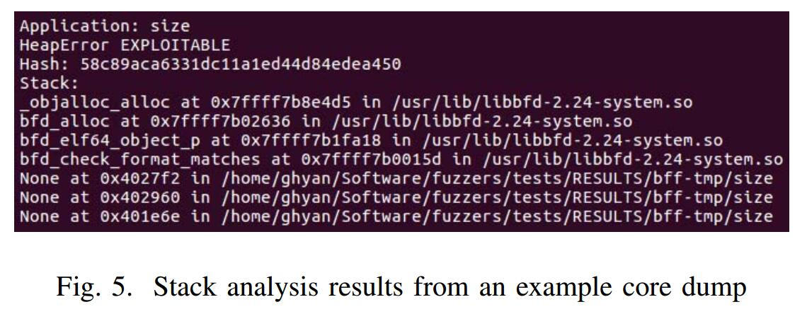
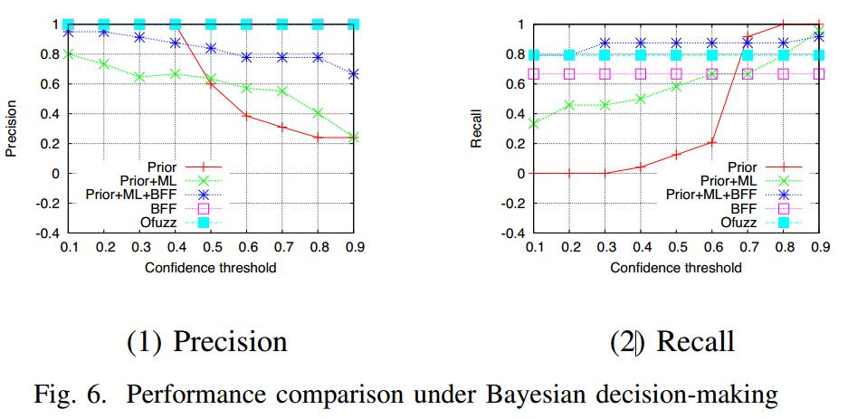
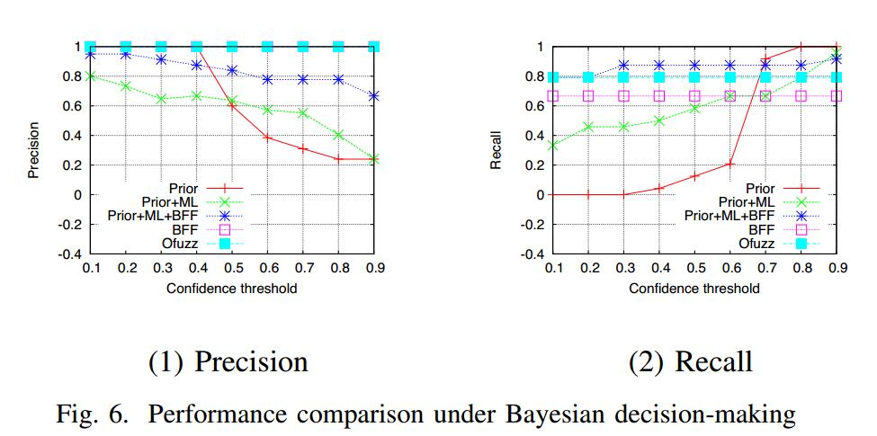

#  ExploitMeter: Combining Fuzzing with Machine Learning for Automated Evaluation of Software Exploitability

# Abstract

可利用的软件漏洞对其信息安全和隐私构成严重威胁。尽管已经投入大量精力来提高软件安全性，但量化软件可利用性的研究仍处于起步阶段。在这项工作中，我们提出了ExploitMeter，这是一个基于模糊的软件可利用性量化框架，可以促进软件保障和网络保险的决策。 ExploitMeter设计为动态，高效和严谨，它以贝叶斯方式集成了基于机器学习的预测和动态模糊测试。使用100个Linux应用程序，我们进行了大量实验，以评估ExploitMeter在动态环境中的性能。

| relevant information |                                                              |
| -------------------- | ------------------------------------------------------------ |
| *作者*               | Guanhua Yan Junchen Lu Zhan Shu Yunus Kucuk                  |
| *单位*               | Department of Computer Science Binghamton University, State University of New York |
| *出处*               | 2017 IEEE Symposium on Privacy-Aware Computing               |
| *原文地址*           |                                                              |
| *源码地址*           | http：//www.cs.binghamton.edu/~ghyan/code/ExploitMeter/      |
| *发表时间*           | 2017年                                                       |

# 1. 介绍

软件安全在确保网络空间可信度方面发挥着关键作用。由于零日软件攻击的地下市场蓬勃发展，大部分网络犯罪都是通过利用易受攻击的软件系统来实现的。不幸的是，在可预见的未来，软件漏洞不太可能被消除，因为现代软件系统变得如此复杂，以至于只有有限认知能力的软件程序员几乎不可能测试他们所有的角落情况，更不用说那些不安全的语言了。 C仍在广泛使用。

在这项工作中，我们探讨了以下基本问题：鉴于软件系统中可能存在许多软件漏洞，我们能否量化其可利用性？软件可利用性的量化可以在两个重要的情况下找到它的应用：软件保障和网络保险。在国家信息保障术语表[30]中，软件保证被定义为“软件没有漏洞的信任程度，无论是故意设计到软件中还是在其生命周期的任何时间意外插入，以及软件在预期中运行“可量化的软件可利用性提供了对可利用软件漏洞不存在的这种信心的定量测量，从而促进了安全关键软件程序部署中的决策。另一方面，新兴的网络保险市场需要采用严格的方法，保险公司可以使用这些方法定量评估使用潜在易受攻击的软件系统与被保险人相关的风险。

正如[33]所述，由于运营网络安全的对抗性和动态性，很难实现可量化的安全措施。事实上，随着新开发技术的发展和部署的新的漏洞缓解功能，软件开发的格局不断变化。针对2006年至2012年期间针对Microsoft Windows平台的软件漏洞的调查显示，堆栈损坏漏洞利用率的百分比已经下降，但UAF漏洞的漏洞率却在上升[26]。

虽然已经做了许多致力于提高软件安全性的努力，但仍然缺乏一个统一的框架来量化软件可利用性在动态操作环境中，正如软件保障和网络保险所需要的那样。在行业中，CVSS（通用漏洞评分系统）[1]被广泛用于估计已知软件漏洞的严重性，包括基于其攻击向量，攻击复杂性，所需权限和用户交互计算的可利用性度量。除了CVSS之外，还提出了一些其他方法来评估软件安全性，例如攻击面度量[22]，漏洞密度度量[7]，[9]，具有危险系统调用的入口点的可达性[39]，以及基于机器学习的预测[12]，[19]。但是，这些方法都不允许我们量化动态执行环境中的软件可利用性。

在此背景下，我们在这项工作中提出了一个名为ExploitMeter的新框架，旨在定量和动态地评估软件可利用性，以促进软件保障和网络保险的决策。在ExploitMeter框架的核心是模仿人工评估人员的认知过程贝叶斯推理引擎：评价者首先基于静态特征采用机器学习今天初步的预测，然后与来自不同模糊器的多个动态模糊测试的新观察结果来更新自己对软件可利用性的判定。此外，评估者使用这些不同的模糊器的经验被用于更新他们的感知性能 - 也以贝叶斯方式 - 并且这些性能测量形成评估者量化软件可利用性的基础。因此，ExploitMeter的推理引擎可以被描述为动态非线性系统，其输入来自基于机器学习的预测和动态模糊测试。

在构建ExploitMeter框架的最后，我们在这项工作中的贡献总结如下：

- 我们从软件程序的静态分析中提取各种特征，我们从中训练分类模型以预测软件程序可能具有的漏洞类型（例如，堆栈溢出和use-after-free）。评估者使用这些分类器的分类性能来得出她对预测结果的初始置信水平。

- 对于每个受测试的软件，我们使用各种模糊器来生成崩溃，从中我们发现导致崩溃的软件漏洞类型。对于发现的每种类型的软件漏洞，我们使用贝叶斯方法来计算评估者对软件漏洞的后验信念。

- 基于概率论，我们将软件程序包含的不同类型软件漏洞的可利用性分数结合起来，以生成最终的可利用性分数。

我们在以下网址提供ExploitMeter的源代码：http：//www.cs.binghamton.edu/~ghyan/code/ExploitMeter/。为了证明其实用性，我们进行了大量实验，其中使用了两个不同的软件模糊器来模拟虚拟机中的100个标准Linux实用程序。我们在不同配置下使用ExploitMeter动态量化这些程序的可利用性，从而深入了解ExploitMeter如何促进软件保障和网络保险实践中的决策制定。

在本文的其余部分安排如下。第二节总结了相关工作。第三节提供了ExploitMeter的实际背景。 ExploitMeter采用的主要方法在第IV节中讨论。在第五节中，我们介绍了实验结果，并在第六节中得出结论性意见

# II 相关工作

许多努力致力于提高软件漏洞发现的效率。这些技术主要分为两类，静态分析（例如，[16]，[21]，[20]，[35]）和动态模糊测试（例如，[32]，[34]，[17]）。 ExploitMeter的当前实现依赖于动态模糊测试来发现软件漏洞，因为模糊测试工具可以轻松实现自动化，程序的崩溃状态允许我们推断导致崩溃的漏洞类型。但是，在ExploitMeter框架中，很容易合并其他软件漏洞发现工具，这仍然是我们未来的工作。

软件安全研究人员也一直在开发模型来预测软件漏洞。该领域的工作通常利用国家漏洞数据库中的大量软件漏洞数据，并通过改进历史漏洞数据来训练预测模型（例如[18]，[9]，[28]，[8]，[ 8]，[27]，[40]）。与我们的工作更相关的是那些应用机器学习来推断软件漏洞的可利用性的工作。例如，Bozorgi等人 [12]训练线性支持向量机，使用从两个公共漏洞数据源中的描述中提取的基于文本的特征，对易受攻击的软件程序是否可利用进行分类。 [12]中提出的预测模型不能用于预测日常漏洞的可利用性。在[19]中Grieco等人从静态分析和动态执行软件程序中提取C标准库调用序列，以分类它们是否容易受到内存损坏。虽然这项工作直接适用于可执行程序，但它并不像ExploitMeter那样提供可量化的软件可利用性度量。所有这些先前工作的共同点是，他们从历史数据中训练模型以预测未来威胁的特征。 ExploitMeter与这些作品不同，因为预测模型仅用于推导先验信念，但这些信念应该用新的测试结果动态更新。这有效地解决了在软件开发技术和威胁缓解功能之间存在军备竞争的动态环境中可预测性的下降。

ExploitMeter还涉及一些关于自动生成软件漏洞的最新工作，例如AEG [10]和Mayhem [14]尽管ExploitMeter的设计受到了这些工作的启发，但是没有必要针对易受攻击的程序找到可操作的漏洞来评估其可利用性。 ExploitMeter采用的方法类似于我们之前的工作[38]，它采用贝叶斯方法来量化软件可利用性。但是，这项工作主要是理论性的，没有具体说明如何推导出先前的信念以及应该使用哪些工具来测试软件漏洞。相比之下，ExploitMeter提供了量化软件可利用性的实用框架

# III 背景

可量化的软件可利用性有助于软件保障和网络保险的决策。为了解释这一动机，我们为这两个应用程序中的每一个提供了一个示例场景：

- 软件保障：考虑一个安全关键环境，其中运行的每个软件应该不受利用，即使软件可能包含已知或未知的漏洞。当要部署新软件时，系统管理员需要确保在其执行环境中可以利用它的可能性应低于某个阈值。可量化的软件可利用性允许系统管理员在决定是否运行软件程序时建立置信度。
- 网络保险：IT（信息技术）经理希望确保企业免受恶意网络威胁。为了计算溢价，网络保险公司需要评估被保险企业网络中安装的软件的安全性。软件可利用性的定量测量允许保险公司量化与在被保险人网络内使用软件相关的风险。一旦投保，可以通过可信计算模块的远程证明来确保软件的完整性。这有助于保险公司仅为已经评估过的软件制定保险单。

两个示例的共同点是必须量化在特定执行环境中运行的软件程序的可利用性。我们的目标是建立一个名为ExploitMeter的实用框架，系统管理员可以使用它来决定是否应该部署特定软件（软件保证），或者由保险公司用来评估软件程序的开发风险然后相应地计算保费（网络保险）。

利用软件的先决条件是它包含一些可以从其攻击面利用的软件漏洞。经典类型的软件漏洞包括堆栈缓冲区溢出，释放后使用引用，堆损坏，整数溢出，除零，解除引用空指针以及类型混淆。有许多工具可用于自动发现软件漏洞。由于软件的源代码可能无法在操作环境中使用，因此我们排除了依赖静态代码分析来查找软件漏洞的工具。并非所有软件漏洞都可以在相同程度上被利用。例如，虽然除零可能会有效地崩溃程序并因此启用拒绝服务攻击，但它不容易被利用用于更有趣的目的，例如权限提升。

# IV 方法

如图1所示，ExploitMeter是一个评估动态环境中软件可利用性的框架。在ExploitMeter中，计划按顺序测试软件S = {s0，s1，...，si，...}的列表。对于每个软件s∈S，假设其可利用性由假想的人类评估者测量，作为她对软件可被利用的可能性的主观信念。但是，软件可以通过各种低级软件漏洞利用，例如缓冲区溢出和整数溢出。此外，攻击者可以利用每种类型的这些安全漏洞的可能性可能会有所不同。因此，我们的模型使评估者能够推断每个软件漏洞类型的软件可利用性。设V = {v0，v1，...，v | V | -1}表示考虑的软件漏洞类型集。因此，软件通过漏洞类型v∈V的可利用性是评估者对通过漏洞类型v利用软件的可能性的主观信念。因此，我们的关键利益是评估零假设H0（s，v）的概率。这表明软件不易受类型v的攻击。我们让H1（s，v）表示相反的假设，即假设软件易受类型v攻击。

因此，由于类型v导致的软件的可利用性可以被表征为评估者的主观概率P（H0（s，v））。在贝叶斯推理[11]中，假设评估者保留P（H0（s，v））的先验概率，并且在看到证据E后，她的后验信念根据贝叶斯规则更新：
$$
P\{H0(s, v)|E\} =  \frac {P\{E|H0(s, v)\}* P\{H0(s, v)\}}{P\{E\}}
$$
为了应用贝叶斯推理[11]，我们需要解决如何推导先验概率P {H0（s，v）}以及如何获得证据E以支持软件可利用性的后验更新。

## A.从机器学习模型中获得初始概率

ExploitMeter允许评估人员使用预测分类模型快速评估软件可利用性。对于每种类型的软漏洞，对基于软件程序的静态分析提取的特征训练分类模型。我们使用f（s）来表示从软件程序中提取的一组特征。给定特征向量f∈F，其中F是特征空间，给出的漏洞类型v的分类模型cv，由`cv：F→{positive，negative}`从历史数据中训练以预测具有特征向量 f 的软件程序 是否包含v类型的漏洞。

受过训练的分类模型可能会对软件程序包含的漏洞类型做出错误的预测。错误预测的来源可以是从软件程序中提取的弱特征，不准确的预测模型（例如，具有不良泛化能力的训练数据过度拟合的模型），或者本质上缺乏可预测性的非静止数据。因此，当使用机器学习模型来预测软件可利用性时，有必要考虑它们的预测性能。 ExploitMeter使用四重（TP，FP，TN，F N）监控每个分类器的性能，其中包括过去预测中的真阳性，假阳性，真阴性和假阴性的数量。令p（cv）表示与分类器cv相关联的性能四元组，并且其第i个元素由p（cv）[i]给出。

为了应用贝叶斯推理，需要假设P {H0（s，v）}的先验概率。基于所评估的软件程序没有发现类型v的漏洞的分数来建立P {H0（s，v）}的先验概率的合理模型。因此，计数器n用于保持评估的软件程序的数量，并且对于每种漏洞类型，nv用于保持已发现包含类型v的漏洞的软件程序的数量。但是，我们可能不想要直接使用nv / n作为先验概率，因为如果nv = 0，则对P {H0（s，v）}的先验概率为0，这决定了方程（1）中后验概率的计算。 忽视了E的存在。为了解决这个问题，ExploitMeter用一些正数初始化nv和n。例如，n = 2且nv = 1最初假设P {H0（s，v）}的初始先验信念是0.5，并且计数器在评估的每个软件程序时更新。

当评估新的软件程序时，分类器cv的预测结果证明了E的存在。根据等式（1），如果cv预测s为正，我们有：
$$
P\{H0(s, v)| classifier cv predicts s to be positive \}
=
\frac {
\frac {nv}{n}·\frac{p(cv)[2]}
{p(cv)[2]+p(cv)[3]}}
{
\frac {nv}{n}·\frac{p(cv)[2]}
{p(cv)[2]+p(cv)[3]} + \frac{n−nv}{n} · \frac{p(cv)[1]}{p(cv)[1]+p(cv)[4]}
}
$$
如果cv预测s为负数，我们有：
$$
P\{H0(s, v)| classifier cv predicts s to be positive \}
=
\frac {
\frac {nv}{n}·\frac{p(cv)[3]}
{p(cv)[2]+p(cv)[3]}}
{
\frac {nv}{n}·\frac{p(cv)[3]}
{p(cv)[2]+p(cv)[3]} + \frac{n−nv}{n} · \frac{p(cv)[4]}{p(cv)[1]+p(cv)[4]}
}
$$

## B.基于模糊测试的软件可利用性后验更新

从软件程序提取的特征数据可能具有低稳定性，因此对于预测其可利用性的能力有限。例如，用于开发这些软件的编程语言的分布可能会随着时间的推移而发生变化，即使对于相同的编程语言，它也可能随着用新的功能替换过时功能而发展。此外，由于网络安全的对抗性质，可以在具有悠久历史的软件中找到新的安全漏洞。例如，自1989年9月以来，2014年发现的ShellShock漏洞突然使所有版本的Bash变得脆弱[36]。对于关键的网络安全操作，我们因此不应仅依赖从历史数据训练的模型来预测软件可利用性。

ExploitMeter允许评估者通过向她提供的新证据更新她对软件可利用性的信念。为了获得新的证据，使用一组模糊器Z = {z0，z1，...，z | Z | -1}来查找被测软件中的漏洞。每个模糊器的工作原理是将格式错误的数据注入程序以创建崩溃。进一步分析这些崩溃以推断潜在的安全漏洞。模糊测试的输出要么软件成功终止，要么导致崩溃。对于每次崩溃，我们都可以推断导致崩溃的软件漏洞类型。在第IV-C节中，我们将详细说明如何在ExploitMeter框架中完成此操作。

在使用Z中的模糊器对软件进行模糊测试后，模糊测试结果将作为评估者更新其后验概率的证据。如果模糊器发现软件的漏洞类型为v，则将Esv定义为1，否则为0。然后我们有两个用fuzzer模糊软件的Esv案例：

案例A：Esv = 1.在这种情况下，模糊器在软件中成功找到v类型的漏洞。有了这样一个确凿的证据，评估者对软件免疫v的后验概率应该是0，而不管她从回归模型得出的初始概率。这可以通过贝叶斯规则得到证实：
$$
P(H0(s, v) | Esv = 1)
=
\frac{P(Esv = 1 | H0(s, v)) · P(H0(s, v))}
{P(Esv = 1)} = 0
$$
必须保持最终的相等性，就好像软件不易受类型v攻击一样，任何模糊器都不可能找到导致它因类型v而崩溃的软件输入。

案例B：Esv = 0.在这种情况下，模糊器在软件s中找不到类型v的漏洞。但是，软件仍然可能容易受到v攻击，因为模糊器可能由于其模糊测试策略而无法检测到漏洞。使用贝叶斯规则，我们有以下内容：
$$
P(H0(s, v) | Esv = 0)
=
\frac{P(Esv = 0 | H0(s, v)) · P(H0(s, v))}
{P(Esv = 0)}
$$
一些模糊测试者比其他模糊测试人员更能检测到特定类型的漏洞。例如，[25]中开发的SmartFuzz方法专注于检测整数错误。让模糊器z对漏洞类型v的检测率为q（v，z）。我们因此：
$$
P(Es,v = 0 | H1(s, v)) = 1 − q(v, z)
$$
如果假设H0（s，v）为真（即软件不易受类型v影响），则情况B必须保持。因此，我们有：
$$
P(Es,v = 0 | H0(s, v)) = 1
$$
结合方程（6）和（7），我们有：
$$
P(Es,v = 0) = \sum_{i=0}^1 P(H_i(s,v))·P(Esv=0|H_i(s,v))
= P(H0(s,v))+(1−P(H0(s,v)))·(1−q(v,z)
$$
最后，我们有以下内容：
$$
P(H0(s, v) | Es,v = 0) =
\frac{P(H0(s,v))}
{P(H0(s,v))+(1−P(H0(s,v)))·(1−q(v,z)) }
$$
软件程序的可利用性取决于它包含的漏洞类型以及每种漏洞类型转化为软件漏洞的可能性。为了对这种依赖关系进行建模，我们假设评估者对于每个漏洞类型v∈V，都相信其被利用的可能性，用r（v）表示。假设V中的漏洞类型是独占且独立的，在看到模糊器的模糊测试结果后，软件的整体可利用性由下式给出：
$$
U(s) = 1−
\prod_{v∈V}[(1−r(v))·(1−P(H0(s,v)|Es,v))+P(H0(s,v)|Esv)]
= 1 − \prod_{v∈V}[1 − r(v) + r(v) · P(H0(s, v) | Esv)]
$$
其中P（H0（s，v）| Esv）是在看到证据Esv后，评估者对假设H0（s，v）的后验概率。方程式（9）RHS（右手侧）的第二个术语， 给出了软件不能通过V中任何类型的漏洞被利用的概率。

ExploitMeter在模糊器模糊后重新计算软件程序的可利用性分数。基于该可利用性得分，如果可利用性得分高于某个置信度阈值，则可以做出决定。否则，评估者需要更多证据来确定软件程序是否确实可以利用。

## C.崩溃造成的漏洞干扰

当程序崩溃或以其他方式异常终止时，现代OS通常允许将崩溃进程的存储器映像和程序寄存器转储到本地文件系统上。这些核心转储文件可以进一步加载到调试器中，例如GNU调试器或Microsoft WinDbg，以在崩溃发生时恢复进程的内部状态。这些核心转储文件可用于推断导致崩溃的漏洞类型。例如，可以检查崩溃进程的堆栈跟踪缓冲区溢出的可能性，这是一种典型的软件漏洞。
Microsoft安全工程中心开发了一个名为！exploitable [4]的WinDbg扩展，根据其原因对崩溃进行分类，例如使用先前释放的堆缓冲区和堆栈缓冲区溢出。可以将每个原因视为漏洞类型，并且不同漏洞类型的可利用性不同。在！exploitable 的情况下，所有类型的软件漏洞都分为四类，具体取决于它们被开发的可能性，可利用，可能可利用 ，可泵不可利用和未知性。 Apple开发了一个名为CrashWrangler的类似工具来检查Mac OS平台上的软件崩溃[3]，并开发了CERT分类工具来评估Linux平台上的软件可利用性[5]。

ExploitMeter依靠这些工具来推断导致程序崩溃的软件漏洞类型。表1中给出了可由CERT分类工具推断出的漏洞类型列表。尽管这些工具是ExploitMeter框架的一个组成部分，但我们知道它们在评估软件崩溃时的安全性方面并不完美。 [31]这些工具背后的一个基本假设是攻击者可以完全控制导致崩溃的错误指令的输入操作数。如果无法从程序的攻击面更改这些输入操作，则这些工具往往会高估发现软件漏洞的风险。此外，这些工具还应用基于规则的启发式和轻量级污点分析，这些技术中固有的局限性可能导致错误的漏洞分类。

## D.训练分类模型

ExploitMeter目前旨在评估ELF（可执行和可链接格式）可执行文件的可利用性。它从ELF可执行文件中提取特征以训练分类模型，该模型预测它们是否包含特定类型的漏洞。可以从ELF可执行文件的静态分析中提取各种类型的功能。
ExploitMeter目前使用以下类型的功能：

- Hexdump功能。我们使用hexdump实用程序从二进制程序中获取字节序列，然后计算软件程序中出现的每个n-gram字节序列的频率。有256个1-gram特征（即0x00到0xFF）和65536个2-gram特征（即0x0000到0xFFFF）。
- Objdump功能。我们使用objdump来反汇编二进制可执行程序，并且对于每个指令，我们将其表示为操作码及其操作数类型的组合。例如，指令mov edi，0x600dc0被抽象为mov-register-immediate，而指令mov rax，QWORD PTR [rip + 0x981375]被抽象为mov-register-memory。使用操作数类型扩展操作码的直觉是ExploitMeter目前专注于评估与内存相关的软件漏洞，因此希望明确识别指令是否访问内存有助于提高分类性能。然后，我们计算出软件程序代码部分中出现的每个n-gram序列的频率。由于软件开发针对合法软件，我们希望大多数合法程序不会使用恶意软件中的大量混淆来混淆反汇编过程。
- 库功能。我们使用ldd实用程序来获取可执行程序所需的共享库列表。值得注意的是，严格来说，ldd实用程序不是静态分析工具，因为它使用动态加载程序来决定运行时需要哪些共享库，但它比静态分析工具（如objdump）提供了更准确的共享库覆盖。对于某些ELF可执行文件，例如mediainfo和pdftk，由于ld.so检测到不一致问题，在它们上运行ldd会崩溃。对于他们，我们使用objdump -p来查找所需的共享库。
- 搬迁功能。我们使用readelf实用程序（使用-rW选项）来发现重定位部分的内容，然后使用c ++ filt实用程序对重定位的符号进行解码。每个已解密的符号都被视为值为1的要素，如果在重定位部分中找不到，则为0。

在动态环境中，分类模型定期重新训练。我们按时间划分为几个时期，T = {T0，T1，...}。获得这些时期的选择可以是灵活的。例如，我们可以将时间划分为相等的长度（例如，三个月），或者让在不同时期测试的软件的数量大致相同，或者将模糊测试活动视为时期。让时期Ti中使用的分类模型cv被区分为c（vi），其中i = 0,1，......对于第一个时期T0，由于没有历史数据来训练每个漏洞类型的分类模型，我们可以使用领域知识来指定先前的概率。

在每个时期的开始，使用所有历史数据对每个漏洞类型重新训练分类模型。通过略微滥用符号S，我们定义Si，其中i = 0,1，...作为已在时期Ti中测试的软件集。当在i ≥ 1的时期Ti的开始建立漏洞类型v的分类模型时，我们如下导出训练数据集。对于每个软件s∈{Sk} 0≤k≤i-1，我们让Ys（v）∈{positive，negative}表示软件s是否被任何模糊器检测到包含v类型的漏洞;我们将元组（f（s），Ys（v））添加到训练数据集中，其中我们记得f（s）是软件s的特征向量。用于时期Ti的分类模型c（vi）通过从f（s）预测所有s∈{Sk}0≤k≤i-1的Ys（v）来训练。 ExploitMeter中分类模型的选择是灵活的，我们将在实验中根据经验评估各种分类模型的性能

## E.贝叶斯参数估计

回想一下，参数q（v，z）表示模糊器z对漏洞类型v的检测率。为了估计q（v，z），我们维护一个性能计数表，用C表示，大小为| V | x | Z |。表C的每个条目C [v，z]是保持模糊器z成功检测到具有漏洞类型v的软件的次数的计数器。除了表C之外，长度为| V |的向量D也保留，其中每个i在[0，| V | -  1]，D [v]给出已用漏洞类型v识别的软件数量。

表C和向量D更新如下。限定：
$$
V_s^{'} = \{v ∈ V : Esv = 1\}.
$$

因此，设置Vs’包含至少一个fuzzer在软件中找到的所有漏洞类型。对于每个v∈Vs’,我们将D [v]增加1，因为在软件中已发现v类型的新漏洞。此外，对于每个v∈Vs‘,我们得到模糊器列表L（s，v）在软件中成功识别出这种类型的漏洞。即，L（s，v）= {z∈Z：Ts [v，z] = 0}。然后，对于每个z∈L（s，v），我们将C [v，z]增加1。

如果假设一个频率论者的观点，我们应该将表C和矢量D中的所有条目初始化为零，并且让q（v，z）简单地为C [v，z] / D [v]。但是，如果在漏洞类型v中找到的软件测试很少，则q（v，z）的估计值可能不稳定。这类似于这样一种情况，即一个先前相信硬币应该公平的人，即使在连续看到三个头之后也不会认为它应该始终产生头部。

因此，我们在估算时考虑了评估者对q（v，z）的先验概率。我们假设当在具有概率q（v，z）的软件中查找漏洞类型v时，每个模糊器z遵循二项式过程。由于二项式过程的共轭先验是Beta分布，我们假设参数q（v，z）的先验取一个
$$
Beta（c_0^{（v，z）}+ 1，d_0^{（v）} - c_0^{（v，z）}+ 1）
$$
分布，其中d0（v）≥c0( v，z）。使用MAP（Maximum A Posteriori）方法估计q（v，z），我们得到：
$$
q(v, z) = \frac{c_0^{(v,z)} + C[v, z]}
{d_0^{(v)}+ D[v]}
$$
其中表C和向量D被初始化为全0。简化等式（13），我们可以通过让C [v，z]为所有v∈V和z∈Z的c0（v，z）来初始化表C，并且对于所有v∈V，D [v]是d0（v） 。如果是这样等式（13）简单地变成：

$$
q(v, z) = \frac{C[v, z]}
{D[v]}
$$
注意：注意q（v，z）估计如公式(14)所示有偏见，因为D [v]不包括软件包含漏洞类型v的情况，但没有一个模糊检测器正确检测到它。因此等式（14）具有过高估计q（v，z）的真值的趋势。由于可能无法在复杂的软件程序中找到所有漏洞，因此可以通过在ExploitMeter中使用更大的互补模糊器来缓解此类系统错误。

类似地，我们以贝叶斯方式估计等式（11）中的参数r（v）。还假设r（v）遵循具有共轭先验Beta（a0（v）+ 1，b0（v）+1）的二项分布。我们使用两个向量A和B，每个向量的大小为| V |，分别存储每种类型的软件漏洞可被利用和不可利用的次数。对于每个漏洞类型v，A [v]和B [v]分别被初始化为a0（v）和b0（v）。最终分析每次崩溃以验证它是否确实可以被利用。对于每次独特的崩溃，如果发现可利用，A [h（d）]增加1;否则，B [h（d）]增加1。 MAP方法导致以下公式：
$$
r(v) = \frac{A[v]}
{A[v] + B[v]}
$$
因此，r（v）的先验估计由a0（v）/（a0（v）+ b0（v））给出，并且在分析由于模糊引起的崩溃之后r（v）的后验估计被连续更新手动。

# 五，实验结果

目前，ExploitMeter已经实现了大约1300行Python代码（不包括模糊器代码）。出于评估目的，我们使用100个Linux应用程序，这些应用程序列在表IV中。所有实验都在以相同方式配置的KVM / QEMU虚拟机中执行：64位Ubuntu 14.04.1,8个逻辑主机CPU，8G RAM和16GB VirtIO磁盘。四个物理工作站专门用于实验，每个工作站有8个内核和32G RAM。在我们的实验中，每个应用程序在模糊测试中提供10个随机选择的种子文件，并且每个应用用这些种子模糊30小时。因此，完成所有模糊测试需要6000个CPU小时。由于有限的计算资源，我们仅使用10个种子来模糊每个应用程序，尽管可以理解，希望用更多种子模糊每个应用程序以实现更好的代码覆盖。对于每种漏洞类型v，ExploitMeter在评估每10个软件程序后重新训练其分类模型。

## A. fuzzing 结果

自从作为威斯康星大学麦迪逊分校[24]的课程项目引入的模糊概念开始以来，已经开发了许多开源模糊器。然而，许多这些模糊器不成熟，不稳定或支持不足[23]。在研究了许多开源模糊器的可用性之后，我们决定在ExploitMeter的当前实现中使用以下模糊器（尽管其他模糊器可以很容易地结合到ExploitMeter中）：

- BFF（基本模糊测试框架）[13]。 BFF是由CERT开发的用于查找Linux和Mac OS平台的软件安全漏洞的模糊测试框架。其核心是zzuf，一个流行的模糊测试软件，通过随机改变程序的输入来发现错误[6]。
- OFuzz [2]。来自卡内基梅隆大学的研究产品OFuzz是一个突变的模糊测试框架，旨在促进对模糊测试结果的严格统计分析。它采用OCaml语言实现，其模块化设计使得开发新的模糊测试功能变得容易，例如优化模糊测试的种子选择[29]，在模糊测试活动中更改调度算法[37]，以及优化突变比率一个模糊的[15]。

表IV列出了BFF和OFuzz的模糊测试结果。这些结果的一些统计数据总结如下：

- BFF：在100个应用程序中，26个在模糊测试期间崩溃。对于这26个应用程序中的每一个，平均而言，它崩溃了21.6次，具有19.7个独特的堆栈哈希，归因于5.9种类型的软件漏洞。
- OFuzz：在100个应用程序中，29个在模糊测试期间崩溃。对于这29个应用程序中的每一个，平均而言，它崩溃了108270.4次，具有17.3个独特的堆栈哈希，归因于4.9种类型的软件漏洞。

在被模糊器撞毁的35个应用程序中，其中20个被两个模糊器崩溃，这表明使用多个模糊器可以提高查找软件漏洞的效率。比较两个模糊器的模糊测试结果，虽然OFuzz比BFF崩溃的应用程序略多，但它平均崩溃的频率比BFF高5012.5倍。对于这些崩溃，我们使用CERT分类工具提供的堆栈哈希值，这些哈希值是在每次崩溃后对堆栈中前五个堆栈帧进行散列而得到的，以估算唯一崩溃的数量。显然，OFuzz往往比BFF更频繁地报告相同的崩溃，因为OFuzz报告的每个崩溃应用程序的平均堆栈哈希数小于BFF。使用CERT分类工具对每个崩溃的漏洞类型进行分类，我们发现对于每个崩溃的应用程序，BFF发现的软件漏洞类型比OFuzz更多。这与我们之前的观察结果一致，即BFF为每个崩溃的应用程序产生比OFuzz更多的独特崩溃。
在图2中，我们针对每个漏洞类型显示了基于两个模糊器的模糊测试结果而导致崩溃的不同应用程序的数量。结果发现，漏洞类型16（SourceAV）导致所有22种漏洞类型中的大多数应用程序崩溃。此外，大多数漏洞类型导致至少一个应用程序崩溃，但类型1（ReturnAv），类型2（UseAfterFree），类型5（StackCodeExecution）和类型14（BlockMoveAv）除外。

## B.软件漏洞的可预测性

接下来，我们评估软件程序可能具有四个函数名称的不同类型软件漏洞的可预测性。图4（1）显示了在从每个类型的软件漏洞的核心转储中恢复的堆栈上可以找到哪些共享库。结果发现，422个共享库中只有28个或6.6％出现在从核心转储中恢复的堆栈中至少一次。可以经常使用这些共享库。例如，由于漏洞类型4（BrachAv）和7（PossibleStackCorruption）以及库libX11.so.6和libpcre.so.3，32个应用程序使用的库libstdc ++.so.6被发现涉及核心转储。由于漏洞类型7，每个应用程序使用31个应用程序，都涉及核心转储。某些库与许多类型的软件漏洞相关联。例如，由于12种不同类型的软件漏洞，仅由应用程序abiword使用的库libabiword-3.0.so已出现在核心转储堆栈上。图4（2）分别显示了每个漏洞类型在核心转储堆栈上具有相关共享库名称的唯一崩溃的比例。显然，对于除18（BenignSignal）之外的任何漏洞类型，超过一半的独特崩溃涉及共享库。此外，图4（3）显示了可以在核心转储堆栈上找到其共享库名称的易受攻击应用程序的比例。我们发现，对于五种漏洞类型，所有易受攻击的应用程序在执行时都会在核心转储堆栈上留下共享库名称的痕迹。这些观察结果表明，ELF可执行文件使用的共享库列表提供了有价值的信息，用于预测它可能包含的软件漏洞类型。

与库功能相比，重定位功能在函数级别提供了更细粒度的信息，因为它们包括在修补代码时需要解析的功能名称。对于在核心转储堆栈上找到的函数名称，我们检查ELF可执行文件的重定位部分，以查看它们是否出现在重定位功能中。由于相同的函数名称可能出现在两个不同的共享库中，因此我们也需要匹配库名称。但是，重定位部分不提供确切的库名称。例如，应用程序mpv和mplayer在其重定位部分中都有函数pa_context_new @ PULSE_0，其中相应的库是libpulse.so.0。因此，我们从重定位部分中的每个函数名称中搜索库密钥，然后查找是否可以在核心转储堆栈上找到的库名中找到不区分大小写的密钥。按照前面的示例，不区分大小写的键是pulse，我们可以从库名libpulse.so.0中找到它。此外，还添加了两个异常情况：如果密钥是GLIBC或CXXABI，我们将分别在库名称中搜索libc.so和libstdc ++。图4（2）给出了唯一崩溃的部分，其中堆栈上的函数名称可以在ELF可执行文件的重定位部分中找到，类似地，图4（3）显示了某些函数名称上的易受攻击的应用程序的分数核心转储堆栈可以在其重定位部分中找到。据观察，这些分数是显着的，表明从重定位部分提取的特征确实可用于预测软件漏洞。虽然这些数字似乎低于库功能中的数字，但是知道应用程序调用易受攻击的函数显然提供了有关其漏洞的更多信息，而不是知道它链接了易受攻击的共享库。

## C.为什么选择贝叶斯？

我们接下来解释在ExploitMeter中使用贝叶斯推理的好处。为了便于解释，我们仅考虑漏洞类型16的预测结果。由于只考虑了一种漏洞类型，我们假设评估者有一个置信度阈值来确定软件程序在评估的不同阶段是否存在16类漏洞： 

- prior:先验概率计算为nv / n，其中我们记得nv是先前看到的包含漏洞类型v和n已经评估的样本数的样本的数量。

- Prior+ ML：后验概率来自等式（2）和（3）使用分类模型预测软件程序是否包含漏洞类型16.在分类模型中，我们使用所有重定位，库和objdump 2-gram特征。
- Prior + ML + BFF：在看到模糊器BFF的模糊测试结果后得出后验概率，模糊器BFF总是在模糊器Ofuzz之前使用。

决策规则很简单：如果概率得分高于给定的置信度阈值，则被评估的软件被认为不易受攻击（对于类型16）。图6显示了在不同评估阶段应用决策规则的精确度和召回分数。为了比较，我们还显示了单独使用BFF和Ofuzz的精确度和召回分数。由于模糊测试结果没有误报，我们可以看到单个模糊器在图6（1）中的精度得分始终为1。

从图6中，我们发现现有方法的性能对置信度阈值敏感。当阈值较低时，该方法始终将新应用程序分类为负数，这会导致调用0和未定义的精度。当阈值超过阳性样本的分数时，该方法倾向于将新应用分类为正，这导致精度降低和具有置信度阈值的召回增加。先前的+ ML方法在看到机器学习的预测结果后，基于后验概率做出决定。该方法的精确度随置信度阈值降低，并且该方法的召回随置信度阈值增加，因为较高置信度阈值导致更多应用被归类为具有相同分类模型的正数。先前的+ ML + BFF方法在看到BFF的模糊测试结果后更新后验概率后作出决定。使用该方法的精度和召回曲线的趋势类似于先前的+ ML方法的趋势。
贝叶斯方法有助于在不同的操作环境下进行决策。例如，在军事网络等安全严密的环境中，在应用程序实际部署之前建立对应用程序安全性的高度信任至关重要。在这种情况下，操作员可以使用具有高置信度阈值的先前+ ML方法来查找具有高召回率的易受攻击的应用程序;然而，高置信度阈值也导致高误报率（即，低精度），并且操作员需要对机器学习模型检测到为正的那些应用执行更多模糊测试以确保它们不易受攻击。另一方面，具有低误报率容限的普通用户可以使用具有低置信度阈值的先前+ ML方法;但是，用户必须承担使用未被检测到的易受攻击程序的风险。

## D.可利用性评分的评估

ExploitMeter提供了一个包含各种输入参数的丰富框架。在本节中，我们将评估ExploitMeter如何使用表II中汇总的参数设置评估可利用性分数。对于每个漏洞类型v和每个模糊器z，漏洞类型v的模糊器z的初始检测率被设置为10/12（即，大约83.3％）。此外，对于CERT分类工具分类为EXPLOITABLE，PROBABLY_EXPLOITABLE，PROBABLY_NOT_EXPLOITABLE或UNKNOWN的漏洞类型，其初始可利用性分别设置为80％，60％，10％或1％。在我们的实验中，这些可利用性分数未更新，因为验证发现的每个漏洞的可利用性是耗时的。

图7（1）显示了ExploitMeter在100个Linux应用程序上按顺序运行后每个应用程序的最终可利用性得分。图中的四条曲线表示每个应用程序在四个不同阶段的可利用性得分：计算先前的信念，从分类模型预测，使用BFF模糊测试，以及使用Ofuzz进行模糊测试。最终的可利用性分数（在使用fuzzer Ofuzz之后）有20个峰值，可利用性分数高于0.6。为了研究分数与表IV中显示的模糊测试结果之间的相关性，我们总结了表III中具有高可利用性分数的20个应用程序的列表，以及CERT分类工具中属于每个可利用性类别的漏洞类型的数量。在100个应用程序中，其中19个至少有一个漏洞类型属于EXPLOITABLE类别，只有它们的可利用性分数高于0.8。应用程序qpdfview有两种漏洞类型属于PROBABLY_EXPLOITABLE类别，也导致相对较高的可利用性得分为0.647。因此，最终的可利用性分数与其模糊测试结果高度相关。

 

图7（1）还揭示了从机器学习模型预测的可利用性分数与从模糊测试结果估计的最终值不一致。由于分类性能较差，预计会出现这种情况，如图3所示，这些漏洞属于EXPLOITABLE或PROBABLY_EXPLOITABLE类别。

图7（2）显示了每个应用程序的平均可利用性得分以及具有随机测试顺序的20个样本运行中的标准偏差。结果发现，对于具有高可利用性分数的20个应用程序，当测试顺序发生变化时，它们的可利用性分数差别很小。这是合理的，因为无论测试顺序如何，一旦发现一种易于利用的漏洞，它就会将评估者对该漏洞类型的后验信念降低为0，从而显着提高其可利用性评分。

相比之下，评估者基于机器学习模型的预测结果的初始信念更容易改变那些没有发现任何高度可利用漏洞的应用程序的可利用性分数。

# VI 结论

在这项工作中，我们开发了一个名为ExploitMeter的框架，它将模糊测试与机器学习相结合，以评估软件的可利用性。 ExploitMeter依赖于分类建模来估计基于从静态分析中提取的特征的软件可利用性的初始信念。 ExploitMeter进一步使用动态模糊测试来更新可利用性的信念。 ExploitMeter采用的贝叶斯方法以有机的方式集成了基于机器学习的预测和模糊测试结果。我们将ExploitMeter应用于100个Linux应用程序列表，以深入了解其性能。

在我们未来的工作中，我们计划提高ExploitMeter中使用的机器学习模型的预测准确性。我们将特别研究以下研究问题：更多的阳性样本是否有助于提高所用机器学习模型的预测准确度？是否有可能找到具有更好预测能力的其他类型的功能？或者，深度学习等新机器学习模型能否提升预测性能？

