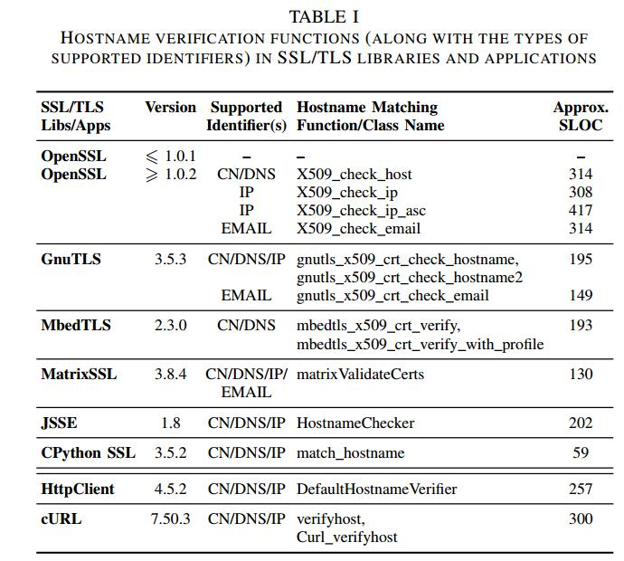

# HVLearn: Automated Black-box Analysis of Hostname Verification in SSL/TLS Implementations

# Abstract

SSL / TLS是用于保护网络通信的最常用的协议系列。 SSL / TLS的安全保证严重依赖于在SSL / TLS协议的握手阶段期间提供的X.509服务器证书的正确验证。主机名验证是证书验证过程的关键组件，它通过检查服务器的主机名是否与X.509证书中存在的任何名称相匹配来验证远程服务器的标识。主机名验证是一个非常复杂的过程，因为存在许多功能和角落情况，例如通配符，IP地址，国际域名等。因此，测试主机名验证实现是一项具有挑战性的任务。在本文中，我们介绍了HVLearn，一种用于分析SSL / TLS主机名验证实现的新型黑盒测试框架，它基于自动机学习算法。 HVLearn使用许多证书模板，即具有设置为特定模式的公用名（CN）的证书，以便测试来自相应规范的不同规则。对于每个证书模板，HVLearn使用自动机学习算法来推断确定性有限自动机（DFA），该自适应有限自动机描述与给定证书的CN匹配的所有主机名的集合。一旦为证书模板推断出模型，HVLearn就会通过查找来自其他实现的推断模型的差异或通过检查从规范派生的基于正则表达式的规则来检查模型中的错误。我们的方法背后的关键见解是，给定证书模板的可接受主机名形成了常规语言。因此，我们可以利用自动机学习技术来有效地推断接受相应常规语言的DFA模型。我们使用HVLearn来分析许多流行的SSL / TLS库中的主机名验证实现，以及用C，Python和Java等多种语言编写的应用程序。我们证明HVLearn可以比现有的黑/灰盒模糊技术实现更高的代码覆盖率11.21％。通过比较HVLearn推断的DFA模型，我们在测试的主机名验证实现中发现了8个唯一违反RFC规范的行为。其中一些违规行为至关重要，可能会使受影响的实施容易受到主动的中间人攻击。

| relevant information |                                                              |
| -------------------- | ------------------------------------------------------------ |
| *作者*               | Suphannee Sivakorn, George Argyros, Kexin Pei, Angelos D. Keromytis, and Suman Jana |
| *单位*               | Department of Computer Science Columbia University, New York, USA |
| *出处*               | 2017 IEEE S&P                                                |
| *原文地址*           | <http://www.cs.columbia.edu/~suman/docs/hvlearn.pdf>         |
| *源码地址*           | https://github.com/HVLearn                                   |
| *发表时间*           | 2017年                                                       |

# 1 简介

SSL / TLS协议族是最常用的机制，用于保护网络通信的安全性和隐私免受中间人攻击。SSL / TLS协议的安全保证严重依赖于SSL / TLS握手阶段服务器提供的X.509数字证书的正确验证。反过来，证书验证依赖于主机名验证，以验证服务器的主机名（即完全限定的域名，IP地址等）是否与“SubjectAltName”扩展名或“公用名”中的标识符之一匹配“（CN）属性的呈现叶证书。因此，实施主机名验证时的任何错误都可能完全破坏SSL / TLS的安全性和隐私保护。

由于存在许多特殊情况（例如，通配符，IP地址，国际域名等），主机名验证是一个复杂的过程。例如，通配符（'*'）仅允许在主机名的最左侧部分（由'.'分隔）中。为了了解主机名验证过程中涉及的复杂性，请考虑在五个不同的RFC [18]，[20]，[21]，[24]，[25]中描述其规范的不同部分的事实。鉴于主机名验证过程的复杂性和安全性至关重要性，对实现进行自动分析以发现与规范的任何偏差至关重要。

然而，尽管主机名验证过程具有关键性质，但以前没有涉及SSL / TLS证书验证的对抗性测试的研究项目[36]，[38]，[45]，[50]，都不支持详细的主机名自动测试验证实施。先前的项目要么完全忽略对主机名验证过程的测试，要么只是检查是否启用了主机名验证过程。因此，他们无法检测到启用主机名验证实现的任何微妙错误，但会略微偏离规范。主机名验证实现的自动对抗性测试背后的关键问题是输入（即主机名和证书标识符，如常用名称）是高度结构化的稀疏字符串，因此使现有的黑/灰盒模糊测试技术难以实现高测试覆盖率或生成触发极端情况的输入。由于SSL / TLS实现的语言/平台多样性，严重的语言/平台相关的白盒测试技术也难以应用于测试主机名验证实现。

在本文中，我们设计，实现和评估HVLearn，一种基于自动机学习的黑盒差分测试框架，可以自动推断主机名验证实现的确定性有限自动机（DFA）模型。 HVLearn背后的关键见解是主机名验证，即使非常复杂，在概念上与许多方面的正则表达式匹配过程非常相似（例如，通配符）。对证书标识符格式结构的这种了解表明，如规范所建议的，给定证书标识符的可接受主机名形成常规语言。因此，我们可以使用黑盒自动机学习技术来有效地推断接受与给定主机名验证实现相对应的常规语言的确定性有限自动机（DFA）模型。 Angluin等人的先前结果。已经证明，在多个状态的多项式时间内，通过黑盒查询可以有效地学习DFA [31]。 HVLearn推断的DFA模型可用于有效执行现有测试技术无法做得好的两个主要任务：（i）查找和枚举多个不同实现之间的独特差异; （ii）通过计算来自不同实现的推断DFA模型的交集DFA，为主机名验证过程提取正式的，向后兼容的参考规范。

我们应用HVLearn来分析许多流行的SSL / TLS库，如OpenSSL，GnuTLS，MbedTLS，MatrixSSL，CPython SSL以及使用C，Python和Java等多种语言编写的Java HttpClient和cURL等应用程序。我们发现了8种不同的规范违规，例如国际化域名中的通配符处理不正确，域名与IP地址混淆，NULL字符处理不正确等等。其中一些违规行为允许网络攻击者通过允许攻击者读取/修改通过使用受影响的实现设置的SSL / TLS连接传输的任何数据来完全破坏SSL / TLS协议的安全保障。 HVLearn在任何两对测试应用程序/库之间平均发现了121个独特的差异。

本文的主要贡献如下。

-  据我们所知，HVLearn是第一个可以学习DFA模型以实现主机名验证的测试工具，这是SSL / TLS实施的关键部分。推断的DFA模型可用于有效的差分测试或提取与多个现有实现兼容的正式参考规范。
- 我们在HVLearn中设计并实现了几个特定于域的优化，如等价查询设计，字母表选择等，以便从主机名验证实现中有效地学习DFA模型。
- 我们在6个流行的库和2个应用程序上评估HVLearn。 HVLearn实现了比现有黑/灰盒模糊技术更高的代码覆盖率（平均11.21％），并发现了8个独特的先前未知的RFC违规，如表II所示，其中一些使得受影响的SSL / TLS实现对于man-in完全不安全 - 中间攻击。

本文的其余部分组织如下：第II部分介绍了SSL / TLS主机名验证过程。我们将在第III节讨论测试主机名验证和测试方法的挑战。第四节描述了HVLearn的设计和实现细节。我们在第V节中介绍了使用HVLearn测试SSL / TLS实现的评估结果。第六节介绍了HVLearn发现的几个安全关键错误的详细案例研究。第七节讨论了相关工作，第八节总结了论文。有关HVLearn发现的错误的详细开发人员回复，我们将感兴趣的读者引用到附录X-B。

# 2 主机名校验概述

作为主机名验证过程的一部分，SSL / TLS客户端必须检查服务器的主机名是否与证书中的“公共名称”属性或证书中“subjectAltName”扩展名中的一个名称相匹配[21] 。请注意，即使该过程称为主机名验证，它也支持验证IP地址或电子邮件地址。

在本节中，我们首先简要介绍主机名格式和规范，这些格式和规范描述了X.509证书中的公共名称属性和subjectAltName扩展格式的格式。图1提供了X.509证书相关部分的高级摘要。接下来，我们将详细描述主机名验证过程的不同部分（例如，域名限制，通配符等）。

## A.主机名验证输入

**主机名格式。**主机名通常是完全限定的域名或没有任何 “.” 字符的单个字符串。若干SSL / TLS实现（即，OpenSSL）还支持将IP地址和电子邮件地址作为主机名传递到相应的主机名验证实现。

域名由多个“标签”组成，每个“标签”用 “.” 字符分隔。域名标签只能包含字母a-z或A-Z（不区分大小写），数字0-9和连字符' - '[16]。每个标签最长可达63个字符。域名的总长度最多为255个字符。早期的规范要求标签必须以字母开头[21]。但是，随后的修订允许以数字[17]开头的标签。

**X.509证书中的通用名称。**公共名称（CN）是X.509证书中“主题可分辨名称”字段的属性。服务器证书中的公用名用于验证服务器的主机名，作为证书验证过程的一部分。通用名称通常包含完全限定的域名，但它也可以包含具有描述服务的任意ASCII和UTF-8字符的字符串（例如，CN ='Sample Service'）。对公共名称字符串的唯一限制是它应遵循X520CommonName标准（例如，不应重复子字符串'CN ='）[21]。请注意，这与非常严格定义的主机名规范不同，并且仅允许如上所述的某些字符和数字。

**X.509证书中的SubjectAltName。**主题备用名称（subjectAltName）是X.509扩展，可用于存储不同类型的身份信息，如完全限定的域名，IP地址，URI字符串，电子邮件地址等。每种类型对允许的格式都有不同的限制。例如，dNSName（DNS）和uniformResourceIdentifier（URI）必须是有效的IA5String字符串，是ASCII字符串的子集[21]。我们将感兴趣的读者引用到RFC 5280的4.1.2.6节以供进一步阅读。

## B.主机名验证规则

**匹配顺序。** RFC 6125建议SSL / TLS实现使用subjectAltName扩展（如果存在于证书中），而不是通用名称，因为公共名称与标识没有很强的联系，并且可以是前面提到的任意字符串[24]。如果subjectAltName中存在多个标识符，则SSL / TLS实现应尝试匹配DNS，SRV，URI或实现支持的任何其他标识符类型，并且不得将主机名与证书的公用名匹配[24]。
证书颁发机构（CA）也应该在颁发证书时使用dNSName而不是通用名称来存储身份信息[18]。

**通用名称/ subjectAltName中的通配符。**如果服务器证书包含通配符'*'，则SSL / TLS实现应使用RFC 6125 [24]中描述的规则将主机名与它们匹配。我们提供以下规则的摘要。

通配符仅允许在最左侧的标签中。如果所呈现的标识符在除最左侧标签之外的任何标签中包含通配符（例如，www.x.example.com和www.foo * .example.com），则SSL / TLS实现应拒绝该证书。允许通配符出现在最左侧标签的任何位置，即通配符不必是最左侧标签中的唯一字符。例如，bar * .example.com，* bar.example.com或f * bar.example.com等标识符有效。

在将主机名与证书中存在的标识符进行匹配时，标识符中的通配符应仅应用于一个子域，并且SSL / TLS实现不应与除主机名最左侧标签之外的任何内容进行比较（例如，* .example。 com应匹配foo.example.com但不匹配bar.foo.example.com 或 example.com）。

RFC 6125中允许涉及通配符的几个特殊情况仅用于向后兼容现有的SSL / TLS实现，因为它们往往与这些情况下的规范不同。 RFC 6125明确指出，这些情况通常会导致过于复杂的主机名验证代码，并可能导致潜在的可利用漏洞。因此，不鼓励新的SSL / TLS实现支持这种情况。我们总结了其中一些：（i）通配符是标识公共后缀的标签的全部或一部分（例如，* .com和* .info），（ii）标签中存在多个通配符（例如，f * b * r.example.com），以及（iii）包含通配符作为多个标签的全部或部分（例如，* . *.example.com）。

**国际域名（IDN）。** IDN可以包含特定语言字母表中的字符，如阿拉伯语或中文。IDN被编码为一串unicode字符。如果域名标签包含至少一个非ASCII字符（例如，UTF-8），则将其分类为U标签。 RFC 6125规定，在执行主机名验证之前，必须将IDN中的任何U标签转换为A标签域[24]。通过添加前缀'xn--'并将应用于相应Ulabel字符串的Punycode变换的输出附加到RFC 3492 [19]中所述，将U标签字符串转换为A标签（ASCII兼容编码）。 U标签和A标签仍然必须满足域名上的标准长度限制（即最多255个字节）。

**subjectAltName中的IDN。**如RFC 5280所示，X.509 subjectAltName扩展中的任何IDN必须定义为IA5String类型，它仅限于ASCII字符的子集[21]。在将IDN中的任何U标签添加到subjectAltName之前，必须将其转换为A标签。涉及IDN的电子邮件地址也必须先转换为A标签。

**通用名称的IDN。**与subjectAltName中的IDN不同，通用名称中的IDN允许包含PrintableString（AZ，az，0-9，特殊字符'=（）+， -  ./：？和空格）以及UTF-8字符[21] ]。

**通配符和IDN。**没有规范定义如何将通配符嵌入IDN的A标签或U标签中[23]。因此，RFC 6125 [24]建议SSL / TLS实现不应与证书中的呈现标识符匹配，其中通配符嵌入在IDN的A标签或U标签内（例如，xn-kcry6tjko * .example .COM）。但是，只要通配符占用IDN的最左侧标签（例如* .xn  -  kcry6tjko.example.com），SSL / TLS实现应匹配IDN中的通配符。

**IP地址。** IP地址可以是证书中的公共名称属性或subjectAltName扩展名（带有“IP：”前缀）的一部分。 RFC 6125的3.1.3.2节规定在执行证书验证之前必须将IP地址转换为网络字节顺序八位字符串[24]。SSL / TLS实现应将此八位字节字符串与公用名称或subjectAltName标识符进行比较。对于IPv4和IPv6，八位字节串的长度必须分别为4个字节和18个字节。仅当两个八位字节字符串相同时，主机名验证才会成功。因此，IP地址标识符中不允许使用通配符，并且SSL / TLS实现不应尝试匹配通配符。

**电子邮件。**电子邮件可以作为旧版SSL / TLS实现中的emailAddress属性嵌入通用名称中。该属性不区分大小写。但是，新实现必须以rfc822Name格式添加电子邮件地址以使用替代名称扩展名而不是公共名称属性[21]。

**际化电子邮件。**与subjectAltName扩展中的IDN类似，在验证之前必须将国际化电子邮件转换为ASCII表示。 RFC 5321还指定网络管理员不得使用非ASCII字符和ASCII控制字符定义邮箱（local-part @ domain / address-literal）。如果本地部分和主机部分分别使用区分大小写和不区分大小写的ASCII比较，则认为电子邮件地址匹配（例如，MYEMAIL @ example.com与myemail@example.com不匹配但匹配MYEMAIL @ EXAMPLE.COM）[21]。请注意，此规范与嵌入在公共名称中的电子邮件地址相矛盾，该电子邮件地址应该完全不区分大小写。

**主机部分中带有IP地址的电子邮件。** RFC 5280和6125未在电子邮件的主机部分中指定对IP地址的任何特殊处理，并且仅允许以rfc822Name格式的电子邮件。 rfc822Name格式支持主机部分中的IPv4和IPv6地址。因此，允许在主机部分中具有IP地址的电子邮件出现在证书[22]中。

**电子邮件中的通配符。**没有规范应该解释通配符并尝试匹配它们是证书中电子邮件地址的一部分。

**subjectAltName中的其他标识符。**还有其他标识符可用于执行身份检查，例如UniformResourceIdentifier（URI），SRVName和otherName。但是，大多数流行的SSL / TLS库不支持检查这些标识符并将其留给应用程序。

# 3 方法

在本节中，我们将介绍主机名验证实现的自动化测试背后的挑战。尽管规模较小，但这些实现的多样性以及主机名验证过程中的细微之处使得这些实现难以测试。然后，我们继续描述使用自动机学习算法测试主机名验证实现的方法的概述。我们还简要介绍了自动机学习算法运行的基本设置。

## A.主机名验证分析中的挑战

我们认为，任何自动分析主机名验证功能的方法都应解决以下挑战：

- **1. 定义不明确的非正式规范。**

如第II部分所述，尽管相关RFC提供了一些定义主机名验证过程的示例/规则，但许多极端情况未指定。因此，任何主机名验证实现分析都必须考虑其他流行实现的行为，以发现可能导致安全性/兼容性缺陷的差异。

- **2.名称检查功能的复杂性。**

由于存在大量的角落案例和特殊字符，因此主机名验证比简单的字符串比较要复杂得多。因此，任何自动分析都必须能够探索这些极端情况。我们观察到证书标识符的格式以及匹配规则非常类似于正则表达式匹配问题。
实际上，我们发现每个给定证书标识符的已接受主机名集合形成常规语言。

- **3.实施的多样性。**

 SSL / TLS协议的重要性和普及性导致了大量不同的SSL / TLS实现。因此，主机名验证逻辑通常以许多不同的编程语言实现，例如C / C ++，Java，Python等。此外，其中一些实现可能只能远程访问而无需访问其源代码。因此，我们认为黑盒分析算法是测试各种不同主机名验证实现的最合适的技术。

## B. HVLearn的主机名验证分析方法

受上述挑战的影响，我们现在提出了分析SSL / TLS库和应用程序中主机名验证例程的方法。

我们的HVLearn系统背后的主要思想如下：对于RFC中的不同规则以及RFC中未明确定义的模糊规则，我们生成具有通用名称的“模板证书”，这些名称是专门为检查具体规则。之后，我们使用自动机学习算法来提取DFA，该DFA描述与模板证书中的公用名匹配的所有主机名字符串的集合。例如，来自标识符模板“aaa。* .aaa.com”的实现的推断DFA可用于测试与RFC 6125中的规则的一致性，禁止将通配符出现在除最常见标签之外的任何其他标签中名称。

一旦学习算法生成DFA模型，我们就会检查模型是否违反任何RFC规则或其他可疑行为。 HVLearn提供了两种检查推断

**DFA模型的方法**：基于正则表达式的规则。第一个选项允许用户提供指定一组无效字符串的正则表达式。 HVLearn可以确保推断的DFA不接受任何这些字符串。例如，RFC 1035规定只应在主机名标识符中使用集[A-Za-z0-9]中的字符以及字符''和'。'。因此，用户可以构造一个简单的正则表达式，HVLearn可以使用它来检查任何经过测试的实现是否接受具有给定集合之外的字符的主机名。

**差分测试**。 HVLearn提供的第二个选项是在推断的模型和从相同证书模板的其他实现推断的模型之间执行差异测试。给定两个推断的DFA模型，HVLearn使用我们在第IV-E节中讨论的算法在两个模型之间生成一组独特的差异。此选项对于查找在RFC中未明确定义的极端情况中的错误特别有用。

我们总结了我们方法的优势如下所示：

- 采用黑盒学习方法确保我们的分析方法独立于语言，我们可以轻松测试各种不同的实现。我们唯一的要求是能够使用我们选择的证书和主机名查询目标库/应用程序，并查找主机名是否与证书中的给定标识符匹配。
- 如上一节所述，主机名验证类似于正则表达式匹配。鉴于正则表达式可以表示为DFA，采用基于自动机的学习算法来表示每个证书模板的推断模型是一种自然而有效的选择。
- 最后，拥有DFA模型的另一个好处是我们可以有效地比较两个推断模型并枚举它们之间的所有差异。此属性对于差分测试非常重要，因为它有助于我们分析规范中的模糊规则。

**限制**。选择将我们的系统作为黑盒分析方法实现的自然权衡是我们无法保证模型的完整性或稳健性。但是，HVLearn推断出的每个差异都可以通过查询相应的实现来轻松验证。此外，由于我们的系统会发现实现之间的所有差异，因此除非明确指定规则，否则它不会报告所有实现中常见的错误，如上所述。最后，我们指出，并非所有系统之间的差异都必然是安全漏洞;对于模糊的RFC部分，它们可能代表同样可接受的设计选择。

## C.自动机学习算法

我们现在将描述自动机学习算法，它们允许我们实现基于自动机的分析框架。

**学习模式**。我们利用工作在主动学习模型中的学习算法，这种模型称为从查询中精确学习。传统的监督学习算法，例如用于训练深度神经网络的算法，在一组给定的标记示例上工作。相比之下，我们模型中的主动学习算法通过自适应地选择用于查询目标系统并获得正确标签的输入来工作。

图2展示了我们的学习模型。学习算法试图通过用其选择的输入查询目标系统来学习目标系统的模型。最后，通过多次查询目标系统，学习算法推断出目标系统的模型。然后通过等价oracle检查此模型的正确性，oracle检查推断模型是否正确地总结了目标系统行为。如果模型是正确的，即它与所有输入上的目标系统一致，则学习算法将输出生成的模型并终止。另一方面，如果模型不正确，等价oracle将产生一个反例，即目标系统和模型产生不同输出的输入。然后，学习算法使用反例来细化推断的模型。该过程重复进行，直到学习算法产生正确的模型。

总而言之，精确学习模型中的学习算法能够使用两种类型的查询与目标系统进行交互：

- 成员资格查询：此类查询的输入是字符串s，输出是接受还是拒绝，具体取决于字符串s是否被目标系统接受。
- 等价查询：等价查询的输入是模型M，如果模型M等于所有输入上的目标系统，则查询的输出为True，或者模型和目标系统下的反例输入产生不同的产出。

**在实践中的自动化学习**。第一个用于从查询模型中精确学习DFA模型的算法是由Angluin [31]开发的，随后在接下来的几年中进行了大量的优化和变化。在我们的系统中，我们使用Kearns-Vazirani（KV）算法[54]。 KV算法利用称为区分树的数据结构，并且在推断DFA模型所需的查询量方面实际上更有效。

为了在实践中使用KV算法和其他自动机学习算法，应该解决的最重要的挑战是如何实现高效且准确的等价oracle以模拟由学习算法执行的等价查询。由于我们只对目标系统进行黑盒访问，因此任何实现等价查询的方法都必然是不完整的。

在HVLearn中，我们使用Wp-method[49]来实现等价查询。 Wp-method仅使用对目标系统的黑盒查询来检查推断的DFA与目标系统之间的等效性。本质上，Wp-method通过使用多个成员资格查询来近似等价oracle。该算法作为输入给出了要检查的DFA和目标系统中状态数量的上限，当建模为DFA时，我们称之为深度的参数。然后，算法创建一组测试输入S，然后将其提交给目标系统。如果目标系统与测试集S中所有输入的DFA模型一致，则在假设目标系统的状态数的上限正确的情况下，DFA和目标系统被证明是等效的。

从理论上讲，可以将Wp-method的深度参数设置为一个非常大的值，以便设计一个在实践中完整的等价oracle。但是，Wp-method产生的测试输入集的大小是O（n2 |Σ|^( m-n + 1)），其中Σ是DFA的输入字母，m是目标系统的状态数的上限，n是输入DFA中的状态数。因此，使用具有大深度的Wp-method（即，目标系统的状态数量的上限）是不切实际的。注意，Wp-method产生的测试输入数量的界限不是最坏的情况;相反，产生的测试输入数量通常是该顺序。

因此，我们的系统的效率必须为我们的DFA维护一个小字母表，并在使用Wp-method时设置目标系统状态数的小上限（深度）。我们将在下一节中解决这两个问题。

# IV . HVLEARN的体系结构

在本节中，我们将基于自动机学习技术描述我们的系统HVLearn的设计和实现。具体来说，我们描述了当我们尝试在实践中使用自动机学习算法时出现的技术挑战。我们还总结了HVLearn为解决这些挑战而实施的优化，并有效地学习了主机名验证实现的DFA模型。

## A.系统概述

图3概述了如何使用HVLearn分析SSL / TLS库的主机名验证功能。要使用HVLearn，用户提供对主机名验证功能的HVLearn访问权限，该功能将X.509证书和主机名作为输入，并根据提供的主机名是否与证书中的标识符匹配来返回接受/拒绝。我们将在第IV-C节中描述如何实现此接口。我们的系统包括许多证书模板，这些证书模板是用于根据第IV-B节中描述的许多不同规则测试SSL / TLS实现的证书。对于每个此类模板，HVLearn将学习一个DFA模型，该模型描述给定证书模板的给定实现所接受的主机名集。为了生成DFA模型，HVLearn使用LearnLib [59]库，该库包含KV算法和Wp-method的实现。为了避免将Wp-method的最大深度设置为不切实际的高值，我们按照第IV-D节中的描述优化等效oracle。

生成模型后，我们的系统将继续按照第IV-E节中的描述分析模型。然后保存我们的分析结果，推断模型和模型之间的差异以供重复使用。可选地，HVLearn还可以利用证书模板的推断模型来提取相应证书模板的正式规范，如第V-F部分所述。

## B.生成证书模板

为了涵盖主机名验证中的所有不同规则和模糊实践，我们创建了一组具有不同标识符模板的23个证书，其中每个证书用于测试规范中的特定规则。选择这些证书是为了涵盖我们在第II节中描述的所有规则。例如，具有通用名称“xn  -  a * .aaa”的证书将测试实现是否允许通配符作为IDN中A标签的一部分，这是RFC 6125明确禁止的。我们的模板证书是自我使用GnuTLS库生成的签名X.509 v3证书。我们选择使用GnuTLS进行证书生成，因为它允许在主题公用名和SAN中使用嵌入的NULL字符的标识符。要测试的模板标识符放在Subject CN和/或SAN中（如dNSName，iPAddress或email）。

## C.执行成员资格查询

为了利用LearnLib中的学习算法（包括Wp-method），我们实现了一个成员资格查询功能，可以对目标系统执行所有查询。此函数接受像字符串的输入并返回二进制值。在我们的系统中，我们使用目标SSL / TLS实现中的主机名验证功能。我们在此注意到，由于LearnLib是用Java编写的，而我们测试的许多SSL / TLS实现都是用C / C ++ / Python编写的，在这种情况下m我们利用Java Native Interface（JNI）[10]有效地对目标进行成员资格查询。

## D.自动学习参数和优化

在本节中，我们将描述我们实现的体系结构决策和优化，以有效地扩展KV算法，以测试复杂的实际SSL / TLS主机名验证实现。

**字母大小**。我们要利用KV算法做出的第一个重要决定是选择算法将使用的字母表。字母表是指学习算法将测试的符号集。

一种简单的方法是使用一组非常通用的字符，例如ASCII字符集。然而，这会对我们系统的性能造成不必要的开销，因为KV算法和Wp-method的性能在很大程度上依赖于底层字母大小。我们的主要观点是，我们可以将字母表缩减为一小组代表性字符，这些字符将彻底测试主机名验证的所有不同方面。特别地，我们在实验中选择集合Σ= {a，1，dot，\ s，@，A，=，*，x，n，\ u4F60，NULL}作为输入字母表。在所呈现的字母表中，'dot'表示 '.' 字符，\ s表示空格字符（ASCII值32），NULL表示零字节字符，\ u4F60表示具有十六进制值4F60的unicode字符。
请注意，这组符号足以分析主机名验证实现，因为它包含来自所有不同类别的字符，如小写，大写，数字，unicode等，以及特殊字符，如NULL字符。为了编码IDN主机名，必须使用小写字符'x'，'n'和' - '字符。最后，包含一些非字母数字字符（如“=”字符）允许我们检测实现接受无效主机名的违规行为。

请注意，即使使用此字母集生成的主机名在处理为DNS名称时通常也无法解析为真实IP地址，但它不会以任何方式影响我们的分析的准确性。这是一个副作用，即主机名验证例程不负责将提供的DNS名称解析为IP地址。它只是检查给定的主机名是否与提供的证书中的标识符匹配。

**缓存成员资格查询**。为避免使用相同输入重复查询SSL / TLS实现的通信成本，我们利用LearnLib的DFALearningCache类来缓存成员资格查询的结果。在每个新查询上检查缓存，并在找到时使用缓存结果。此优化对于减少Wp-method在多个等价查询中生成的重复查询的开销特别有用。

**优化等价查询。**实际上，学习算法生成的第一个模型通常只是单个状态DFA，它拒绝所有主机名。原因是学习算法不能生成任何接受主机名，因此无法区分目标系统中的初始状态和任何其他状态。有时，为了强制KV算法使用Wp-method生成接受主机名，需要非常大的深度。这可能会导致系统中的效率问题。但是，如果我们为模型提供接受主机名，那么无需在Wp方法中使用过多的深度参数即可快速改进平凡模型。

回想一下，Wp-method中的指数项取决于模型中状态数与提供的深度之间的差异。因此，一旦我们在目标系统中发现接受状态，具有小得多的深度的Wp-methods仍将能够探索主机名验证实现的许多不同方面。

为了生成接受主机名，我们在等价查询期间和调用Wp方法之前执行以下测试。首先，我们在提供的通用名称中搜索任何通配符（*），并用字母表中的随机字符替换它们以获得具体的主机名。接下来，我们检查生成的模型和目标主机名验证实现是否同意使用此方法生成的一组主机名。如果没有，我们将返回它们不同的主机名作为反例。这种启发式的主要优点是它允许我们快速生成接受主机名，这些主机名在目标系统中发现新状态，而无需调用具有非常大深度值的Wp-method。一旦发现这些状态，并且推断模型的质量提高，则利用具有小深度参数的Wp-method来发现目标系统中的其他状态。

## E.推断的DFA模型的分析和比较

在HVLearn输出模型之后，我们系统的下一个任务是分析生成的RFC违规模型或RFC中的混淆/模糊规则，比较不同的推断模型并分析发现的任何差异不同的实现之间。

**分析单个DFA模型。**对于单个模型，我们希望确定模型是否接受RFC规范禁止的无效主机名。如果规范不清楚，除了下面描述的差异分析之外，我们的分析仍然可以用于手动检查特定证书模板上的实现行为。

我们的系统提供两种选择来执行单个模型的分析。首先，我们的系统生成输入，这些输入将在推断的模型中运用导致接受状态的所有简单路径（即，没有循环的路径）。直观地说，这些输入是一小组输入，描述了给定证书模板可接受的所有不同主机名。通过检查这些证书，我们可以确定实现是否接受无效的主机名。其次，HVLearn允许用户指定要针对推断模型检查的正则表达式规则。在这种情况下，用户指定正则表达式，HVLearn验证正则表达式和推断模型不共享任何公共字符串。此选项允许使用简单的正则表达式规则轻松检查某些RFC违规。例如，请考虑规则，指定不应将非字母数字字符作为匹配主机名的一部分。通过指定正则表达式规则“（.）* =（.）*”，我们可以检查在推断模型中是否存在包含“=”字符的任何匹配主机名。

**比较DFA模型之间的独特差异**。为了分析RFC中未指定的某些极端情况，测试单个模型可能还不够。相反，我们比较不同SSL / TLS实现的推断模型，并找到实现行为不同的输入。为了执行此分析，我们使用[33]中的差异枚举算法。简而言之，该算法计算两个或更多给定模型之间的乘积DFA，然后找到所有简单路径到达DFA产生不同输出的状态。

## F.规范提取

正如我们已经讨论的那样，RFC规范通过在所有情况下都没有指定正确的行为，将主机名验证的某些方面留给了实现。在这些情况下，在实现中强加特定限制是具有挑战性的，因为我们必须小心避免破坏与现有实现和有效证书的兼容性。在本节中，我们将描述对于RFC规范含糊不清的情况，如何使用不同证书模板的推断DFA模型来推断与现有实现兼容的正式规范。
我们的主要见解如下：对于每个证书模板，我们可以使用DFA接受所有SSL / TLS实现接受的主机名集作为相应规则模板的正式规范。这种选择背后的直觉是，该规范避免了每个库的小特性，因此非常紧凑。另一方面，如果此规范中存在漏洞，则此漏洞也必须存在于所有经过测试的实现中。由于每个实现都是独立审计的，因此我们的选择使我们相信我们的规范可以抵御简单的漏洞，同时保持与测试实现的向后兼容性。

**计算规范。**为了计算每个证书模板的相应规范，我们按如下方式进行：首先，我们使用HVLearn获取所有正在测试的主机名验证实现的DFA模型。接下来，我们计算所有推断模型产生的DFA。产生 的DFA接受每个DFA的常规语言的交集。我们使用标准自动机算法计算产生的DFA [60]。我们的实现集的推断形式规范由每个DFA模型的产品DFA表示。然后可以将此产品DFA转换回正则表达式以提高可读性。

最后，我们想指出，计算k个DFA的交集具有最差的O（nk）时间复杂度，其中n是每个DFA中的状态数[55]。但是，在我们的例子中，推断的DFA大多数是相似的，因此产品结构非常有效，因为相交两个DFA并不会在最终产品DFA中添加大量状态。我们在第五节提供了更多证据支持这一假设。

# V.评估

我们评估HVLearn的主要目标是回答以下问题：（i）HVLearn在实际主机名验证实施中发现RFC违规的效果如何？ （ii）我们的优化对提高HVLearn的性能有多大帮助？ （iii）HVLearn相比现有的黑盒或覆盖范围的灰盒技术如何（iv）进行比较，HVLearn可以从推断的实际主机名验证实现的DFA推断出后向兼容的规范。

## A.主机名验证测试主题

我们使用HVLearn测试六种流行的开源SSL / TLS实现中的主机名验证实现，即OpenSSL，GnuTLS，MbedTLS（PolarSSL），MatrixSSL，JSSE和CPython SSL，以及两种流行的SSL / TLS应用程序：cURL和HttpClient。请注意，像1.0.1之前的OpenSSL版本这样的几个库不提供对主机名验证的支持，而是由应用程序开发人员实现它。因此，支持不同库的cURL / HttpClient等应用程序通常被迫编写自己的主机名验证实现。

在支持主机名验证的库中，有些像OpenSSL提供了单独的API函数，用于匹配每种类型的标识符（即域名，IP地址，电子邮件等），并根据设置将其留给应用程序选择合适的一个。 相比之下，像MatrixSSL这样的其他人将所有支持的标识符类型组合在一个函数中，并通过检查输入字符串找出合适的标识符。表I显示了我们测试的所有实现的主机名验证函数/类名称以及它们各自支持的标识符类型。最后一列显示了SLOCCount [14]工具报告的每个主机匹配函数/类的物理源代码行（SLOC）。请注意，显示的SLOC仅计算执行主机名匹配的代码部分。

## B.使用HVLearn查找RFC违规

我们使用HVLearn为每个不同的证书模板生成DFA模型，这些模板对应于来自RFC的不同模式。之后，我们通过执行输出DFA的差异测试以及检查单个DFA是否违反基于规则表达式的规则来检测潜在的错误行为，这些规则是我们手动创建的，如第IV-E节所述。

表II列出了我们的实验结果。我们评估了来自四个不同RFC的各种规则[16]，[17]，[21]，[24]。我们发现，我们测试的每个规则都被至少一个实现违反，而平均每个实现都违反了三个RFC规则。其中一些违规行为具有严重的安全隐患（例如，错误处理国际域名中的通配符，将IP地址混淆为域名等）。我们将在第VI节中详细描述这些案例及其安全隐患。

请注意，违规次数最多的库是JSSE（四次违规），而HttpClient是违规次数最多的应用程序（五次违规）。 OpenSSL，MbedTLS和CPython SSL每个只有两个违规，共同违反匹配的无效主机名。感兴趣的读者可以在附录中找到我们结果的扩展描述（表VIII）。

## C.比较DFA模型之间的唯一差异

为了评估所有不同主机名验证实现之间的差异，我们计算了测试集中每对主机名验证实现的差异数。回想一下，对于两个给定的DFA模型，我们将差异的数量定义为产品DFA中的简单路径的数量，这导致两个模型产生不同的输出[33]。

表III列出了我们实验的结果。例如，OpenSSL和GnuTLS总共有95个差异。这是通过总结表VIII中每个通用名称的推断的DFA之间不同的唯一路径的数量而获得的。请注意，所有实现对都包含大量唯一的情况，在这些情况下它们会产生不同的输出。如表III所示，每对测试的实现在它们之间平均有127个独特的差异。我们注意到一些差异仅仅意味着不明确的RFC规则，而一些差异则揭示了潜在的无效主机名或RFC违规错误。感兴趣的读者可以在附录中的表VIII中找到每个实现所接受的唯一字符串的更详细列表。在任何情况下，我们发现SSL / TLS协议的这种安全关键组件的所有实现都存在如此大量的差异，这是一个令人担忧的问题，因为它表示规范实施不当或规范模糊不清本身。我们的分析表明这两种情况都存在于实践中。

## D.比较HVLearn和黑/灰盒模糊的代码覆盖率

为了比较HVLearn在查找错误和黑/灰盒模糊测试中的有效性，我们研究了以下研究问题：

**RQ.1：HVLearn的代码覆盖率与黑/灰盒模糊技术的不同？**

我们比较了HVLearn和其他两种技术（黑盒模糊测试和覆盖引导灰盒模糊测试）所测试的主机名验证实现的代码覆盖率。我们在下面简要描述我们的测试设置

**HVLearn**：HVLearn利用自动机学习，通过预定义的证书模板和字母集调用主机名验证匹配例程。 HVLearn通过使用新的主机名字符串查询实现，自适应地优化与测试主机名验证实现相对应的DFA。我们测量在学习过程中实现的代码覆盖率，直到完成为止。我们还监视NQ的查询总数，它来自成员资格和等价查询。

**黑盒模糊测试**：使用HVLearn使用的相同字母和证书模板，我们随机生成NQ字符串并使用相同的证书模板查询目标SSL / TLS主机名验证功能。请注意，黑盒模糊器生成独立的随机字符串，没有任何指导。

**覆盖引导的灰盒模糊测试**：与黑盒模糊测试不同，覆盖引导的灰盒模糊测试通过使用进化技术在输入生成过程中尝试生成更有趣的输入。在每一代中，通过突变/交叉从上一代生成新的一批输入，并且仅保留增加代码覆盖的输入以进行进一步的改变。覆盖引导的灰盒模糊测试是一种在大型真实世界程序中查找错误的流行技术[6]，[11]。

为了与HVLearn进行公平的比较，我们实现了我们自己的覆盖引导灰盒模糊器，因为像AFL这样的现有工具不能提供限制给定字母表中的突变输出的简单方法。使用相同的字母集，我们用一组不同长度的字符串初始化模糊器，因为种子在队列Q中保存。然后，模糊器使用种子来查询目标主机名验证实现。完成查询后，使用种子，模糊器获得字符串S =dequeue（Q）。它随机改变S中的一个字符并获得 S’。然后它使用变异的 S‘ 查询目标。如果变异的字符串 S’ 增加代码覆盖率，我们将其存储在队列中以进一步突变，即enqueue（S‘，Q）。否则，我们扔掉它。因此引导模糊器总是在具有更好代码覆盖的字符串上变异。模糊器迭代地执行NQ轮次的这种入队/出队操作，并且我们获得每个功能SSL / TLS实现的最终代码覆盖COV_randmu。请注意，我们在整个测试期间保持测试证书模板的固定。

我们使用由Gcov [51]提取的行的百分比作为代码覆盖率的指标。考虑到主机名验证只是SSL / TLS实现的一小部分，我们不计算相对于总行数的行百分比。相反，我们计算仅考虑与主机名验证相关的函数中行覆盖率的百分比。

**结果1：与黑/灰盒模糊测试技术相比，HVLearn平均增加了11.21％的代码覆盖率。**

因此，令LE（f）为SI中函数f执行的行数，L（f）为f的总行数，代码覆盖率可在以下公式中定义：
$$
coverage = \frac {\sum_{i = 1}^m LE（f_i）}{\sum_{i=1}^m L（f_i）}
$$
其中f1，f2，...，fm是与主机名验证相关的函数。图4显示了代码覆盖率比较，它表明与黑/灰盒模糊测试技术相比，HVLearn实现了明显更好的代码覆盖率。

## E.自动学习性能

HVLearn主要基于KV算法和Wp-method来执行其分析。因此，彻底评估这些算法的不同参数及其对HVLearn性能的影响至关重要。我们现在将评估学习算法的每个不同参数对HVLearn整体性能的影响。

- **RQ.2：字母大小如何影响HVLearn在实践中的表现？**

如第III-C部分所述，字母表大小会影响我们系统的性能。理论上，KV算法和Wp-method的性能取决于输入字母表的大小。我们进行了两个实验，用于评估字母大小在实践中影响学习算法组件性能的程度。在第一个实验中，我们评估了在真实世界的DNS名称中增加字母表大小的效果。对于本实验，我们在默认配置中使用了我们的系统，并启用了所有优化（例如，查询缓存和EQ优化），并将Wp-method深度设置为1.我们使用CPython的SSL实现作为这些实验的主机名验证功能。

 图5显示了我们实验的结果。请注意，从字母大小9开始，我们在字母表中包含的每个附加字符将使学习算法执行至少10％以上的查询，以便为两个DNS名称生成模型，而此百分比仅增加当更大的字母大小。

我们还测量了增加字母大小对我们系统整体运行时间的影响。为了执行此实验，我们使用与之前实验相同的设置，并使用包含通用名称“* .aaa.aaa”的证书评估HVLearn的性能。表IV显示了该实验的结果。我们注意到，成员资格查询的增加直接转化为增加的运行时间。具体来说，通过在字母表中添加5个附加字符（从2到5），我们注意到运行时间增加了7倍。当我们在字母表集中添加更多字符时，可以观察到类似的结果。

**结果2：在字母表集中仅添加一个符号会导致查询数量增加至少10％。因此，HVLearn使用的简洁字母集对系统的性能至关重要。**

- **RQ.3：会员缓存会提高HVLearn的性能吗？**

表IV列出了使用和不使用不同字母大小的成员资格查询缓存来推断具有公共名称“* .aaa.aaa”的证书模板的模型所需的查询数。我们注意到缓存始终有助于减少推断模型所需的成员资格查询数量。总的来说，缓存将查询数量减少了42％，从而显着提高了系统的效率。因此，对于本节中的其余实验，我们利用启用了成员资格查询缓存的系统。

**结果3：成员缓存平均提供学习算法所产生的成员资格查询数量减少42％。**

- **RQ.4：Wp-method的深度参数如何影响HVLearn的性能和准确度？****

如第IV-D节中所讨论的，Wp-method执行的查询数量是可自定义深度参数的指数。我们评估了这个指数项在实践中如何影响查询的数量，此外，深度参数的不同值对HVLearn推断的模型的正确性有何影响。

对于我们的第一个实验，我们探索了成员查询总数与相应深度参数之间的相关性。该实验的结果显示在图6和表V中。为了确保实验在合理的时间内完成，我们进一步将字母大小减小到仅两个符号。结果清楚地表明，深度参数与学习算法执行的查询总数之间的依赖关系是明确的指数，实际上与O（|Σ| ^d）界限完全匹配，其中d是深度参数，如章节中所讨论的IV-d。请注意，当Wp-method的深度参数设置为小于8的值时，HVLearn无法推断目标实现的任何方面，并输出拒绝所有主机名的单个状态DFA模型，如表V所示

**结果4：Wp-method深度参数的较大值导致不切实际的运行时间，而较小的值导致不完整的模型。**

- **RQ.5：HVLearn中的等价查询优化提供了多少改进？**

之前的实验清楚地表明单独使用Wp-method不足以使用HVLearn准确分析各种不同的模板。使用我们的完整字母表，推断出通用名称“* .aaa.aaa”的完整模型需要深度参数≥8，如表V所示。使用13个符号的完整字母表，这将需要大约230个基于查询算法的复杂性。我们发现即使运行深度为6的算法，仍然无法推断出完整的模型，也会导致超过6800万个查询。
因此，我们的等价查询优化是HVLearn的一个重要组成部分，它允许它生成准确的DFA模型，可用于评估实现的安全性和正确性。从表V可以看出，使用我们的等价查询优化和深度参数仅为1，我们的系统能够为给定的证书模板生成完整的模型。运行相同的实验，字母大小为15，我们发现HVLearn仅使用14,812个查询推断出正确的模型，如表IV所示

**结果5：在某些情况下，EQ优化提供了推断完整DFA模型所需的查询数量超过一个数量级的改进。**

## F.规范提取

现在让我们来研究如何利用HVLearn的规范提取功能来推断对应于通用名称“* .a.a”的规则的实际规范。此规则对应于基本通配符证书情况，其中在标识符的最左侧标签中找到通配符。尽管如此，图7表明即使对于这个简单的规则，不同实现的相应DFA模型也存在明显的差异。例如，DFA模型（a）接受主机名“.a”，模型（b）接受主机名“.a.a”，而模型（d）接受主机名“a.a.a.”。只有模型（c）通过仅接受与正则表达式“a + .a.a”匹配的主机名来执行最直观的匹配（这里'+'表示字符'a'的一个或多个重复）。

通过计算所有DFA模型之间的交集，我们获得了交叉点DFA模型（e）。我们的第一个观察是交叉点DFA只有6个状态，因此它非常紧凑，如第V-F节所述。此外，我们注意到交叉点DFA与DFA（c）相同，它对应于相应规则的最自然的实现。更重要的是，即使我们计算交叉点而不包括模型（c），我们仍然会推断出相同的规范。因此，我们得出结论，计算DFA模型的交集，即使是以不同方式失败的实现，通常也可以生成紧凑和自然的规范。

**推断模型的大小。**通常，推断模型的实际大小在很大程度上取决于测试系统的实现细节。但是，我们希望系统推断的DFA模型将具有大约l + 2个状态，其中l是证书模板中公共名称的长度。实际上，如果我们考虑图7中推断的DFA，我们可以注意到，对于长度为l = 5的通用名称“* .a.a”，平均状态数为6.9，这非常接近预期的7个状态。直观地说，这个大小背后的推理是，用于匹配长度为l的字符串的DFA通常具有l + 2个状态，其中l个状态将DFA向前移向接受状态，而另外2个状态包括初始状态和当找不到匹配时DFA进入的接收器状态

# VI.  bugs案例研究

 我们的研究目标旨在通过证书验证中不正确或不明确的主机名检查来了解潜在利用的严重性。我们也有兴趣发现SSL / TLS实现的主机名检查与RFC指定的不一致。在本节中，我们将介绍我们从实验结果或我们发现的拐角案例中获得的一些有趣案例。

## A. IDN标识符中的A-labels内的通配符

RFC 6125严格禁止将证书与包含嵌入在IDN的A-labels内的通配符的标识符进行匹配。对于具有“xn-aa *”形式的标识符的证书，由于转换过程的复杂性，很难预测将它们转换为punycode格式后将匹配的unicode字符串集合。无法轻松预测与A标签匹配的主机名集与嵌入式通配符通常会为中间人攻击提供途径。

最近在Ruby OpenSSL扩展[28]和Mozilla Firefox [27]使用的NSS库中发现了将标识符与嵌入在A-labels中的通配符匹配的主机名验证实现。这些问题被相应产品的开发人员识别为安全漏洞。

使用HVLearn，我们发现JSSE和HttpClient（在构造函数中不使用PublicSuffixMatcher）也容易受到此问题的影响。我们的工具还报告其他测试的库/应用程序没有受到影响。

## B.混淆CN和SAN标识符之间的检查顺序

RFC 6125明确指定当存在任何subjectAltName标识符时，应用程序不应尝试将主机名与主题CN匹配，而不管subjectAltName中是否存在匹配，如第II部分所示。我们使用HVLearn发现了一些违反该规则的行为，如表II所述。我们还发现MatrixSSL在这种情况下表现出一种有趣的行为。

更具体地说，MatrixSSL在尝试匹配SAN中的任何标识符之前匹配CN标识符，即使它们存在于证书中。请注意，CN对其内容没有任何强烈限制，甚至可能包含非FQDN字符（例如，UTF-8）。因此，某些证书颁发机构可能会遵循RFC 6125中的说明，在存在SAN标识符的情况下不会检查CN，并且只要用户被成功识别为CN，就会发出证书而不管CN中的值。 SAN标识符中域的所有者。虽然很自然，但这种选择会使使用MatrixSSL的应用程序容易受到简单的中间人攻击。

具体而言，攻击者可以为攻击者拥有的域生成带有SAN标识符的签名证书，例如“www.attacker.com”，并将CN字段设置为受害域，例如“www.bank.com”。 MatrixSSL将首先检查CN并省略检查SAN标识符。因此，MatrixSSL将允许攻击者劫持CN字段中存在的任何域（例如，www.bank.com）。

## C.劫持基于IP的证书

RFC [16]中域名实现和规范的第2.3.1节规定，首选名称（标签）应仅以字母字符开头。但是，RFC [17]更改了此限制，以允许第一个字符为字母或数字。此更改引入了与IP地址相同的有效DNS名称。

不幸的是，IP地址也是有效的DNS名称这一事实可能为攻击开辟了一条新的途径，如下所述。请注意，要使此攻击变得切实可行，必须存在0-255范围内的数字顶级域（TLD），这是当前不可用的。尽管如此，我们的描述应作为新TLD的预防性说明。

该攻击基于以下事实：某些实现首先检查给定主机名是否与证书的CN / SAN匹配为域名，然后是IP地址。因此，请考虑攻击者控制IP地址，例如80.50.12.33并持有具有该IP地址的基于IP的证书。然后，假设“33”是有效的TLD，同一实体将自动拥有域名“80.50.12.33”的证书，并可以对该域执行中间人攻击！

我们评估了此攻击在当前的SSL / TLS实现中是否可行。表VI显示了我们的评估结果。在主题CN或subjectAltName DNS列中标记为accept的所有库/应用程序都容易受到此攻击。尽管此问题目前尚未被利用，但如果将来引入数字TLD，则会给这些库带来安全风险

## D. CN / SAN标识符中的嵌入NULL字节

2008年，Kaminsky等人 [53]演示了流行的SSL / TLS库的主机名验证实现中的漏洞，其中X.509 CN中的早期NULL字节（\ 0）终止导致某些库识别不同的CN值。简而言之，客户端在尝试连接到“www.bank.com”时接受来自攻击者子域“www.bank.com \ 0.attacker.com”的证书，因此允许攻击者劫持连接。

为了防御这次袭击，接下来是两道防线。第一种选择是拒绝任何包含嵌入在任何CN / SAN标识符中的NULL字节的证书。第二种是简单地修补从函数中检索CN / SAN标识符的API函数，以便即使存在嵌入的NULL字节也可以恢复整个标识符。
我们彻底评估了每个SSL / TLS库中实施的防御。表七列出了我们的评估结果。第二列描述SSL / TLS库是否允许嵌入的NULL字节，第三列显示用于检索CN / SAN标识符的相应API函数，第四列描述API调用是否也返回相应的长度CN / SAN标识符。请注意，这是一个非常重要的功能，否则，使用SSL / TLS库的应用程序无法知道标识符字符串的终止位置。我们注意到除了JSSE之外，所有库都实现了这个重要的特性。请注意，即使JSSE没有返回相应标识符的长度，因为JSSE是用Java编写的，所以它不容易受到嵌入式NULL字节攻击，因为Java字符串不是NULL终止的。

尽管SSL / TLS实现采取预防措施来防止嵌入式NULL字节攻击，但这并不意味着使用这些库的应用程序也是安全的。
实际上，实现主机名验证功能的应用程序必须确保它们不使用易受攻击的函数，例如来自libc的标准字符串比较函数（例如，strcmp，strcasecmp，fnmatch），因为它们匹配NULL终止样式的字符串。

为了评估使用SSL / TLS库抵御嵌入式NULL字节攻击的应用程序的安全性，我们对几个应用程序进行了手动审计。不幸的是，我们发现几个流行的应用程序容易受到使用嵌入NULL字节证书的中间人攻击。一些例子包括FreeRadius服务器[8]，它是部署最广泛的RADIUS（远程认证拨入用户服务）服务器之一，OpenSIPS [12]是一种流行的开源SIP服务器，Proxytunnel [13]是一种隐身隧道代理和Telex Anticensorship系统[15]，它是一个开源的审查制度绕过软件。

本节的一个重要内容是嵌入NULL字节攻击，即使在SSL / TLS库级别处理，仍然对使用这些库的应用程序提出了非常现实和被忽视的威胁。

# VII. 相关工作

A.保护SSL / TLS实现

已经在大量项目中检查了SSL / TLS实现的不同组件的安全性分析。我们提供以下最相关项目的摘要。这些项目与我们的项目之间的主要区别在于，这些项目都没有专注于自动分析SSL / TLS证书验证实现的主机名验证部分的正确性。先前的工作不包括详细分析主机名验证，主要是准确建模实施的硬度。在本文中，我们通过使用自动机学习技术并证明它们能够以黑盒方式准确有效地推断主机名验证实现的DFA模型来解决这个问题。

**自动分析SSL / TLS实施**。布鲁贝克等人 [36]随后陈等人 [39]使用基于突变的差异测试来查找证书验证问题。但是，在他们的情况下，被禁用的主机名验证功能被禁用，以便发现其他证书验证问题，因此，他们无法发现我们的工作发现的错误。He等人 [52]使用静态分析来检测SSL / TLS库API的错误使用。 Somorovsky [61]创建了TLS-Attacker系统地模糊TLS实现的工具。但是，TLS-Attacker专注于查找协议级别的错误，并且没有分析SSL / TLS实现的主机名验证功能。最后，de Ruiter和Poll [41]使用自动机学习算法来推断TLS协议的模型，并手动检查机器以发现错误。与我们的方法相反，我们专注于分析主机名验证实现，他们的工作集中在由TLS握手期间交换的不同消息引起的TLS状态机。

**证书验证**。 Georgiev等人 [50]研究了SSL / TLS API在非浏览器软件中被滥用的不同方式。他们在关键软件所依赖的不同SSL / TLS实现中手动识别普遍存在的错误证书验证。 Fahl等人。 [45]调查了Android应用中SSL / TLS API的错误使用情况。但是，与HVLearn不同，这些项目都没有考虑API函数的实现。

**解析具有嵌入式NULL字符的X.509证书。**Kaminsky等人 [53]证明了几个主机名验证实现在X.509证书中错误处理了嵌入的NULL字符，并且可以用来欺骗CA发布具有错误主题名称的有效叶证书。但是，他们手动发现了这个问题，并且没有任何自动分析主机名验证实现的技术。此外，这些问题应该由SSL / TLS实现修复，但我们发现使用不正确的API从证书中提取标识符字符串的几个应用程序仍然存在这些漏洞，如第VI节所述。

**加密攻击和实施错误。**关于SSL / TLS协议实现的各种加密攻击有大量工作。感兴趣的读者可以参考[40]进行调查。这些攻击包括各种基于协议的攻击[35]，[43]，[44]，[46]以及定时攻击[37]和伪随机数生成器[57]中的缺陷。除了加密攻击之外，实施错误可能会导致严重的安全漏洞，正如最近发现的攻击[26]，[56]所证明的那样。

## B.自动推理和应用

Angluin [31]发明了L *算法，用于从成员资格和等价查询中学习确定性有限自动机（DFA）。在接下来的几年中，开发了许多变化和优化，包括HVLearn [54]中使用的Kearns-Vazirani算法。感兴趣的读者可以阅读Balcazzar等人的论文 [34]用于流行算法的统一表示。自动机学习算法已被应用于推断各种协议的模型，如EMV银行卡[29]，电子护照[30]，TLS协议[41]和TCP / IP实现[47]，[48]。

Argyros等[33]利用符号有限自动机学习算法创建差异测试框架，并利用它来发现Web应用程序防火墙中的错误。虽然我们的方法本质上是相似的，但我们通过仅使用必要的符号进行分析来解决大字母的问题。此外，我们的方法不是使用差分测试来模拟等价查询，而是使用Wp-method的优化版本，它提供了更强的正确性保证。

# 八.结论

我们设计，实现并广泛评估了HVLearn，一种用于分析不同主机名验证实现的自动化黑盒自动机学习框架。 HVLearn支持从多种不同的实现中自动提取DFA模型，以及对推断的DFA模型进行有效的差分测试。我们对广泛的主机名验证实施进行了广泛的评估，发现8个RFC违规，具有严重的安全隐患。其中一些RFC违规可以实现主动的中间人攻击。我们还发现每对推断的DFA模型之间平均有121个独特的差异。此外，鉴于RFC规范通常对极端情况不明确，我们希望HVLearn推断的模型对于开发人员根据RFC规范检查其主机名验证实现非常有用，因此可以帮助减少未检测到安全漏洞的机会。
我们已经将HVLearn开源，以便社区可以继续以此为基础。可以通过https://github.com/HVLearn访问该框架。