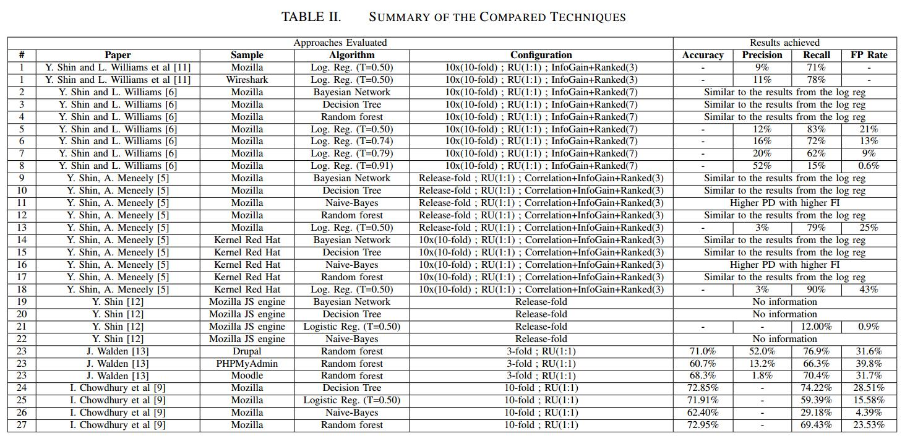
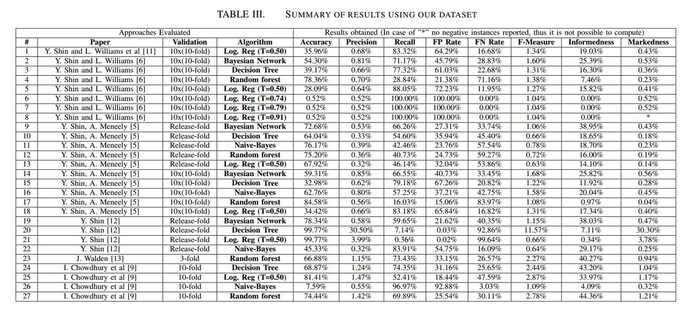

# Experimenting machine learning techniques to predict vulnerabilities

# Abstract

软件度量标准可用作软件漏洞存在的指示器。这些指标已用于机器学习，以预测容易包含漏洞的源代码。虽然无法找到缺陷的确切位置，但模型可以显示在检查和测试期间哪些组件需要更多关注。每种新技术都使用他自己的评估数据集，该数据集多次具有有限的大小和代表性。在此体验报告中，我们使用大型且具有代表性的数据集来评估几种最先进的漏洞预测技术。该数据集是使用来自五个广泛使用的开源项目的2186个漏洞的信息构建的。结果表明，数据集可用于区分哪种是最佳技术。还表明，一些技术可以预测几乎所有数据集中存在的漏洞，尽管精度非常低。最后，准确性，精确度和召回率并不是表征这种工具有效性的最有效方法。
关键词 - 机器学习，软件度量，软件安全，漏洞

| relevant information |                                                              |
| -------------------- | ------------------------------------------------------------ |
| *作者*               | Henrique Alves, Baldoino Fonseca,Nuno Antunes                |
| *单位*               | Instituto de Computac¸ao Universidade Federal de Alagoas;CISUC, Department of Informatics Engineering University of Coimbra |
| *出处*               | 7th Latin-American Symposium on Dependable Computing         |
| *原文地址*           | <https://ieeexplore.ieee.org/document/7781850>               |
| *数据集地址*         | https://eden.dei.uc.pt/~nmsa/metrics-dataset/index.html      |
| *发表时间*           | 2016年                                                       |

# 1. 简介

软件漏洞代表了当今软件开发人员最头疼的问题之一。正在开发的大多数软件都以某种方式暴露给外部用户，这些用户迟早会试图利用恶意的方式利用它。即使在软件安全方面投入了大量精力，攻击仍然经常发生，每年的财务损失达到2260亿美元[1]。更糟糕的是，软件的大小和复杂性的增加加剧了这个问题。

开发安全代码是一项艰巨而昂贵的任务，需要花费大量时间。软件工程师有许多技术可以找到这些缺陷和漏洞，但众所周知，最有效的技术通常需要大量的时间和专业资源。代码检查和测试等技术是发现漏洞的有效且被广泛接受的方法，但这些方法有其局限性。代码审查和检查[2]被认为是减少错误数量的非常有效的方法，但众所周知，它们的成本限制了它们在大型工件中的适用性。即使测试虽然更容易和更便宜，但可能会导致测试代码多于其自己的系统代码，以覆盖整个系统代码。随着系统规模的增长变得越来越昂贵，以满足提供高度信任的严格覆盖要求[2]。为了解决这个问题，开发人员试图将精力集中在系统中最棘手的部分。

虽然识别系统中最有问题的部分是一个有趣且有效的解决方案，但执行此分析的标准可能是多样化和混乱的。诸如[3]，[4]，[5]，[6]等研究已经研究了这种可能性，并使用了几种与机器学习技术相结合的软件度量来完成这项活动。很明显，没有代码生而平等且具有不同的特征。这些工作表明，这些功能可以区分代码中漏洞的存在（最近的一项研究证实[7]）。

在这项工作中，我们感兴趣的是代表代码静态属性的软件度量。代码执行和代码流失度量标准不在范围之内。现有工作使用不同的配置和方法呈现不同的结果，并考虑不同的度量集。例如。虽然在[8]中使用了9个软件度量来构建预测模型，但在[9]中使用了17个软件度量。此外，还有各种各样的机器学习技术，通过这些技术，文章可以更频繁地使用某些技术，并且每种技术都支持基于其中任何一种的特定结果。我们意识到最常见的是朴素贝叶斯，决策树，随机森林和逻辑回归。

在这种情况下，很难比较这些工作并选择最适合每种利用方案的工作。此外，每项工作中提供的评估结果并不是评估其有效性的非常有用的方法，主要有两个原因[7] :( i）每项工作都使用特定的数据集来进行评估; （ii）使用的数据集具有有限的代表性[7]。

该实践经验报告提供了一项比较研究，以评估现有方法预测C / C ++软件项目漏洞的有效性。该研究基于一个大型数据集[7]，其中包含有关函数和文件的软件度量的信息，以及从安全角度来看五个项目中是否存在安全漏洞，因为它们被广泛使用并暴露于攻击。使用此数据集，可以评估第三方工作中呈现的预测模型的有效性。我们复制了六项研究中提出的方法，这些研究涉及基于软件指标预测软件漏洞。

此篇文章的结构如下。第二节介绍了进行的研究。第三节介绍并讨论了取得的成果。第四部分回顾了相关工作，第五部分讨论了对本研究有效性的潜在威胁，第六部分总结了论文。

# II.研究

本研究提出了在C / C ++软件环境下脆弱性预测方法有效性的实验评估。主要目标是从文献中提出的方法中了解哪些方法能够产生更好的模型来预测脆弱性。在实践中，该研究试图回答以下问题：

- 生成的模型于预测易受攻击的文件并避免误报有多好用？

- 在这种环境中哪些技术表现更好？

- 表征方法有效性的最佳指标是什么？

为了回答这个问题，我们设计了一种基于五个关键组件的方法，如图1所示。以下小节将讨论这些组件中的每一个。

## A. 数据集

评估中使用的数据集在[7]中给出，可以从[10]下载。它包含有关函数和文件的软件度量标准以及是否存在安全漏洞的信息。表I列出了数据集中的数据摘要。我们可以观察到，数据集是基于2186安全补丁和相应源存储库的4372个快照构建的：1对应于紧接在补丁之前的提交，1对应于紧随其后的提交。

此数据集包含有关函数，文件的软件度量以及是否存在安全漏洞的信息。这些信息是针对五个开源项目收集的：Mozilla Firefox，Linux内核，Xen Hypervisor，Httpd和Glibc。这些项目具有良好的安全性，是区分漏洞的良好选择，因为它们是不同领域的项目。 Mozilla是一个Web浏览器，Linux内核是操作系统内核，Xen是虚拟器环境，Httpd是通信协议，Glibc是用C编写的系统调用库。
最后，如图II-A所示，与中性代码相比，易受攻击代码的百分比非常低。

## B.测试主题平衡和验证

在这种工作中预计会出现差异，因为预计在这种数据集中，易受攻击的实例的数量远远小于非易受攻击的实例的数量。因此，针对此类任务的所有方法都需要执行数据平衡。
评估的方法涉及称为随机欠采样（RU）的平衡技术，移除随机选择的多数类数据。选定的比例是直到多数类中的数据实例数与少数类的数相同。
同样重要的是要强调的是，不同的方法对结果交叉验证使用不同的策略。在某些情况下，它使用了10倍交叉验证（[9]），而在其他情况下，这种重复使用重复10次，命名为10x10倍验证[6]，[11]。最后，一些案例使用下一个版本验证（Release-fold），其中模型使用以前的版本进行训练，并使用下一个版本进行测试[5]，[12]。这些配置总结在表II的配置列中。

## C.评估方法

在我们的研究中评估的方法来自已发布的工作，这些作品使用软件度量来构建预测模型，以找到具有更高可能性的漏洞的文件。

在[12]中提出了使用九种代码复杂度指标的案例研究。该方法提交来自Mozilla模块训练预测模型的逻辑回归数据。他们的结果表明，复杂度指标能够识别最容易出现漏洞的区域，但是，这种方法仍需要改进，因为结果显示低误报率和高假阴性率。

类似地，在[9]中使用了17个软件度量来训练预测模型，其中7个特定于面向对象语言。作者使用四台机器避免了最大限度，因为它们代表了不再关注模型的易受攻击的代码。

## E.方法有效性的指标

在我们的分析过程中，我们使用下面提供的一组指标来表征这些方法的有效性。这些指标是根据实验期间获得的基本测量值计算的：真阳性（TP）;误报（FP）;真阴性（TN）;和漏报（FN）。

准确度（1）表示正确分类的案例与总案例之间的比例。误报率（fpr）（2）表示错误预测的文件与实际中性文件易受攻击的比率。高fpr显示模型将许多实例作为误报返回给开发人员。
$$
accuracy = \cfrac{T P + T N}{T P + F N + T N + F P}
$$

$$
fpr = \cfrac{F P}{T N + F P}
$$

我们还使用了长期用于表征系统有效性的指标，特别是在信息检索领域。精度（3）表示正确预测的易受攻击文件与检测到的所有文件的比率。Recall（4）描述了模型正确预测为易受攻击的真实易受攻击文件的百分比。也称为真阳性率，它与模型如何覆盖易受攻击的实例有关。最后，FMeasure（5），也称为F1Score，代表精度和召回的调和平均值。
$$
precision = \cfrac{T P}{T P + F P}
$$

$$
recall = \cfrac{T P}{T P + F N} = tpr
$$

$$
FMeasure = 2 * \cfrac{precision * recall}{precision + recall} = F_1Score
$$

虽然这些指标解决了不同的问题，但所有这些指标都存在一些可能影响其有用性和代表性的偏见[14]：1）阳性样例的患病率; 2）模型的偏差; 3）倾斜; 4）成本比率。这些偏见促使我们在分析中包含不同的指标。

受到博彩公司赔率[15]的启发，提出了无偏见的指标来表征考虑分类比例的预测因子的有效性，类似于投注赔率。Bookmaker Informedness（6）描述了预测因子的有效性，考虑了结果比例的测量。它量化了预测变量预测结果的一致程度，即预测变量对指定条件的信息与机会的相关性。另一方面，Markedness（7）量化了结果将预测变量作为标记的一致性，即指定预测变量的条件与机会的标记程度。
$$
Informedness =  \cfrac{T P}{T P + F N} - \cfrac{F P}{T N + F P}
$$

$$
Markedness = \cfrac{T P}{T P + F P} - \cfrac{F N}{T N + F N}
$$

# III.结果和讨论

在平衡数据集中应用论文的方法，我们得到了表III中的结果。我们可以观察到，取得的成果差异很大。精度值范围为0.32％至30.50％，召回值范围为0.36％至100.00％。

通过使用决策树算法的方法获得了精确度方面的最佳结果。 Logistic回归在recall方面呈现出最佳结果，但在精确度方面表现非常糟糕，这降低了报告实例的可信度。重要的是要注意该方法可以配置和调整，即配置要使用的阈值，但由于缺乏信息，我们使用了Weka的默认配置。

精确度度量的结果对于描述这些技术的有效性似乎并不十分有用。我们可以观察到，许多技术的准确度高于50％，除了7个案例从7.59％到45.33％不等，3个案例等于0.52％。然而，其中许多案例的精确度不到1％。精确度量提供的结果也没那么有用，因为它们专注于误报并完全忽略漏报。如果模型过于专注于避免误报，那么它最终会报告少量的真阳性。
标记是一个更完整的指标，因为它也认为是假阴性。

我们可以清楚地看到，大多数方法的精度值非常低。这是因为学习模型报告的误报太多，因为他们使用平衡数据集进行训练，但随后使用不平衡数据集进行测试。这种不平衡的数据集具有更多中性实例，其中一些最终报告为易受攻击。

三种方法实现了100％的召回，另外六种方法实现了超过80％的召回。虽然这看起来非常令人印象深刻，但当我们考虑到机会以及假阳性和真阴性的分布时，我们理解结果并不像第一眼看上去那么好。事实上，没有一种方法达到Informedness值高于45％。这表明，在某些情况下，召回可能是误导性的指标。

由于精确度和召回率的这种限制，我们决定使用度量informedness 和markedness 对技术进行更详细的分析，这些分析不会受到偏差的影响。图3显示了这两个指标的所有方法的结果摘要。

第一个观察结果是树的方法在informedness 方面明显优于其他方法：23,24,27。正如我们所看到的，方法6,7,8显然远离这些树方法，尽管它们呈现出更高的recall比那些方法。事实上，只比较informedness 值，我们可以看到，在（4,6,7,8,26）中考虑了一系列机会非常差的方法。如上所述，虽然这些方法似乎具有非常高的召回率，但实际上这种高召回率是由于所产生的模型报告的事件比其余方法更为积极，导致误报过多。

# IV 相关工作

I软件度量已被多次使用，以训练有效预测故障的预测模型[16]，[17]，[18]。虽然圈复杂度受到了很多关注，但其他指标也与理解代码有关。例如，有一段时间讨论了哪个是“最具预测性”的指标：Cyclomatic Complexity或LoC数量[18]。我们认为，在安全漏洞的情况下，这些指标与具有报告漏洞的代码之间存在某种关系。下面我们回顾一下这些工作并讨论它们的优点和缺点。

一些工作集中评估和比较不同的技术。对于实际情况，将使用文本挖掘技术获得的结果与基于软件度量的方法进行比较，如[13]中所述。这些实验基于三个开源php项目的223个漏洞：Drupal，Moodle和PHPMyAdmin。在所有三种应用中，文本挖掘模型具有比软件度量更高的召回率。但是，使用的数据集具有明显的代表性问题

鉴于CCC指标在识别漏洞方面显示的有趣结果，[9]提出了一个框架，通过使用CCC指标和现有的机器学习技术自动预测漏洞。通过对Mozilla Firefox进行实证研究并使用四个预测器C4.5决策树，随机森林，Logistic回归和Naive Bayes来验证所提出的方法。结果表明，这些预测器能够预测与Mozilla Firefox中的文件相关的大部分漏洞。
[19]中的工作提供了几种机器学习方法的比较分析，其中哪些方法在检测代码气味方面更有效。基于手动验证的数据集，在总共16种算法中包括若干技术和配置。在检测代码气味时，一些技术的准确度高于96％，使用决策树和随机森林算法可以获得最佳结果。

# V.对有效性的威胁

实验的有效性受到以下威胁：T1）并非所有方法的配置都可用，不能保证实验在理想条件下再现。 T2）数据集包含报告的漏洞，因此可能存在从未识别的易受攻击的代码。 T3）最后的威胁是，这些方法中的某些方法是针对不同语言提出的，而不是数据集代码：C / C ++。

# VI. 结论

本实践经验报告对基于软件指标的18种最先进的漏洞预测方法进行了评估。此评估基于一个大型且具有代表性的数据集，该数据集构建了五个广泛使用的开源项目中2875个漏洞的信息。

有可能观察到这样的传统指标，如准确性在这种情况下可能不是很有用，而且即使使用平衡数据集，精度和召回也可能略有误导。另一方面，诸如informedness 和markedness 等指标更有效。

结果表明，一些方法明显优于其他方法，随机森林实施在所考虑的所有指标中都取得了非常高的结果。
未来的工作包括根据所考虑的语言扩大该分析的范围，以及脆弱性预测算法的基准程序提案

