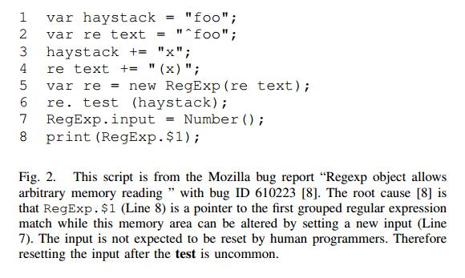
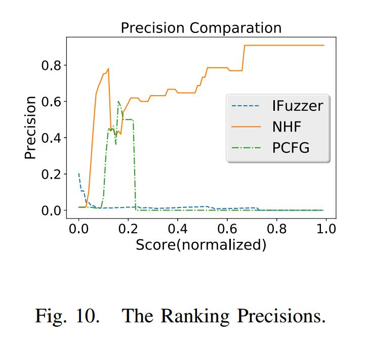

# Improving Fitness Function for Language Fuzzing with PCFG Model


# Abstract

在本文中，我们建议使用机器学习技术来模拟语言解释器的错误模糊，并开发基于遗传编程的语言模糊测试的适应度函数。基本思想是错误触发脚本通常包含不常见的用法，这些用法在日常开发中不太可能被程序员使用。我们通过使用概率上下文无关语法模型和马尔可夫模型来计算脚本的概率，以便错误触发脚本将获得更低的概率和更高的适应值，从而捕获不常见。我们选择ROC（接收器操作特性）曲线来评估适应度函数在从正常脚本中识别错误触发脚本时的性能。我们使用来自Github的大量JavaScript脚本和来自SpiderMonkey的bugzilla的错误报告的POC测试用例进行评估。实验中的ROC曲线表明，我们的方法可以提供更好的能力来排序前K个元素中的错误触发脚本。

关键词 - 语言模糊，概率上下文无关语法，进化算法，脚本排序，马尔可夫链

| relevant information |                                                              |
| -------------------- | ------------------------------------------------------------ |
| *作者*               | Xiaoshan Sun, Yu Fu，Yun Dong，Zhihao Liu, Yang Zhang        |
| *单位*               | Trusted Computing and Information Assurance Laboratory Institute of Software, Chinese Academy of Sciences<br> Beijing Capitek Co., Ltd |
| *出处*               | 2018 42nd IEEE International Conference on Computer Software & Applications |
| *原文地址*           | <https://ieeexplore.ieee.org/document/8377723>               |
| *数据集地址*         | <https://github.com/learnbigcode/learnbigcode.github.io/blob/master/datasets/index.md> |
| *发表时间*           | 2018年                                                       |

# I  简介

现代Web浏览器通常集成解释器来解析，编译和执行用JavaScript编写的脚本。这类解释器的突出例子包括谷歌Chrome的JavaScript引擎V8 [1]，Mozilla FireFox的SpiderMonkey [2]和Apple Safari浏览器的SquirrelFish [3]。语言模糊测试是在Web浏览器中查找安全漏洞以提高其安全性的一种有效方法，因为Web浏览器越来越成为黑客攻击的目标。

由测试语言定义的所有可能脚本构成脚本空间，语言模糊测试可被视为空间搜索问题。遗传编程（GP）是一种有效的搜索大空间目标解决方案的方法。它已应用于测试[4] [5] [6]和模糊测试[7]。解释器的缺陷是多种多样的，并且解释器中的错误概念被模糊地定义，因此不能直接定义适应度函数。我们建议使用基于机器学习的方法来定义语言模糊测试的适应度函数。大多数错误触发脚本包含不常见的用法，这种不常见可以被建模为生成此脚本的低概率，概率可以通过概率无上下文语法（PCFG）计算，因为该模型用于测量一棵树的可能性，脚本可以解析为抽象语法树（AST）。但是，较长的脚本因此被认为不太可能，并且它不适用于我们的概念“bug-triggering”，因为通常这样的脚本很短。这意味着需要进一步的设计。

贡献：本文的主要贡献是：

- 我们建议使用机器学习技术来模拟解释器模糊测试中的“错误触发”概念，我们的称为自然启发式模糊测试的适应性函数基于``PCFG模型``并集成它使用``马尔可夫链模型``的模型，结果称为MPCFG模型。我们使用均匀分布来标准化MPCFG模型计算的概率，并使用几何平均值来减少脚本长度值的影响。结果，适应度值几乎与脚本长度无关。因此，我们可以缓解基于GP（遗传编程）的语言模糊测试中的膨胀问题。
- 我们使用大量开源JavaScript脚本进行了一项实验，以评估适应度函数的有效性。实验表明，我们的方法比用于IFuzzer和纯PCFG模型的方法更有效地区分正常和不常见的脚本，这可能表明我们的方法可以用作JavaScript模糊器的更好的适应性函数，以更有效地生成错误触发脚本。

# II 相关工作

语言模糊测试正在积极研究中。早期的语言模糊测试工作，例如包括LangFuzz [8]，JsFunFuzz [9]和CSmith [10]，主要使用手工制作的规则来指导测试用例程序的生成。但是它们在程序生成的引导方式上彼此不同，CSmith生成的C程序覆盖了C的大部分，同时避免了未定义和未指定的行为，这些行为会破坏其自动查找错误代码错误的能力; LangFuzz [8]使用代码变异从先前生成的程序生成新程序，这些程序在解释器中触发了错误; JsFunFuzz [9]是SpiderMonkey的早期模糊器。据报道，JsFunFuzz和DOMFuzz发现了790个安全关键错误。然而，这些方法可能会退化为随机搜索[7]。

我们的工作还涉及基于GP的模糊测试。进化模糊器的适应度函数通常是基于覆盖的。DeMott等人 [11]提出了一种灰盒技术来生成具有更好代码覆盖率的新输入，以通过使用块覆盖作为适应值来发现错误。 Kifetew等 [12]将随机语法与GP结合起来，通过运行被测系统与单元中所有未被解析的树并测量覆盖的分支数量以及覆盖未覆盖分支的距离来确定适合度值。 VUzzer [13]计算每个输入的适合度作为执行的基本块的频率的加权和。它们主要使用代码覆盖进行模糊测试，并且它们的适应度函数是独立于特定程序定义的。 IFuzzer [7]将结构度量，例如程序的``圈复杂度``作为遗传编程中脚本的适应值。
机器学习方法已成功应用于统计代码实现[14]，基于n-gram模型的抄袭检测器[15]，基于n-gram语言模型的错误检测[16]，以及使用贝叶斯推理可能的错误程序行为检测[17]。将机器学习方法应用于程序分析任务的统计基础是软件的自然性，由Hinder [18]和Ray [19]研究。**基于机器学习的方法也应用于模糊测试。 Godefroid等 [20]提出了一种使用基于神经网络的技术生成新输入的方法。他们通过选择概率低于阈值pt的值来对所学习的样本分布进行采样。 Skyfire [21]学习概率上下文敏感语法以指定语法特征和语义规则，并使用学习的语法生成种子输入。 Skyfire在生成过程中更喜欢低概率生产规则，以产生不常见的输入。 Tree Fuzz[22]使用类似PCFG的模型从代码语料库中学习概率分布，并通过以深度优先的方式创建树来从模型生成新数据。**

我们的工作在很多方面都与相关工作不同。我们建议将PCFG和Markov模型用于“错误触发”触发脚本的概念，并且我们提出了基于GP的语言模糊测试的适应度函数，而之前的工作使用基于代码覆盖的测量或代码复杂度测量。较长的脚本通常在基于PCFG的模型中具有较低的概率，因此较长的公共脚本和不常见的脚本具有较低的概率，并且模型可能无法区分它们。我们开发了一种方法来显着减少其长度的影响，以便模型可以区分不常见的脚本和常见的脚本。我们表明，我们的模型可以作为更好的适应度函数来描述“错误触发”脚本的模糊概念，而不使用代码复杂性和代码覆盖方法，并且比基于代码复杂性的方法更好地工作。

# III 用fuzzing的软件的自然性

在本节中，我们将解释使用机器学习方法对“bug-triggering”脚本的概念进行建模以构建基于GP的语言模糊测试的适应度函数的基本思想。

A. Hindle等人[18]已观察到它在理论上，编程语言是复杂，灵活和强大的，但程序员实际编写的程序大多是简单而且相当重复，因此它们具有有用的可预测统计属性，可以在软件工程任务的统计模型中捕获。
这种观察也存在于人类编写的脚本中，并且“错误触发”脚本在大多数情况下是直观奇怪的，原因是人类通常不以这种方式使用脚本语言。这称为不常见。


例如，图1显示了JavaScript中“Regexp”的特征用法。 “re.test（str）”（第3行）是分支条件，分支中的流动语句继续存储结果。这是程序员在大多数JavaScript程序中编写的逻辑。图2给出了一个示例脚本，它通过更新输入（第7行）违反了这种用法，并且该脚本在一个版本的SpiderMonkey中触发了一个错误。这种用法可以被认为是不常见的。由于不常见的脚本不太可能，并且使用可能成为开发人员的“盲点”，因此常见的使用反映了某些假设，这可能导致解释器的开发人员使用这些假设编写代码，这些假设在某些不常见的脚本中可能无效。因此，我们的想法是从人类程序员开发的正常脚本语料库中学习共性，并且学习到的信息可用于通过测量脚本与普通脚本的偏差来计算脚本的不常见。偏差较大的脚本可能更有可能触发解释器中的错误。该偏差可用于计算基于GP的语言模糊测试的脚本的适合度。



# IV 设计

在本节中，我们详细说明了语言模糊测试的适应度函数的基本原理和设计细节。

## A.机器学习模型

- **PCFG模型**

在这里，我们提出了PCFG [24] [25]的正式定义和概率计算。

一个PCFG G是元组（V，N，S，R，D），其中：

- V是一组终端，例如字符串，数字和标识符。
- N是一组非终结符号Ni，例如程序中的语句，for-loop结构。
- S∈N是起始符号。
- R是一组Ni→βm形式的规则，其中βm= M1M2… Mn是末端和非末端的序列。
- D是一个为规则分配概率的函数，因此

$$
∀i \sum_mD(N_i → β_m) = 1
$$

我们使用PCFG模型利用公式2中的规则直接从AST树t计算脚本的概率。
$$
P(t) = D(N_t → β)
\prod_1^kP(t_{M_i})
$$
其中N_t是t的根节点，β= M1M2… Mk和 t_m_i 表示N_t的根，其根是M_i（1≤i≤k）

- **马尔可夫链PCFG模型**

PCFG模拟N_i和β_m之间的依赖关系为规则Ni→βm。但是，不应错过内部子树的依赖关系。例如，脚本的AST树如图4所示，语法定义如下（我们省略了不同种类的stmt和param的进一步定义）：

```c
fun_def := param_list stmt_list
stmt_list := stmt | stmt stmt_list
param_list := ε | param | param param_list
stmt := assign | if | while | fun_def| . . .
```
所以我们可能有规则stmt_list→fun_def stmt_list和stmt_list→assign stmt_list等等。有趣的def是函数X（），赋值是X.prototype.getName = ....规则无法模拟函数X（）和X.prototype.getName = ...之间的依赖关系，因为它们没有出现在一条规则中。因此我们需要修改PCFG模型。


我们选择直接使用马尔可夫链模型用于stmt列表和其他递归定义。对于AST中的子树t，递归地定义Nt，Nt→βk和βk= M1M2… MK。使用新公式计算Nt→βk的概率：

$$
D(N_t)P(M_1|N_t)
\prod_2^k
P(M_i|N_t,M_1 . . . M_{i−1})
$$
该公式使用马尔可夫模型来计算一系列语句的概率。

例如

```
P(testCallProtoMethod) = P(fund_def)P(ε|fun_def)P(stmt_list|fun_def)P(stmt_list1)
P(stmt_list1) = P(fun_defX)P(assign|fun_def)P(var|fun_def assign)
. . . . . .
```

完全条件概率P（Mi | Nt，M1 ... Mi-1）计算起来很昂贵。所以我们必须计算近似概率。如果我们假设Mi的概率仅由其前进符号Mi-1确定，则等式3中的概率
$$
P(M_1|N_t)
\prod_2^k
P(M_i|N_t,M_1 . . . M_{i−1})
$$
可以是简化为
$$
P(M_1|N_t)
\prod_2^k
P(M_i|N_t,M_{i−1})
$$
这是精度和效率之间的权衡。马尔可夫模型可以通过假设当前语句依赖于先前的K个元素来模拟程序的有趣属性[26]。如果K大于1，则精度提高，同时消耗更多的内存和计算时间。

## B.模糊的自然启发式

本小节介绍了基于马尔可夫链PCFG模型构建模糊测试适应度函数的技术。 PCFG和Markov-Chain PCFG模型将为较长的脚本提供较低的概率值，这对于我们的适应度函数来说是不可取的。

我们首先通过归一化因子Z_fix（t）=（1/| N |）^lt 来减小程序长度对P（t）的影响，其中t是程序的AST，lt 是 t 中包含的非终结符的数量， |N| 是语法规则中可用的非终结符号。 Z_fix（t）是均匀分布下 t 中非终结序列的概率。随着脚本长度的增加，Z_fix（t）和P（t）同时减少。因此，P’（t）对脚本的长度不太敏感。
使用Z_fix（t），等式2被修改为：
$$
P^{’}(t) = Z_fix(t)D(N_t → β_k)
\prod_1^kP(t_{M_i})
$$
现在P’（t）不是概率，因为它们不总和为1。相反，它衡量脚本的不常见。也就是说，具有更高P’（t）的脚本表明它与普通的脚本共享更多结构特征。如果P’（t）为低，那么它更可能包含非自然的语法元素序列。

马尔可夫链PCFG模型包含生产
$$
\prod_1^kP(M_i|N_t,M_1 . . . M_{i−1})
$$
和Z_fix同等地减少每个条件概率的值。然而，并非每个条件概率都同样重要。我们发现许多错误触发脚本在许多其他子树中只包含一个或两个不常见的子树。所以我们需要放大那些不常见的子树的因素。

我们递归地标准化每个子树的概率，而不是通过Z_fix标准化整个概率。然后我们使用几何平均值来表示整个概率。
$$
P^h(t) = φ{(1/|N|)^lD(N_t → β_k)
\prod_1^kP^h(t_{M_i})}
$$
采用等式5中的φ函数来增加通常具有低概率的那些不常见结构的重要性。我们在当前的实现中选择了square函数作为φ。设计原则是x^2的方差大于x的方差。
$$
H(t) = − log(P^h(t))
$$
函数H（t）是我们方法的适应度函数。具有较低值的脚本被认为是“错误触发”对象的更好脚本。分数较高的脚本被认为更有可能触发错误。

## C.参数训练

等式3中的D（Ni），P（M1 | Ni）和P（Mi | Nt，Mi-1）的值可以从大的训练语料库中学习。 D（Ni）计算如下：
$$
D(Ni) = \frac{\#Ni}{\#N}
$$
其中＃（Ni）是Ni的出现次数，＃N是训练语料库中规则的出现次数。类似地，条件概率P（Mi | Nt，Mi-1）可以近似为
$$
P(M_i|N_t,M_{i−1}) = \frac{\#Mi}{\#Mi−1M}
$$
其中#Mi和＃Mi-1被统计为训练语料库中的所有规则Nt→βm。

我们的模型试图捕捉脚本的不常见。因此，如果序列Mi-1Mi没有出现在训练语料库中，那么我们认为这个序列更可能是奇数，我们将概率P（Mi | Mi-1）设置为CPU允许的最小浮点值而不是零。

# V.评估

在这部分，我们评估我们的方法。我们将我们的适应性函数与纯PCFG方法进行比较，IFuzzer中的适应性函数是最先进的基于GP的语言模糊测试。我们在选择模糊测试中的候选者时评估这些函数的准确性和精确性。

## A.评估数据集设置

在我们的实验中，来自Mozilla的Bugzilla的150,000个JavaScript脚本[27]（100,000个用于参数训练）和900个触发错误的JavaScript脚本（全部用于测试）用于评估三个适应度函数。我们从2000年到现在的SpiderMonkey的确认崩溃报告中选择了所有的错误触发脚本（一些崩溃报告仅提供跟踪，我们只是省略它们）。这些脚本是从报告文本或附件中提取的。
我们将Bugzilla中的一组bug触发脚本称为bug组，将[27]中的50,000个脚本称为普通组。

普通组中的脚本主要是针对现实世界的项目编写的，因此脚本不太可能在发布之前触发已在其上测试过的解释器中的错误。因此，我们假设普通组中的脚本不会触发错误。

我们来自bug组的错误触发脚本是独立于SpiderMonkey的版本。原因是如果没有特定版本的JavaScript解释器，很难确定脚本是否可以触发错误。脚本可能不会在SpiderMonkey 32中触发错误，但它可能会触发其他版本的SpiderMonkey或其他解释器（如V8和Webkit）中的错误。

实验设置：我们使用Acorn [28]作为所考虑的JavaScript脚本的解析器。我们的NHF函数的原型已经使用Python实现。此外，该实验是在具有3.40GHz的Intel i7-6700 CPU和8G内存的计算机上进行的。

B.评估措施

我们使用ROC（接收器操作特性）作为评估方法。一个原因是ROC被机器学习社区广泛接受。另一个原因是模糊测试不是确定性的，并且发现的错误数量可能会有很大的偏差。适应度函数为脚本提供分数，我们可以将分数高于θs的脚本分类为错误触发。因此，我们可以使用ROC曲线来评估适应性函数在排序脚本中的性能。对于给定的阈值θs，如果适应度值高于θs的测试用例的数量是B，并且适合度高于θs的两个组中的脚本数量是N.精度被定义为B / N并且召回是定义为B /（T  -  B），其中T是错误组中的脚本数。应该注意的是，在模糊测试中不使用阈值，因为我们只选择GP迭代中的前K个元素。

## C.评估结果

由IFuzzer，PCFG和NHF为JavaScript脚本计算的适合度值的频率直方图分别在图5,6,7中示出。这些图的水平轴表示归一化的适应值。 （即，脚本的适应值除以手动选择的值，以便可以清楚地显示图形并保留分布的形状）1在直方图中，具有较高适应值的脚本应该在“bug”中-组”。理想情况下，两组的距离应该很大。但是，实际上正常组和bug组重叠。可以注意到，在NHF的直方图中，正常组和bug组具有更大的差异。


图8显示了IFuzzer，NHF和PCFG的ROC曲线。它表明，IFuzzer的适应度函数和PCFG方法的ROC曲线都低于对角线，表明它们在预测脚本是否是错误触发方面表现不如盲目。

相反，我们方法的ROC曲线高于对角线，这意味着它优于PCFG和IFuzzer。由于我们使用此适应性功能进行模糊测试，因此我们无需选择阈值。我们只在GP的迭代期间为下一代人口选择前K个脚本。图10显示了用作分类器时三个适应度函数的精确率。我们显示了不同阈值（X轴）的精度（Y轴）。这证明了前K个脚本的准确性。 IFuzzer的精度很低，并且随着阈值的增加而没有改善。当阈值大约为0.2时，PCFG的精度很高，当阈值设置为大于0.2时，PCFG的精度开始显着下降。这是因为正常组中的某些脚本的长度足以使其具有比错误组中的脚本更高的值。我们的方法对于足够大的阈值具有稳健的性能，并且如果阈值大于0.6，则精度超过80％。



我们还注意到，IFuzzer倾向于为普通和bugtrigger组中的复杂长脚本计算更高的适应值。为了量化适应度值和脚本长度之间的相关性，我们计算相关系数如下：
$$
r(S,L) =
\frac{cov(S,L)}
{\sqrt{var(S)var(L)}}
$$
其中S是适应值，L是脚本长度，cov（S，L）是S和L的协方差，var（X）和var（L）分别是X和L的方差。特别是，cov（S，L）计算如下：
$$
cov(S,L) = \frac {\sum_{i=1}^n(S_i − \overline S)(L_i −\overline L)}
{n − 1}
$$
表I总结了不同数据集组的脚本适应度值和长度的相关系数。 IFuzzer的相关系数很高。应该注意的是，正常组中的相关系数大于IFuzzer的bug组中的相关系数。原因是bug组中的脚本通常包含相对简单的结构，因此它们的大多数适应值都很小。PCFG方法具有较小的相关系数。我们的方法进一步减少了适应值和脚本长度之间的相关性。这可能表明，使用我们的方法，脚本的适应值几乎与其长度无关。


# VI 结论

我们提出了一种新颖的适应度函数，它将马尔可夫链和PCFG模型集成为语言模糊测试的“错误触发”概念。马尔可夫链模拟列表中相邻元素之间的依赖关系，用于递归规则。我们使用规范化方法来减少脚本长度的影响，以便长公共脚本不会被视为不常见的脚本。我们使用来自Github和Firefox的Bugzilla的大量JavaScript应用程序代码来评估我们方法的有效性。实验结果表明，我们的方法的准确性优于基于IFuzzer和PCFG的概率。我们的模型与语言无关，也可以应用于其他语言的解释器模糊测试。我们将在未来的工作中开发出更完整的模糊测试工具。