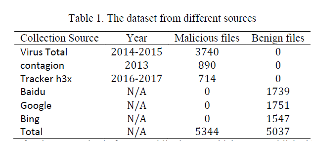

# database

用于存放本地下载的论文和其它相关学习资料，如PPT，PDF，word文件，小工具等等。（文件大小不要操作100M，超过100M的文件或工具可自己上传到网盘，然后将链接和密码写到对于的资料简介处）

---

## Paper

> 翻译或总结后的论文原文网上未能公开下载，通过其它方式下载到本地的论文可存放到对应文件夹下，目前包括的论文类别有如下几种：
>
> *  Fuzzing
> *  AutomatedExploit
> *  ReverseEngineering
> *  MaliciousSampleDetecion
> *  TaintAnalysis
> *  SymbolicExecution

---

## other

> 存放其它非论文资料，如一些学习资料，包括PPT、PDF、word等。一些好用的工具也可存放到这里。

---

## 数据集

- ### 恶意文档检测数据集

  > 上传者：刘露平
  >
  > 时间：2019.03.27
  >
  > 下载链接：[https://drive.google.com/file/d/1WQalJ39wzZ9g6LpxZTdSVQkIHpXDfHNv/view?usp=sharing](https://drive.google.com/file/d/1WQalJ39wzZ9g6LpxZTdSVQkIHpXDfHNv/view?usp=sharing)
  >
  > 摘要：该数据集是通过收集整理自己形成的，目前包含总共样本10381个，其中恶意样本5344个，正常样本5037个。包含Office(rtf,doc,ppt,xls, docx, pptx, xlsx）和PDF几个类别等几个类别。各个样本的统计分布如下图所示
  >
  > 

- ### UNSW-NB-15数据集

> 上传者：王炎
>
> 时间：2019.04.03
>
> UNSW-NB 15数据集的原始网络数据包是由澳大利亚网络安全中心（ACCS）的网络范围实验室中的IXIA PerfectStorm工具创建的，用于生成真实现代正常活动和合成当代攻击行为的混合体。
>
> Tcpdump工具用于捕获100 GB的原始流量（例如，Pcap文件）。此数据集有九种类型的攻击，即Fuzzers，Analysis，Backdoors，DoS，Exploits，Generic，Reconnaissance，Shellcode和Worms。使用了Argus，Bro-IDS工具，开发了12种算法，通过类标签生成49个特征。
>
> 数据分布情况如下所示

| Type           | No of Records | Description                                                  |
| -------------- | ------------- | ------------------------------------------------------------ |
| Fuzzers        | 24,246        | This attack scan to discover flaws and security loopholes in a program, operating system, or network by feeding it with the massive inputting of random data to make it crash. |
| Analysis       | 2,677         | A port based intrusion attack against web applications       |
| Backdoors      | 2,329         | This is a remote attack to gain unauthorized access to a system |
| DoS            | 16,353        | This attack exhaust the destinations resources so that resources required by the is not made available and normal traffic becomes denied |
| Exploits       | 44,525        | a sequence of instructions that takes advantage of a glitch, bug, or vulnerability to be caused by an unintentional or unsuspected behavior on a host or network. |
| Generic        | 58,871        | A techniques works against all block-ciphers (with a given block and key size), without consideration about the structure of the block-cipher |
| Reconnaissance | 13,987        | This is a probe attack that that gathers information about a computer network to evade its security controls |
| Shell code     | 1,511         | Small program with instructions from a shell to compromised the victim’s computer |
| Worms          | 174           | A Self replicating malicious code attack that that spread itself to other computers, mostly over a computer network, without attaching itself to a program like a virus |

> 主页介绍和下载链接：<https://www.unsw.adfa.edu.au/unsw-canberra-cyber/cybersecurity/ADFA-NB15-Datasets/>
>
> 论文介绍：<https://ieeexplore.ieee.org/abstract/document/7348942>

- ### 源代码度量和漏洞的数据集

> 上传者：王炎
>
> 时间：2019.04.08
>
> 它包含有关函数和文件的软件度量标准以及是否存在安全漏洞的信息。表I列出了数据集中的数据摘要。我们可以观察到，数据集是基于2186安全补丁和相应源存储库的4372个快照构建的。此数据集包含有关函数，文件的软件度量以及是否存在安全漏洞的信息。这些信息是针对五个开源项目收集的：Mozilla Firefox，Linux内核，Xen Hypervisor，Httpd和Glibc。这些项目具有良好的安全性，是区分漏洞的良好选择，因为它们是不同领域的项目。 Mozilla是一个Web浏览器，Linux内核是操作系统内核，Xen是虚拟器环境，Httpd是通信协议，Glibc是用C编写的系统调用库。
>
> **官方主页介绍及下载地址**：https://eden.dei.uc.pt/~nmsa/metrics-dataset/index.html
>
> 相关论文：
>
> 1. LADC 2016: *Experimenting Machine Learning Techniques to Predict Vulnerabilities*
> 2.  EDCC 2016: *Software Metrics and Security Vulnerabilities: Dataset and Exploratory Study*

- ### Python AST(抽象语法树)数据集

> 上传者：王炎
>
> 时间：2019.0410
>
> 此数据集包括100'000 + 50'000 python文件作为解析的抽象语法树以及解析器的代码（包装内置的Python AST解析器）
>
> 下载地址：<https://www.sri.inf.ethz.ch/py150>

- ### JavaScript AST（抽象语法树） 数据集

> 上传者：王炎
>
> 时间：2019.0410
>
> 该数据集包括100'000 + 50'000个JavaScript文件。数据以JavaScript和解析后的抽象语法树形式提供（使用acorn.js解析并以链接中所述的JSON格式序列化）
>
> 下载地址：<https://www.sri.inf.ethz.ch/js150>>

- ### Java Github 数据集

> 上传者：王炎
>
> 时间：2019.0410
>
> 该数据集包括来自GitHub的大约14'000个Java文件，分为训练和测试集。这些文件来自至少分叉过一次的开源项目。 
>
> 下载地址：<http://groups.inf.ed.ac.uk/cup/javaGithub/>

- ### Java变量和方法命名数据集和嵌入

> 上传者：王炎
>
> 时间：2019.0410
>
> 此数据集包括Java源代码和包含其标记的JSON序列化文件以及引用同一变量的标记的位置。它还包含用于变量和方法名称的预先训练的嵌入。
>
> 下载地址：<http://groups.inf.ed.ac.uk/cup/naturalize/>>

- ### 方法命名数据集

> 上传者：王炎
>
> 时间：2019.0410
>
> 此数据集包括Java源代码和JSON文件，其中包含11个最流行的GitHub Java项目的方法的名称和标记。 
>
> 下载地址：<http://groups.inf.ed.ac.uk/cup/codeattention/>

